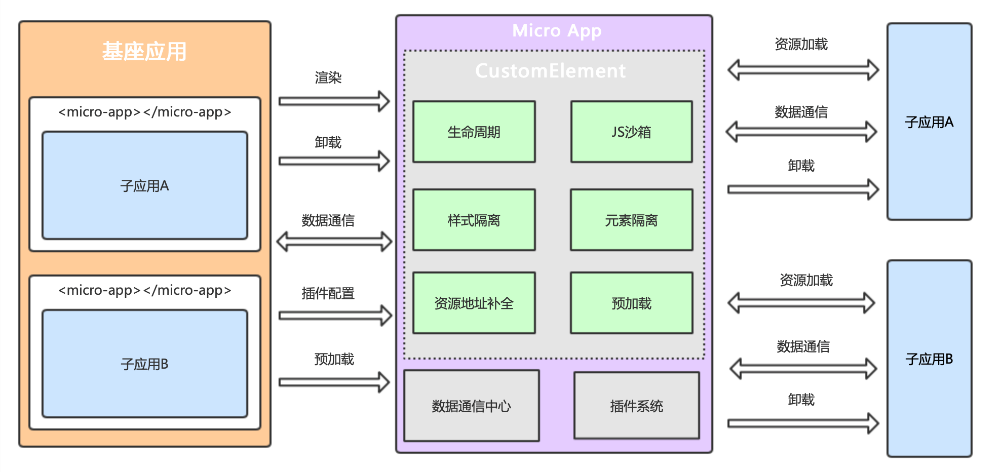

## 简介

​	官网地址：[MicroApp (micro-zoe.github.io)](https://micro-zoe.github.io/micro-app/)

​	microApp是由京东前端团队推出的一款微前端框架，它采用`组件化思维`，借鉴了`WebComponent的思想`，通过`js沙箱`、`样式隔离`、`元素隔离`、`路由隔离`模拟实现了ShadowDom的隔离特性，并结合CustomElement将微前端封装成一个类WebComponent组件，从而实现微前端的组件化渲染，旨在降低上手难度、提升工作效率，并且无关技术栈，也不和业务绑定，可以用于任何前端框架。



## 配置项

| 属性值                                        | 描述                           |
| --------------------------------------------- | ------------------------------ |
| name='xx'                                     | 应用名称                       |
| url='xx'                                      | 引用地址                       |
| iframe                                        | 开启iframe沙箱                 |
| inline                                        | 使用内联script                 |
| destroy                                       | 卸载时强制删除缓存资源         |
| clear-data                                    | 卸载时清空数据通讯中的缓存数据 |
| disable-scopecss                              | 关闭样式隔离                   |
| disable-sandbox                               | 关闭js沙箱                     |
| ssr                                           | 开启ssr模式                    |
| keep-alive                                    | 开启keep-alive模式             |
| default-page='页面地址'                       | 指定默认渲染的页面             |
| router-mode='search/native/native-scope/pure' | 路由模式                       |
| baseroute='/my-page/'                         | 设置子应用的基础路由           |
| keep-router-state                             | 保留路由状态                   |
| disable-memory-router                         | 关闭虚拟路由系统               |
| disable-patch-request                         | 关闭子应用请求的自动补全功能   |
| fiber                                         | 开启fiber模式                  |

​	配置方式可以选择全局或者部分：

①全局配置会影响每一个子应用。

②如果希望在某个应用中不使用全局配置，可以单独配置关闭。

​	micro-app还提供了一些其它的配置项，比如：

①`global`：当多个子应用使用相同的js或css资源，在link、script设置global属性会将文件提取为公共文件，共享给其它应用。设置global属性后文件第一次加载会放入公共缓存，其它子应用加载相同的资源时直接从缓存中读取内容，从而提升渲染速度。

②`globalAssets`：用于设置全局共享资源，它和预加载的思路相同，在浏览器空闲时加载资源并放入缓存，提高渲染效率。当子应用加载相同地址的js或css资源时，会直接从缓存中提取数据，从而提升渲染速度。

③`exclude`：当子应用不需要加载某个js或css，可以通过在link、script、style设置exclude属性，当micro-app遇到带有exclude属性的元素会进行删除。

④`ignore`：当link、script、style元素具有ignore属性，micro-app不会处理它，元素将原封不动进行渲染。

## 生命周期

​	micro-app通过CustomEvent定义生命周期，在组件渲染过程中会触发相应的生命周期事件。

### created

​	`<micro-app>`标签初始化后，加载资源前触发。

### beforemount

​	加载资源完成后，开始渲染之前触发。

### mounted

​	子应用渲染结束后触发。

### unmount

​	子应用卸载时触发。

### error

​	子应用加载出错时触发，只有会导致渲染终止的错误才会触发此生命周期。

## 监听生命周期

### **在Vue中监听**

> vue中监听方式和普通事件一致。

```typescript
<template>
  <micro-app
    name='xx'
    url='xx'
    @created='created'
    @beforemount='beforemount'
    @mounted='mounted'
    @unmount='unmount'
    @error='error'
  />
</template>

<script>
export default {
  methods: {
    created () {
      console.log('micro-app元素被创建')
    },
    beforemount () {
      console.log('即将渲染')
    },
    mounted () {
      console.log('已经渲染完成')
    },
    unmount () {
      console.log('已经卸载')
    },
    error () {
      console.log('加载出错')
    }
  }
}
</script>

```

### **全局监听**

> 全局监听会在每个应用的生命周期执行时都会触发。

```typescript
import microApp from '@micro-zoe/micro-app'

microApp.start({
  lifeCycles: {
    created (e, appName) {
      console.log(`子应用${appName}被创建`)
    },
    beforemount (e, appName) {
      console.log(`子应用${appName}即将渲染`)
    },
    mounted (e, appName) {
      console.log(`子应用${appName}已经渲染完成`)
    },
    unmount (e, appName) {
      console.log(`子应用${appName}已经卸载`)
    },
    error (e, appName) {
      console.log(`子应用${appName}加载出错`)
    }
  }
})
```

### 全局事件

> 在子应用的加载过程中，micro-app会向子应用发送一系列事件，包括渲染、卸载等事件。

- 渲染事件：通过向window注册onmount函数，可以监听子应用的渲染事件。


```typescript
/**
 * 应用渲染时执行
 * @param data 初始化数据
 */
window.onmount = (data) => {
  console.log('子应用已经渲染', data)
}

```

- 卸载事件：通过向window注册onunmount函数，可以监听子应用的卸载事件。

```typescript
/**
 * 应用卸载时执行
 */
window.onunmount = () => {
  // 执行卸载相关操作
  console.log('子应用已经卸载')
}

```

- 还可以通过window.addEventListener监听子应用的卸载事件unmount。

```typescript
window.addEventListener('unmount', function () {
  // 执行卸载相关操作
  console.log('子应用已经卸载')
})

```

## 功能

### JS沙箱

​	默认开启。使用Proxy拦截了用户全局操作的行为，防止对window的访问和修改，避免全局变量污染。每个子应用都运行在沙箱环境，以获取相对纯净的运行空间。

### 虚拟路由系统

​	通过拦截浏览器路由事件以及自定义的location、history，实现了一套虚拟路由系统，子应用运行在这套虚拟路由系统中，和主应用的路由进行隔离，避免相互影响。还提供了丰富的功能，帮助用户提升开发效率和使用体验。

### 样式隔离

​	默认开启。开启后会以`<micro-app>`标签作为样式作用域，利用标签的name属性为每个样式添加前缀，将子应用的样式影响禁锢在当前标签区域。*但主应用的样式依然会对子应用产生影响，如果发生样式污染，推荐通过约定前缀或CSS Modules方式解决。*

### 元素隔离

​	ShadowDom中的元素可以和外部的元素重复但不会冲突，micro-app模拟实现了类似ShadowDom的功能，元素不会逃离`<micro-app>`元素边界，子应用只能对自身的元素进行增、删、改、查的操作。

### 数据通信

​	主应用和子应用之间的通信是绑定的，主应用只能向指定的子应用发送数据，子应用只能向主应用发送数据，这种方式可以有效的避免数据污染，防止多个子应用之间相互影响。同时也提供了全局通信，方便跨应用之间的数据通信。

### 资源系统

​	资源路径自动补全：指对子应用相对地址的资源路径进行补全，以确保所有资源正常加载。

​	publicPath：如果自动补全失败，可以采用运行时publicPath方案解决。

​	资源共享：当多个子应用拥有相同的js或css资源，可以指定这些资源在多个子应用之间共享，在子应用加载时直接从缓存中提取数据，从而提高渲染效率和性能。

​	资源过滤：可以指定部分特殊的动态加载的微应用资源（css/js) 不被 micro-app 劫持处理，或者进行删除。

### 预加载

​	指在子应用尚未渲染时提前加载静态资源，从而提升子应用的首次渲染速度。为了不影响主应用的性能，预加载会在浏览器空闲时间执行。

### 插件系统

​	提供了一套插件系统，赋予开发者灵活处理静态资源的能力，对有问题的资源文件进行修改。主要作用就是对js进行修改，每一个js文件都会经过插件系统，我们可以对这些js进行拦截和处理，它通常用于修复js中的错误或向子应用注入一些全局变量。

### 多层嵌套

​	支持多层嵌套，即子应用可以嵌入其它子应用，但为了防止标签名冲突，子应用中需要做一些修改。无论嵌套多少层，name都要保证全局唯一。

### keep-alive

​	在应用之间切换时，我们有时会想保留这些应用的状态，以便恢复用户的操作行为和提升重复渲染的性能，此时开启keep-alive模式可以达到这样的效果。开启keep-alive后，应用卸载时不会销毁，而是推入后台运行。

> ​	keep-alive模式与普通模式最大的不同是生命周期，因为它不会被真正的卸载，也就不会触发 unmount 事件。
>
> - 主应用生命周期：
>   1. created：`<micro-app>`标签初始化后，加载资源前触发
>
>   2. beforemount：加载资源完成后，开始渲染之前触发(只在初始化时执行一次)
>
>   3. mounted：子应用渲染结束后触发(只在初始化时执行一次)
>
>   4. error：子应用渲染出错时触发，只有会导致渲染终止的错误才会触发此生命周期
>
>   5. afterhidden：子应用推入后台时触发
>
>   6. beforeshow：子应用推入前台之前触发(初始化时不执行)
>
>   7. aftershow：子应用推入前台之后触发(初始化时不执行)
> - 子应用：在子应用卸载、重新渲染时，micro-app都会向子应用发送名为appstate-change的自定义事件（应用初始化时不会触发），子应用可以通过监听该事件获取当前状态，状态值可以通过事件对象属性e.detail.appState获取。e.detail.appState的值有三个：
>   1. afterhidden：卸载
>   2. beforeshow：即将渲染
>   3. aftershow：已经渲染

### 高级功能

​	通过自定义fetch替换框架自带的fetch，可以修改fetch配置(添加cookie或header信息等等)，或拦截HTML、JS、CSS等静态资源。自定义的fetch必须是一个返回string类型的Promise。