## 相关信息简介

2020年9月18日，Vue.js发布3.0版本，代号：One Piece（海贼王）

2 年多开发, 100+位贡献者, 2600+次提交, 600+次 PR、30+个RFC

Vue3 支持 vue2 的大多数特性

可以更好的支持 Typescript，提供了完整的类型定义

使用了改进的 Vue CLI，可以更加灵活地配置项目，同时支持 Vue2.x 项目升级到Vue3

Vue3 的自定义渲染 API 允许开发者在细粒度上控制组件渲染行为，包括自定义渲染器、组件事件和生命周期等，扩展能力强

# 一、Vue3 对比 Vue2

更小：Vue3移除一些不常用的 API，引入tree-shaking，可以仅打包需要的，使打包整体体积变小了。

更快：主要体现在编译方面，比如diff算法优化、静态提升、事件监听缓存、SSR优化。

更友好：vue3在兼顾Vue2的options API的同时还推出了composition API，大大增加了代码的逻辑组织和代码复用能力。

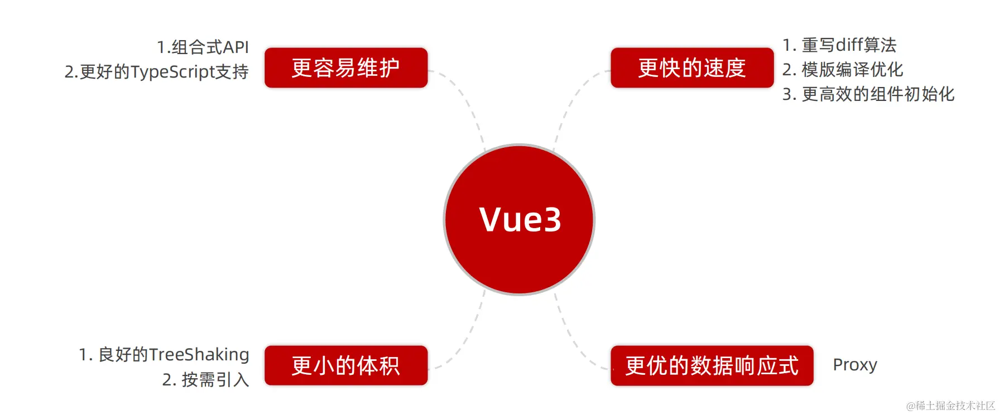

## 性能提升

打包大小减少 41%（支持 vite 打包工具，使得打包速度更快）

初次渲染快 55%，更新渲染快 133%

内存减少 54%

**使用 Proxy 代替 defineProperty 实现数据响应式**

**重写虚拟DOM的实现和Tree-Shaking**

## 打包优化 

> ​	Vue 3通过支持ES模块导入、利用Tree Shaking、移除不常用的特性以及拆分内部逻辑与懒加载等多种方式，实现了对打包体积的有效控制，提升了应用的加载速度和性能。

- 精确实现按需引入，减小打包体积：**支持 ES 模块导入**，使得打包工具可以静态分析模块依赖性并删除未使用的导出相关的代码。**采用函数式编程**，使得Vue3支持更好的Tree Shaking，在模板中实际使用了该功能时才导入该功能的帮助程序，可以过滤不使用的模块和没有使用到的组件。在Vue3中，任何一个函数，如ref、reactive、computed等，仅仅在用到的时候才打包，没用到的模块都被摇掉，打包的整体体积变小。而在 Vue2 中很多方法都是直接挂载在实例上，即使它们没有被显式使用，也可能会被打包进最终的构建产物中，导致体积增加
- **移除**了一些在 Vue2中存在但**不常用的特性**（如 filters过滤器，推荐使用计算属性或方法来实现相同的功能），有助于减小Vue 3核心库的体积，使得最终打包的应用更加轻量
- **拆分内部逻辑与懒加载**，对内部逻辑进行了更细致的拆分，并采用了懒加载的策略。只有当某个功能或组件被实际使用时，其对应的代码才会被加载和执行，有助于减少应用的初始加载时间，因为用户不需要等待所有功能都加载完成才能开始使用应用

## TreeShaking

> Vue3采用了ES模块（ESM）作为主要的打包和分发格式，这使得它能够充分利用现代JavaScript打包工具（如Webpack、Rollup等）的Tree Shaking功能。
>
> Tree Shaking可以移除JavaScript中未引用的代码，Vue3的API设计更加模块化，很多功能如`ref`、`reactive`、`computed`等都是通过函数式API提供的，只有在被实际引用时才会被包含进最终的打包文件中。这种设计显著减少了最终打包体积，因为它去除了那些未被实际使用的代码。

​	Tree Shaking是一个术语，用于描述通过静态分析找出项目中未使用的代码（死代码）并将其从最终打包文件中排除的过程。

- 工作原理：

① 静态分析：分析项目代码，利用ES6模块的静态结构特性，确定哪些模块和函数被实际使用。

②删除未使用代码：在打包过程中，删除未被使用的代码，只保留实际需要的部分。

- 让Tree-shaking生效的必要条件：使用ES6模块（import/export）；代码需静态，避免动态导入和执行；尽量使用纯函数和表达式，减少副作用。

​	在Vue 2中，许多功能（如指令、混入、过滤器等）是直接绑定到Vue实例或全局的，这导致即使这些功能在应用中未被使用，它们也可能被打包进最终的构建文件。而在Vue 3中，这些功能大多被设计为可按需引入的ES模块，使得Tree Shaking能够更有效地工作。

**Vue2中的Tree Shaking**：

- 源代码是使用CommonJS模块格式编写的，这种格式不支持现代打包工具（如Webpack或Rollup）的Tree Shaking功能。
- 这意味着，无论Vue项目中实际使用了哪些Vue特性，最终打包时都会包含Vue的整个库，包括那些未使用的部分。

**Vue3中的Tree Shaking**：

- 源代码被重写为使用ES Modules（ESM）格式，这是一种支持Tree Shaking的模块格式。
- 使用ES Modules，现代打包工具能够分析代码，并只包含那些实际被项目引用的Vue特性和组件，从而移除未使用的代码（即“死代码”）。
- 这种改进有助于减少最终打包文件的大小，加快应用的加载速度，提升用户体验。

## 编译优化

> ​	Vue3的编译器也进行了优化，以生成更高效、更轻量的代码，意味着编译后的代码体积更小，执行速度更快。例如，Vue 3的编译器会尝试识别并优化静态内容，以减少运行时的工作量。还引入了一些新的编译时特性，如Teleport和Fragments，这些特性在编译时就被处理，从而减少了运行时的开销。
>
> ​	Proxy 惰性响应式、静态提升、静态节点标记、动态追踪、PatchFlag 标记、diff 双端比较的优化、使用 Block tree、事件监听缓存优化

- **静态模板提升**：Vue 3在编译过程中会将模板中的静态内容（即在组件的整个生命周期内不会发生变化的部分）提升为常量，避免在每次渲染时重复创建相同的内容。这种优化减少了运行时的开销，提高了渲染性能。
- **PatchFlags**：采用 PatchFlags来标记模板中的动态节点，帮助Vue在更新DOM时更加高效地定位和处理变化。当模板中的数据发生变化时，Vue会使用虚拟DOM进行比对，但PatchFlags允许Vue跳过那些没有发生变化的节点，直接更新发生变化的节点，从而减少了不必要的DOM操作。

- **Block Tree**：采用 BlockTree 进行动态追踪和靶向更新，使用BlockTree来更高效地处理动态内容的更新，通过将模板划分为多个块（Block），可以更精确地定位并更新发生变化的DOM部分，避免在更新过程中对整个DOM树进行不必要的遍历和比对，从而提高了更新性能。

## 静态节点的优化

​	Vue3对Vue2进行了多方面的升级，其中在静态节点优化方面，引入了静态提升和静态节点标记等机制，以显著提高渲染性能和效率。同时，Vue3也支持服务端渲染（SSR），进一步优化了应用的整体性能。

### 静态提升

​	vue2无论元素是否参与更新，每次都会重新创建然后再渲染。vue3对于不参与更新的元素，会做静态提升，只会被创建一次，在渲染时直接复用即可。

> ​	在Vue2中，模板中的每个插值表达式（如`{{ name }}`）和指令（如`v-if`、`v-for`）都会在每次组件重新渲染时被动态解析和计算，无论模板的哪一部分是否实际发生了变化。而Vue3的编译器会静态分析模板，识别出哪些部分是静态的，并通过静态提升技术将其提升到编译阶段，作为常量或静态VNode（虚拟节点）存储在生成的渲染函数中，使得这些部分在组件的每次渲染中都不会被重新计算和创建。

​	Vue 3的编译器会检查模板中的节点，如果节点是纯静态的（即没有绑定任何动态数据或指令），那么这些节点就会被提升到render函数外部，并生成一个静态节点树。在渲染时，这些静态节点树可以直接被复用，而无需重新计算或渲染。通过静态提升可以避免每次渲染的时候都要重新创建这些对象，从而大大提高了渲染效率。

​	*举个例子：*

```html
<span>你好呀</span>
<div>{{ message }}</div>
```

​	*没有做静态提升之前：*

```typescript
export function render(_ctx, _cache, $props, $setup, $data, $options) {
  return (_openBlock(), _createBlock(_Fragment, null, [
    _createVNode("span", null, "你好呀"),
    _createVNode("div", null, _toDisplayString(_ctx.message), 1 /* TEXT */)
  ], 64 /* STABLE_FRAGMENT */))
}
```

​	*做了静态提升后：*

```typescript
const _hoisted_1 = /*#__PURE__*/_createVNode("span", null, "你好呀", -1 /* HOISTED */)

export function render(_ctx, _cache, $props, $setup, $data, $options) {
  return (_openBlock(), _createBlock(_Fragment, null, [
    _hoisted_1,
    _createVNode("div", null, _toDisplayString(_ctx.message), 1 /* TEXT */)
  ], 64 /* STABLE_FRAGMENT */))
}

// Check the console for the AST
```

​	*静态内容hosted_1被放置在render函数外，每次渲染的时候只要取hosted_1即可，同时hosted_1被打上PatchFlag,静态标记为-1，特殊标记是负整数表示永远不会用于Diff*

- 作用：

  ​	Vue3**在编译时会对模板进行静态分析，不参与更新的元素会做静态提升，并在渲染过程中缓存起来，只会被创建一次，在后续的渲染过程中直接复用，避免了重复创建节点**，大型应用会受益于这个改动，免去重复的创建操作，优化了运行时候的内存占用

  - 减少渲染时间：静态内容只会被创建一次，并在后续的渲染中直接复用，避免在每次渲染时重新计算和创建静态部分，显著提高了渲染性能
  - 优化内存使用：静态内容被存储在JavaScript堆内存中，而不是在DOM树中，有助于减少内存占用。静态部分只会被创建一次并存储在内存中，避免了在多次渲染中重复创建相同节点的开销
  - 提升代码清晰度：优化后的渲染函数更加简洁，去除了大量重复的静态内容生成代码。
  - 减少了render函数的复杂性和执行成本，因为静态节点不需要在每次渲染时都重新计算或创建

### 静态节点标记

​	在编译阶段，Vue 3的编译器会根据模板的静态结构和动态绑定等信息，通过PatchFlag对模板中的节点进行静态标记。被标记为静态的节点在后续的渲染过程中会被视为不需要重新渲染的节点，在运行时，diff算法可以跳过静态节点的比较和更新，直接复用它们，从而避免不必要的计算和DOM操作。这样，只有动态节点才会在数据变化时触发重新渲染，从而提高了渲染性能。

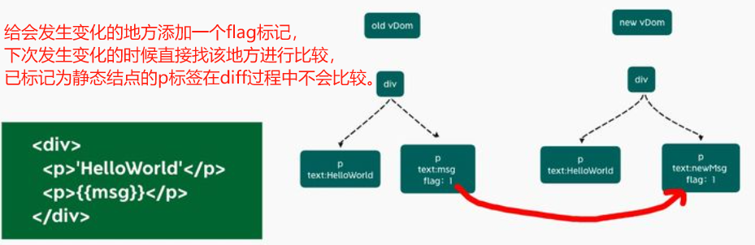

> ​	在编译过程中，Vue3会对模板中的节点**进行静态与动态的区分标记**，这实际上是**通过Patch Flag**等技术手段实现的。
>
> **Patch Flag**：巧妙结合 `runtime` 与 `compiler` 实现靶向更新和静态提升。
>
> - Vue 3在虚拟DOM节点上引入了Patch Flag，这些标记用于指示节点的某些部分在渲染过程中是否会发生变化。通过这种方式，Vue 3可以减少不必要的DOM比较和更新操作，仅对发生变化的部分进行渲染，从而进一步提高渲染效率。
> - `patchFlag` 是 `complier` 时的 `transform` 阶段解析 AST Element 打上的**优化标识**。并且，顾名思义 `patchFlag`，`patch` 一词表示着它会为 `runtime` 时的 `patchVNode` 提供依据，从而实现靶向更新 `VNode` 的效果。
>
> 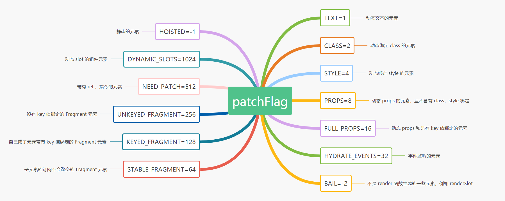
>
> ​	值得一提的是整体上 `patchFlag` 的分为两大类：
>
> ① 当 `patchFlag` 的值**大于** 0 时，代表所对应的元素在 `patchVNode` 时或 `render` 时是可以被优化生成或更新的。
>
> ② 当 `patchFlag` 的值**小于** 0 时，代表所对应的元素在 `patchVNode` 时，是需要被 `full diff`，即进行递归遍历 `VNode tree` 的比较更新过程。

- **目的**：优化虚拟DOM的渲染过程，将模板中的静态节点与动态节点进行区分，以便在后续的渲染过程中跳过不必要的虚拟DOM对比和渲染操作，仅对动态节点进行渲染
- **实现**：根据模板的静态结构和动态绑定信息，编译器对节点进行静态标记，以便在渲染过程中进行高效处理

### SSR优化

​	服务端渲染（SSR）是指将页面的渲染工作从客户端转移到服务器端，由服务器根据请求动态生成HTML页面并发送给客户端。Vue2 中也是有 SSR 渲染的，但是 Vue3 中的 SSR 渲染相对于 Vue2 来说，性能方面也有对应的提升。

- 当存在大量静态内容时，这些内容会被当作纯字符串推进一个 buffer 里面，即使存在动态的绑定，会通过模版插值潜入进去。这样会比通过虚拟 dmo 来渲染的快上很多。
- 当静态内容大到一定量级，会用`_createStaticVNode`方法在客户端去生成一个 static node，这些静态 node，会被直接 innerHtml，就不需要再创建对象，然后根据对象渲染。`_createStaticVNode`方法是一个内部 API，用于在编译时识别并标记那些不会变化的节点为静态节点，这些节点在服务器端渲染时会被直接转换为 HTML 字符串，并在客户端加载时通过 `innerHTML` 插入到 DOM 中，而无需创建虚拟 DOM 对象并进行复杂的渲染过程。通过减少客户端的渲染工作和资源消耗，显著提升了 SSR 和 SSG 应用的性能。

​	*举个例子：*

```html
<div>
	<div>
		<span>你好呀</span>
	</div>
	...  // 很多个静态属性
	<div>
		<span>{{ message }}</span>
	</div>
</div>
```

​	*编译后：*

```typescript
import { mergeProps as _mergeProps } from "vue"
import { ssrRenderAttrs as _ssrRenderAttrs, ssrInterpolate as _ssrInterpolate } from "@vue/server-renderer"

export function ssrRender(_ctx, _push, _parent, _attrs, $props, $setup, $data, $options) {
  const _cssVars = { style: { color: _ctx.color }}
  _push(`<div${
    _ssrRenderAttrs(_mergeProps(_attrs, _cssVars))
  }><div><span>你好呀</span>...<div><span>你好呀</span><div><span>${
    _ssrInterpolate(_ctx.message)
  }</span></div></div>`)
}
```

- **优点**

  更快的页面加载速度：由于初始HTML是在服务器端生成的，因此用户可以更快地看到页面内容
  更好的SEO优化：搜索引擎可以更容易地抓取和索引服务器端渲染的页面内容，从而提升页面在搜索结果中的排名
  减轻客户端负担：服务器端渲染可以减少客户端的渲染工作，降低客户端的资源消耗

- 实现方式

  使用Nuxt.js：Nuxt.js是一个基于Vue.js的服务器端渲染框架，提供了完整的服务器端渲染解决方案，包括路由管理、数据预取、组件渲染等

  配置与部署：开发者可以根据Nuxt.js的文档进行项目配置和部署，方便地实现Vue应用的服务器端渲染，从而提高应用的性能和SEO表现

## 动态节点的优化

> ​	Vue3 通过引入Proxy对象、优化虚拟DOM算法、支持静态标记和静态提升、缓存事件侦听器以及支持Fragment和Teleport等特性，实现了对动态节点的更高效优化。这些优化措施不仅提高了Vue应用的性能，还使得开发者能够更加方便地构建和维护Vue应用。

### 动态追踪

​	在Vue3中，动态追踪主要依赖于其响应式系统的改进。Vue3引入了Proxy对象来替代Vue2中的Object.defineProperty，以实现更加高效的响应式数据追踪。

1. Proxy的优势：
   - **全局拦截**：Proxy可以拦截对象属性的读取、设置、删除等多种操作，而不仅仅是属性的值变化。这使得Vue3能够更全面地追踪数据的变化。
   - **性能提升**：由于Proxy是代理整个对象，而不是像Object.defineProperty那样逐个属性地设置getter和setter，因此Vue3在初始化响应式对象时更加高效。
   - **支持数组和Map/Set等数据结构**：Proxy能够拦截数组和Map/Set等复杂数据结构的操作，使得Vue3能够更好地处理这些数据结构的变化。
2. 动态追踪的实现：
   - 当Vue3组件中的响应式数据发生变化时，Proxy会拦截到这些变化，并通知Vue的渲染系统重新渲染相关的组件。
   - Vue3的渲染系统会根据变化的数据和组件的依赖关系，智能地确定需要重新渲染的组件部分，从而实现高效的动态追踪。

### 动态节点标记

​	在Vue3中，虽然没有直接提及“动态节点标记”这一概念，但Vue3通过优化其虚拟DOM算法和渲染机制，实现了对动态节点的更高效处理。

1. 虚拟DOM的优化：
   - **静态标记（Patch Flag）**：Vue3在虚拟DOM节点上引入了静态标记（Patch Flag），这些标记用于指示节点的某些部分在渲染过程中是否会发生变化。通过这种方式，Vue3可以减少不必要的DOM比较和更新操作，提高渲染性能。
   - **静态提升（Hoist Static）**：对于不参与更新的静态节点，Vue3会在初始化时创建一次，并在后续的渲染过程中复用这些节点，而不是每次都重新创建。不仅减少了不必要的DOM操作，还优化了内存使用。
2. 事件侦听器缓存：
   - Vue3还优化了事件侦听器的处理机制。默认情况下，Vue会将事件侦听器视为动态绑定，并在每次渲染时都追踪其变化。但是，如果事件侦听器函数在多次渲染中保持不变，Vue3会将其缓存起来并复用，以减少不必要的性能开销。
3. Fragment和Teleport的支持：
   - Vue3还支持Fragment（多根节点组件）和Teleport（跨组件渲染），这些特性使得开发者可以更加灵活地构建组件，并在一定程度上优化动态节点的渲染和布局。

## 运行时优化

- **事件侦听器缓存**：当组件重新渲染时，如果事件处理器（即绑定到元素上的函数）没有发生变化，Vue 3会复用之前的事件监听器，而不是重新创建。这种缓存机制减少了DOM操作的次数，并降低了内存消耗，从而提高了事件处理的效率。
- **组件实例缓存**：Vue 3的`<keep-alive>`组件提供了一种缓存组件实例的方式。当组件被包裹在`<keep-alive>`中时，其状态或实例在组件切换时会被保留而不是被销毁。这意味着当组件再次被需要时，Vue可以快速地恢复其状态，而无需重新创建和初始化组件。这对于那些开销较大或需要频繁切换的组件来说，可以显著提高应用的性能和响应速度。
- **异步组件**：开发者可以定义一个异步组件，该组件在需要时才会加载其定义。这有助于减少应用的初始加载时间，因为用户只需要加载当前路由或视图中所需的组件。此外，当应用规模增大时，异步组件还可以帮助将代码拆分成更小的块，以便更好地进行管理和维护。
- **代码拆分**：Vue 3与Webpack等现代前端构建工具紧密集成，支持自动的代码拆分和懒加载。这意味着开发者可以将应用拆分成多个路由或功能块，并在用户访问相应页面或功能时按需加载它们。这种技术显著减少了应用的初始加载时间，并提高了应用的响应性和可用性。

## 事件监听缓存优化

​	在Vue3中，当组件被创建时，其内部会缓存特定类型的事件处理器。这意味着，如果你在组件的模板或方法中为某个元素（如`window`或`document`）绑定了事件监听器（如`@scroll`或`@resize`），Vue3会确保这些监听器只被创建一次，并在组件的整个生命周期内重用，避免了在每次组件渲染时都重新创建和销毁事件监听器的情况。默认情况下，当组件重新渲染时，如果事件监听器（如`@click`）**绑定在同一个元素上且监听函数没有变化**，Vue会**尽量重用**现有的事件监听器而不是重新添加。但在某些情况下，如果监听器函数本身发生了变化（例如，你绑定了一个计算属性或方法作为监听器，并且这个计算属性或方法的返回值在每次渲染时都不同），那么Vue可能需要重新添加监听器。

​	*举个例子：*

```html
<div>
  <button @click = 'onClick'>点我点点点点</button>
</div>
```

​	*没开启事件监听器缓存：*

```typescript
export const render = /*#__PURE__*/_withId(function render(_ctx, _cache, $props, $setup, $data, $options) {
  return (_openBlock(), _createBlock("div", null, [
    _createVNode("button", { onClick: _ctx.onClick }, "点我点点点点", 8 /* PROPS */, ["onClick"])
                                             // PROPS=1<<3,// 8 //动态属性，但不包含类名和样式
  ]))
})
```

​	*开启事件监听器缓存：*

```typescript
export function render(_ctx, _cache, $props, $setup, $data, $options) {
  return (_openBlock(), _createBlock("div", null, [
    _createVNode("button", {
      onClick: _cache[1] || (_cache[1] = (...args) => (_ctx.onClick(...args)))
    }, "点我点点点点")
  ]))
}
```

​	*开启缓存后，没有了静态标记，也就是说下次diff算法的时候直接使用，因为在Vue3的diff算法中，只有有静态标记的才会进行比较，才会进行追踪*

- 事件处理器缓存：Vue 3内部优化了事件处理器的缓存机制，确保相同的事件处理器在组件多次渲染时只被创建一次，避免了不必要的重复创建和销毁，从而减少了内存使用和垃圾回收的开销。
- 自动清理：当组件被销毁时，Vue 3会自动清理与该组件相关的所有事件监听器，防止内存泄漏。这种自动化的清理机制简化了开发者的工作，减少了出错的可能性。
- 性能提升：通过减少事件处理器的创建和销毁频率，Vue 3应用能够更快地响应用户交互，特别是在处理高频事件时，如滚动、拖拽等，提升了应用的性能和用户体验。
- 简化开发：开发者不再需要在组件销毁时手动移除事件监听器，Vue 3的自动管理机制让代码更加简洁和易于维护。

## 虚拟DOM优化

- **静态标记（Static Marking）**：Vue 3在虚拟DOM中使用了静态标记来跳过静态节点的比对和更新，进一步减少了不必要的操作。
- **更快的Diff算法**：Vue 3的Diff算法在保持原有功能的基础上，进行了多项优化，以减少不必要的遍历和计算。例如，通过PatchFlags等机制，Vue 3能够更精确地定位到需要更新的节点，并只对这些节点进行更新操作，从而避免了对整个DOM树的全面遍历和比对。这种更高效的Diff算法使得Vue 3在处理大型应用或复杂场景时，能够保持出色的渲染性能。

## 重写 diff 算法

> `diff` 过程在一定程度上是减少了对 `DOM` 的直接操作。但是，**这个减少是有一定成本的**。因为，如果是复杂应用，那么就会存在父子关系非常复杂的 `VNode`，而这也就是 `diff` 的痛点，它会不断地递归调用 `patchVNode`，不断堆叠而成的几毫秒，最终就会造成 `VNode` 更新缓慢。
>
> 这也是为什么我们所看到的大型应用诸如阿里云之类的采用的是基于「React」的技术栈的原因之一。
>
> Vue3也是痛改前非，重写了整个 `Compiler` 过程，提出了静态提升、靶向更新等优化点，来提高 `patchVNode` 过程。

​	Vue2中的虚拟dom是全量的对比（每个节点不论写死的还是动态的都会一层一层比较，浪费了大部分事件在对比静态节点上），其核心目的是通过最小化对真实DOM的操作来提高性能。基于两个树（旧树和新树）的递归比较算法。

​	Vue3新增了静态标记，为会发生变化的地方添加一个 flag 标记，下次发生变化的时候，与上次虚拟节点对比时，只对比带有patch flag的节点（动态数据所在的节点）；可通过flag信息得知当前节点要对比的具体内容，只对动态节点部分进行diff运算，减少了资源的损耗。 采用**同序列比对**和**最长递归子序列**的算法来计算出最小的修改偏移量。

​	diff 算法升级的一些关键点：

1. **静态提升**：Vue 3 的编译器在编译阶段（或预处理阶段）会分析模板，将在渲染过程中不会发生变化的静态内容（如纯 HTML）提升出渲染函数，这样在每次渲染时就不会重新创建这些静态节点，从而节省性能。
2. **静态标记**：与静态提升类似，Vue 3 还会对模板进行静态标记，将静态节点和动态节点进行区分。在 diff 算法中，Vue 3 可以跳过对静态节点的比较和更新，直接复用之前的 DOM 节点，减少了不必要的操作。

1. **块树**：引入了块树的概念，将模板编译成更小的单元（块），这些块可以独立地更新。这有助于减少每次渲染时需要重新比较的 DOM 数量。
2. **Patch Flags**：使用了 Patch Flags 来标记一个节点可能需要更新的类型（如属性、文本、子节点等）。这些标志在运行时被用来指导 diff 过程，从而只关注实际发生变化的部分，并跳过那些未改变的部分。
3. **Fragments 优化**：在 Vue 2 中，Fragments（片段）会引入额外的虚拟 DOM 层级，导致 diff 算法需要进行更多的比较操作。而在 Vue 3 中，对 Fragments 进行了优化，可以直接将其内部的内容合并到父级中，减少了虚拟 DOM 层级，提高了 diff 算法的效率。
4. **动态属性的快速路径**：通过快速路径优化了动态属性的处理。对于动态属性，Vue 3 会使用更快速的路径进行处理，减少了比较的开销，提高了 diff 算法的性能。
5. **缓存优化**：通过缓存事件处理器、计算属性等方式，避免了每次更新时重新计算或创建事件处理函数，减少了内存消耗和性能开销。
6. **更智能的子节点比对**：在 Vue 2 中，子节点的比对是基于索引的，这可能导致即使子节点的内容没有变化，只要它们的顺序发生了变化，就会触发大量的 DOM 更新。Vue 3 改进了这一点，它使用 `key` 来更智能地比对和移动 DOM 元素，减少了因节点顺序变化而导致不必要的额外 DOM 操作。
7. **双端对比策略**：Vue 3 的 diff 算法采用了双端对比的方式，它会同时从新节点和旧节点的两端进行对比，以尽可能少地进行操作来更新 DOM。这种策略有助于减少不必要的 DOM 变动，提高渲染效率。
8. **编译器优化**：Vue 3 的编译器进行了大量的优化，生成更高效、更轻量的渲染函数。这些优化包括代码拆分、作用域提升、条件表达式优化等，都有助于提高 diff 过程的效率。
9. **源码实现**：在 Vue 3 的源码中，diff 算法的实现主要集中在 `packages/runtime-core/src/renderer.ts` 文件中的 `patch` 函数及其相关辅助函数中。这些函数负责实际的 DOM 更新操作，并根据 Patch Flags 和其他信息来决定是否需要进行更新。

## **源码层面**

- vue2
  1. 源码作为一个整体的项目来管理，虽然内部通过目录结构对不同的功能模块（如核心库、编译器、模板编译器、服务器渲染器等）进行了逻辑上的划分，但这些模块在开发和维护时仍紧密关联于同一个仓库。
  2. 在 Javascript 中使用 flow 进行静态类型检测，但它对一些复杂场景的支持相对较弱，可能导致类型检查不够准确或完整。

- vue3
  1. 整个源码通过 `monorepo`单体仓库的方式维护，即将多个独立的项目（或包）放在同一个仓库中管理。根据功能将不同模块拆分到`packages`目录下面不同的子目录中，package（如 `reactivity` 响应式库、`runtime-core`、`runtime-dom`、`compiler-core` 等）可以独立于 Vue 使用。
  2. 使用typescript进行重构，对typescript支持更友好，提供了完整的类型定义，能够在编写 Vue 应用时享受到静态类型检查带来的好处，可以在编译阶段发现并修复许多潜在的错误，从而减少运行时错误的发生。TypeScript 的自动补全、错误提示等功能能够显著提升开发者的开发效率和体验。


## 新增特性/组件

### Fragment - 文档碎片（片段）

​	在 Vue2 中: 组件有且仅有一个根标签，当用户意外创建多根组件时会发出警告，为了修复此错误，许多组件被包装在一个`<div>`中。

```html
<!-- Vue2 -->
<template>
  <div>
    <header>...</header>
    <main>...</main>
    <footer>...</footer>
  </div>
</template>
```

​	在 Vue3 中: **允许组件有多个根节点**，Vue将为我们创建一个虚拟的Fragment节点，将多个标签包含在里面

```html
<!-- Vue3 -->
<template>
<div> 多读书多看报 </div>
<div> 少吃零食多睡觉 </div>
</template>
```

> 在Suspended-component完全渲染之前，备用内容会被显示出来。
>
> 如果是异步组件，Suspense可以等待组件被下载，或者在设置函数中执行一些异步操作。
>
> 多个根节点上的 Attribute 继承：需要显式定义 attribute 应该分布在哪里，否则控制台会给出警告提示。

​	优点：减少标签层级, 减小内存占用

1. 允许在Vue模板中返回多个元素，而无需添加额外的包裹元素(不再需要根标签)
2. 可以将多个元素作为Fragment的子元素来返回，并且Fragment本身不会被渲染到DOM中，避免引入不必要的父元素，减少标签层级，使得模板结构更加清晰， 减小内存占用

### Teleport - 瞬移组件的位置（传送）

> Teleport 提供了一种干净的方法，让组件的 html 在父组件界面外的特定标签(很可能是 body)下插入显示

1. 可以将组件的内容渲染到指定 DOM 节点，**允许将组件模板中的一部分HTML“传送”到DOM中的另一个位置**，只改变了渲染的 DOM 结构，不会影响组件间的逻辑关系，一般用于创建全局弹窗和对话框等组件
2. 允许我们将子元素渲染到DOM树的指定位置，而不是直接在当前组件的模板中渲染，对于需要在组件外的指定元素中渲染内容（比如弹出层、模态框等）非常有用，可以使用Teleport组件的to属性来指定目标元素的选择器或DOM节点

### Suspense - 异步加载组件的 loading 界面（不确定的）

> **允许组件在等待异步组件时渲染备用内容**，可以让我们创建一个平滑的用户体验

1. 提供了更优雅的方式来处理异步加载的组件，允许指定加载中和加载完成时渲染不同的内容
2. 允许在异步加载组件时显示一个占位符，直到组件加载完成，这个占位符可以是一个自定义的loading组件或者其他内容，当异步组件加载完成后，Suspense组件会自动替换占位符为实际组件

- Composition (组合) API
  - setup配置
  - ref 和 reactive
  - watch与watchEffect
  - provide 与 inject
  - …
- 新的生命周期函数

- 其它 API 更新
  - 新的API：**Vue3 使用 createApp 方法来创建应用程序实例，并有新的组件注册和调用方法**
  - **emits**属性：Vue3 的组件可以使用 emits 属性来声明事件
  - **新增了异步组件的写法**：`const Foo = defineAsyncComponent(() => import('./Foo.vue') )`
  - 全局 API 的修改
  - 将原来的全局 API 转移到应用对象
  - 模板语法变化

### 自定义渲染API

​	Vue2.x 项目架构对于 Weex（移动端跨平台方案）和 myvue（小程序上使用）等渲染到不同平台（跨平台渲染）不太友好，因为 Vue 2.x 的核心是为 Web 平台设计的，不同平台有不同的运行时环境和渲染机制，而 Vue 2.x 的核心库并没有直接支持这些差异。

​	Vue3.X 推出了自定义渲染API（也称为运行时核心或 `@vue/runtime-core`），允许开发者编写与平台无关的 Vue 代码，并通过不同的渲染器将这些代码转换为特定平台可以理解的格式，解决了该问题。

​	下面，我们先来看看Vue2和Vue3的入口文件写法有哪些不同。

​	Vue2：入口文件通常使用`new Vue({...})`来创建Vue实例，并挂载到DOM元素上。

```typescript
import Vue from 'vue'
import App from './App.vue'
new Vue({ render: h => h(App) }).$mount('#app') 
```

​	Vue3：引入了`createApp`函数，这个函数接受根组件作为参数，并返回一个应用实例，该实例提供了`.mount()`方法来挂载应用。

```typescript
const { createApp } from 'vue'
import App from "./src/App"
createApp(App).mount(('#app')
// 注意：对于非 Web 平台，你不会直接这样写，而是会使用相应的框架或插件提供的 API
```

​	Vue 官方提供的 `createApp` 函数默认是为 Web 平台设计的，它使用 Vue 的 DOM 渲染器将 Vue 组件的模板 template 映射并渲染成 HTML 代码。如果你希望将 Vue 组件渲染到非 HTML 元素上，比如 canvas，那么就需要使用一个自定义渲染器（Custom Renderer API）来定义自己的 render 渲染生成函数了。

```typescript
import { createApp } from "./runtime-render"; // 自己编写的为特定平台（如 Weex 或小程序）定制的，并且已经包含了必要的渲染逻辑和适配器
import App from "./src/App"; // 根组件
createApp(App).mount('#app');
```

​	使用自定义渲染API来构建跨平台应用，如Weex和myvue这类方案的问题就得到了完美解决，只需重写createApp（不推荐）即可。

​	实际上，对于Weex和小程序等特定平台，Vue社区已经提供了相应的框架或插件（如 Weex 自身的 Vue 运行时，Uni-app、MPVue等），这些框架已经内置了对这些平台的支持，并允许开发者以Vue的方式编写代码，而无需直接处理自定义渲染器（底层渲染逻辑）。

> ### 示例：重写`createApp`以支持自定义渲染
>
> ```typescript
> // 假设你有一个自定义渲染器createCustomRenderer  
> import { createRenderer } from 'vue/runtime-core'; // 注意：这是Vue内部API的简化表示  
>   
> // 自定义渲染器配置  
> const customRenderer = createRenderer({  
>   // ... 实现你的渲染逻辑  
> });  
>   
> // 封装createApp以使用自定义渲染器  
> function createCustomApp(rootComponent) {  
>   const app = createApp(rootComponent);  
>     
>   // 这里可以扩展app实例，添加自定义方法或属性  
>   // 或者直接使用自定义渲染器挂载应用  
>   // 注意：这里只是一个概念示例，实际实现可能会有所不同  
>   // app.mount = (container) => {  
>   //   customRenderer.mount(rootComponent, container);  
>   // };  
>   
>   // 由于Vue 3的createApp不直接支持更换渲染器，  
>   // 你可能需要在挂载时直接使用自定义渲染器的mount方法  
>   // 或者通过插件/mixin等方式在Vue应用中注入自定义行为  
>   
>   // 返回扩展后的app实例（或直接使用自定义挂载逻辑）  
>   return app;  
> }  
>   
> // 使用自定义的createCustomApp  
> import App from "./src/App";  
> createCustomApp(App).mount('#app'); // 注意：这里的mount可能需要替换为自定义的挂载逻辑
> ```
>
> **注意**：上面的代码是一个概念性的示例，用于说明如何结合Vue 3和自定义渲染逻辑。实际上，Vue 3的`createApp`函数并不直接支持更换渲染器，因此你可能需要采取其他方式（如插件、mixin或直接在Vue组件内部处理）来将Vue组件树映射到你的自定义渲染环境中。

## 语法API不同

- Vue2：
  - 选项式API，面向对象编程。OptionsAPI 在options里写data,methods,created等描述组件对象，多个逻辑可能在不不同地方，代码内聚性低
  - 逻辑复用：使用mixins进行代码逻辑共享，mixins也是由一大堆options组成，如果有多个mixins则可能造成命名冲突等问题，还会导致依赖关系不清晰
  - 集中化管理：Vuex通过集中式存储管理应用的所有组件状态，具有state、mutations、actions等核心概念
  - 异步操作：通常在Vuex的actions中处理异步操作，actions支持返回Promise，但组件内部的异步操作可能较为分散
  - 只支持一个根节点 ，在模板中如果使用多个根节点时会报错
  -  无法单独使用部分模块
  - 使用`new Vue()`创建实例同一个 Vue 构造函数创建的每个根实例共享相同的全局配置，因此全局 API 影响所有 vue 实例
  - 组件注册方式：使用`Vue.component(tagName, options)`方法进行全局注册，在Vue实例的`components`选项中进行局部注册
- Vue3：
  - 选项式API/组合式API，引入了Composition APl，可以将同一逻辑功能代码写在同一片区域，而不是分散在各个options里，更高效地组织和复用逻辑代码
  - 逻辑复用：支持将一部分独立可复用的逻辑代码抽离封装为特定功能函数（hook），使得组件之间逻辑的提取和重用变得更加简单，并避免命名冲突
  - 集中化管理：结合reactive、ref等API实现状态管理，或通过Pinia等库进行集中化管理
  - 异步操作：同样支持在Vuex的actions中处理异步操作，但更鼓励在组件内部直接使用async/await或Promise来处理异步操作，特别是在Composition API的`setup`函数中，这使得异步操作的处理更加直观和集中
  - 支持多个根节点，也就是 fragment，即可以直接在 template 中使用多个根级别的元素，而不需要额外的包装元素
  - 更注重模块上的拆分，模块之间耦合度低，可以独立使用，还对所有的 API 进行重写
  - 使用`createApp()`工厂函数创建实例，可以返回一个提供应用上下文的应用实例，不同的实例注册的组件无法在不同的实例下使用
  - 组件注册方式：通过`createApp`方法创建Vue应用实例，并使用该实例的`.component`方法进行全局注册，局部注册是在组件的`export default`选项中的`components`字段进行。`<script setup>` 提供了更简洁的编写方式，但组件的注册（无论是全局还是局部）仍然需要遵循Vue的注册机制
  - 面向函数编程，没有this，减少了this指向不明的情况，处处皆函数，会有更好的类型推断，当内部有异步函数，需要使用到await的时候，可以直接使用，不需要在setup前面加async
- 更好的TS支持
  - Vue2可能不适合使用TS，原因在于Vue2的Option API风格。**Options API是基于对象的结构，而TS是一种类型系统、面向对象的语法，两者有点不匹配。**在Vue2结合TS的具体实践中，要用 `vue-class-component` 强化 Vue 组件，让 Script 支持 TypeScript 装饰器，用 `vue-property-decorator` 来增加更多结合 Vue 特性的装饰器，最终导致 TS 的组件写法和 JS 的组件写法差异较大，增加了学习曲线。
  
  - 在Vue3中，量身打造了`defineComponent`函数，使组件在TS下可以更好地利用参数类型推断 。**Composition API代码风格更加符合函数式编程和TS的类型系统**，比较有代表性的api就是 ref 和 reactive，允许开发者显式地声明响应式数据的类型，从而提高了类型安全性和代码的可维护性。
  
- v-model 的本质变化
  - prop：value --> modelValue
  - event：input --> update:modelValue
  - .sync 修改符已移除，由v-model代替
  - v-if 优先 v-for 解析


## 组件通信的区别

- Vue3移出事件总线，使用mitt代替。
- vuex换成了pinia。
- 把.sync优化到了v-model里面了。
- 把$listeners所有的东西合并到$attrs中了。
- $children被砍掉了。

> - **Provide/Inject**：在Vue 3中，`provide` 和 `inject` API 得到了改进，允许跨组件层级传递数据，而不仅仅是父子组件之间。
> - **Composition API中的响应式引用**：在Composition API中，可以通过`ref`和`reactive`等API来创建响应式数据，并通过`toRefs`或`setup`函数的返回值来暴露给模板或其他Composition API函数使用。

## 生命周期

| vue2            | vue3              | 生命周期                    |
| --------------- | ----------------- | --------------------------- |
| beforeCreate()  | setup()           | 组件开始创建数据实例之前    |
| created()       | setup()           | 组件数据创建数据实例完成    |
| beforeMount()   | onBeforeAMount()  | DOM挂载之前                 |
| mounted()       | onMounted()       | DOM挂载完成（页面完成渲染） |
| beforeUpdate()  | onBeforeUpdate()  | 组件数据更新之前            |
| undated()       | onUpdated()       | 组件数据更新之后            |
| beforeDestroy() | onBeforeunmount() | 组件销毁之前                |
| destroyed()     | onUnmounted()     | 组件销毁之后                |


### vue2.x 的生命周期

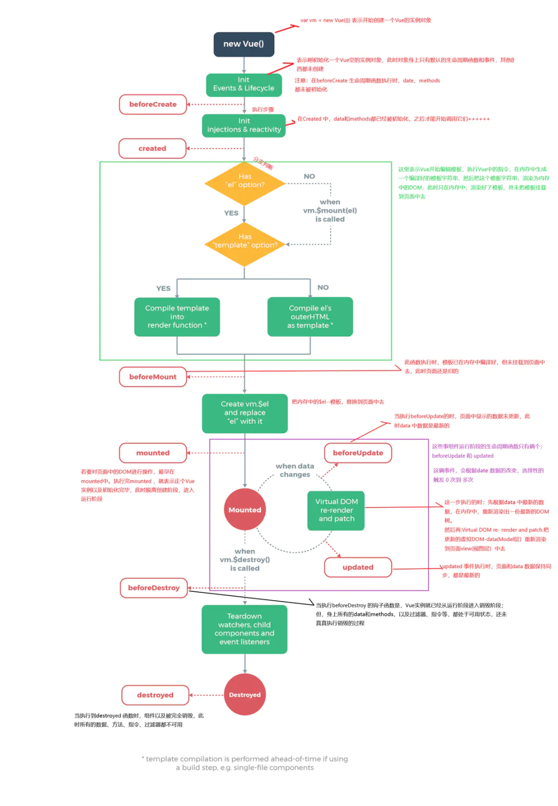

### vue3.0 的生命周期


## 响应式系统

> ​	vue2采用的是defineProperty来劫持整个对象，然后进行深度遍历所有属性，给每个属性添加gette、setter实现响应式；而vue3采用proxy重写响应式系统，因为proxy可以对整个对象进行监听，不需要深度遍历。

### 数据劫持

- Vue 2 使用基于 Object.defineProperty 的响应式系统，不能检测对象属性的添加和删除，对于数组和对象的修改需要特定的方法来触发更新，对一个嵌套层级较深的对象，需要通过遍历来劫持它内部深层次的对象变化。
- Vue 3 使用Proxy 对象来实现响应式系统，支持更深层次的响应式，无需特定方法来触发更新，对深层嵌套对象进行惰性响应式（只有在数据被实际访问时才会进行响应式处理）。

> ​	所谓的**数据响应式**就是建立响应式数据与依赖（调用了响应式数据的操作）之间的关系，当响应式数据发生变化时，可以通知那些使用了这些响应式数据的依赖操作进行相关更新操作，可以是DOM更新，也可以是执行一些回调函数。

| 特性              | Vue2                                   | Vue3                                     |
| ----------------- | -------------------------------------- | ---------------------------------------- |
| 实现方式          | 基于`Object.defineProperty`            | 基于`Proxy`对象                          |
| 依赖收集          | 使用Watcher机制                        | 使用Proxy的拦截能力和依赖关系图          |
| 新增/删除属性监听 | 需要手动使用`Vue.set`或`this.$set`     | 自动监听                                 |
| 数组变化监测      | 有限支持（如直接修改索引值不触发更新） | 全面支持                                 |
| 性能与灵活性      | 相对较低，对复杂数据结构的支持有限     | 更高，支持更复杂的数据结构和动态属性添加 |

**Object.defineProperty 实际上是 JavaScript 对象的一个内置方法，而 proxy 是针对整个对象及其所有基本方法的拦截器，这是最本质的区别！**

- Vue2底层是通过 ES5 的 Object.defineProperty() 进行数据劫持，结合订阅发布的方式实现，有一定的局限性。性能差的原因是需要**递归地对所有的属性进行拦截**，重写 getter 函数和 setter 函数，而且只能对已经存在的属性进行劫持，**监听不到属性的删除和新增**。

  缺点：

  ①对数组更新的时候无法实现响应式，它内部有一个this.$set去实现
  
  ②如果响应式定义的数据层级比较深（对象里面还有对象），它内部是通过递归的形式去实现的；如果属性是在对象创建后动态添加的，那么这些属性将不是响应式的，除非显式地使用 Vue 提供的方法

> - 还有很多情况是监听不到的，因为 defineProperty 只能劫持已有的属性，对于新增属性和删除属性是拦截不到的，必须额外通过 **$set、 $delete** 这些 API 来手动触发页面的更新，给开发者增加了负担。
> - **Vue2 中，数组不采用 defineProperty 来进行劫持 （因为对所有索引进行劫持会造成性能浪费），需要对数组单独进行处理。**同时无法监控到数组的长度的变化，同样也是需要使用 $set 来处理。

- Vue3底层是通过 ES6 的 Proxy 代理的方式重写了响应式系统，因为 proxy 可以**对整个对象进行监听**，所以不需要深度遍历。 

  它解决了Vue2底层实现的缺点，对数组、层级比较深的对象处理都很优秀

  缺点：浏览器兼容不是很好

> - **它不需要对所有属性重写 getter 和 setter，还能监听到属性的删除和新增，**使用ref或者reactive将数据转化为响应式数据，能够更好地支持动态添加属性和删除属性。
> - **可以直接监听数组的变化**，在内部实现上进行了大量的优化，使得渲染速度更快，内存占用更少。包括ES6中的新增的 set 和 map 也支持了。

以下是对两者响应式原理的详细对比：

### Vue2 的响应式原理

​	Vue2的响应式原理是基于`Object.defineProperty`方法实现的。这一方法允许对象中的属性被赋予getter和setter函数，从而实现对属性的访问和修改进行拦截。但这种方法有一些限制，比如不能监听数组的变化（除了`push`、`pop`等七个方法外），以及对象属性的添加或删除。

​	在组件实例化过程中，Vue会对数据对象（data）**进行递归地遍历**，**将每个属性都转换为getter/setter**，并且为每个属性创建一个依赖追踪的系统。当属性被访问或修改时，getter/setter会触发依赖追踪系统，从而进行依赖收集和派发更新，以保证数据和视图的同步。

> ​	具体实现步骤如下：
>
> 1. 创建Observer对象：通过递归地将data对象的属性转换为响应式属性，**使用Object.defineProperty()为每个属性添加getter和setter方法**。Vue2中 通过使用 Object.defineProperty() 方法，将对象的属性转换成 getter 和 setter，**当数据发生变化时，会自动触发相应的更新函数，实现数据的响应式**。
>
>    - 数据劫持：在Vue初始化时，Vue会遍历data中的所有属性，并使用`Object.defineProperty`将这些属性转化为getter和setter。由于vue2是针对属性的监听，所以就必须要去**深度遍历**每一个属性。
>    
>    - Getter与Setter：
>    
>      Getter：在getter中，Vue会收集对数据的依赖。当一个属性被读取时，会触发getter，并把对应的依赖（Watcher）添加到依赖列表中。
>    
>      Setter：在setter中，Vue会监听到属性的变化。当一个属性被赋新值时，会触发setter，然后通知依赖列表中的Watcher执行更新。
>
> 2. 创建Dep对象：用来管理 Watcher，它用来收集依赖、删除依赖和向依赖发送消息等。用于解耦属性的依赖收集和派发更新操作。
>
> 3. 创建Watcher对象：Watcher对象用于连接视图和数据之间的桥梁，**当被依赖的属性发生变化时，Watcher对象会接收到通知并更新视图**。当数据发生变化时，它会通知订阅该数据的组件更新视图。Watcher 在实例化时会将自己添加到 Dep 中，当数据发生变化时，会触发相应的更新函数。
>
> 4. 模板编译：Vue会解析模板，将模板中的数据绑定指令转译为对应的更新函数，以便在数据发生变化时调用。
>
>    - Watcher这个机制用来收集依赖和触发更新。每个组件实例都会对应一个Watcher对象，用来管理该组件所依赖的属性。当组件中的数据被访问时，会触发对应的getter，并将该组件的Watcher添加到依赖列表中。
>    - 在修改对象的值时，会触发对应的setter，setter通知之前依赖收集得到的依赖列表Dep中的所有Watcher，告诉它自己的值改变了，需要执行更新操作，重新渲染视图。这时，这些 Watcher就会开始调用update来更新视图，对应的getter触发追踪，把新值重新渲染到视图上。
>

​	限制：

- Vue2的响应式系统仅对已经存在的属性进行劫持（且在created()之前就完成了监听），**新添加的属性或删除的属性不会被响应式监听**。

   - 新增属性的响应问题：Vue.set 方法或 this.$set：向响应式对象中添加一个 property，并确保这个新 property 同样是响应式的，且触发视图更新。它必须用于向响应式对象上添加新 property，因为Vue 默认只能检测到那些在初始化时就已存在的属性的变化，无法探测普通的新增 property。
   - 对象属性的删除问题：①Vue.delete 方法或this.$delete：用来删除对象的属性，并触发响应式更新（很少用到）。eg：使用Vue.delete(vm.someObject, ‘propertyToDelete’)来删除一个属性。②正常的delete方法，虽然确实删除了属性，但是无法被监测到。

- **对数组拦截有问题**，对于数组的操作（如直接通过索引修改数组元素），无法直接进行响应式处理。如果通过数组下标修改对象属性的话是可以监测的，因为对象内部属性都是响应式的，但如果通过数组下标修改普通元素是无法监测到的。无法监控到数组的长度的变化。
   - 使用数组变异方法：Vue提供了一些数组变异方法（push、pop、shift、unshift、splice、sort、reverse），这些方法主要集中在数组长度变化的操作，会触发数组的响应式更新（因为 Vue 在内部对这些方法进行了重写，以便在它们被调用时能够触发依赖的更新）。如果不是这7个方法的话（比如调用slice、map、filter等会返回一个新的数组，而不会修改原始数组），记得要将返回的新数组覆盖掉原始数组，依然能触发响应式。
   - 利用Vue.set方法：该方法不但能解决对象新增属性的问题，还能解决修改数组的问题（用的不多），但主要用于对象属性的添加或修改。
   - 替换整个数组：如果需要修改多个数组元素，并且想要确保这些修改都能被 Vue 检测到，可以考虑创建一个新数组，其中包含所有修改后的元素，然后用这个新数组替换原来的数组。

- defineProperty方案**在初始化时候**，**需要深度递归遍历待处理的对象才能对它进行完全拦截**，明显增加了初始化的时间。

```typescript
	Object.defineproperty 初始化的时候拦截对象，设置为get和set属性
const obj = {
  name: "wxs",
  age: 25,
};
Object.entries(obj).forEach(([key, value]) => {
  Object.defineProperty(obj, key, {
    get() {
      return value;
    },
    set(newValue) {
      console.log(`监听到属性${key}改变`);
      value = newValue;
    },
  });
});
obj.name = 'vivien';
obj.age = 22;
obj.sex = "female";
	输出结果 => 监听到属性name需要改成vivien、监听到属性age需要改成22、监听不到属性sex
```

### Vue3 的响应式原理

​	Vue3的响应式原理相较于Vue2有了较大的改进，它基于ES6中的`Proxy`对象来实现响应式数据的双向绑定，Object.defineproperty是劫持所有对象的属性设置为getter、setter，然后遍历递归去实现，而proxy则是代理了整个对象，**可以对整个对象进行监听，不需要深度遍历**。

​	优点：

- **能对数组进行拦截，可以监听到数组索引和数组length属性，还能对Map，Set实现拦截**，不再进行数组原型对象上重写数组方法
- proxy是懒处理行为，即**只有在被访问或操作时才会触发相应的拦截器**，也使之初始化速度和内存得到改善
- 对象新增的属性不需要使用$set添加响应式，因为proxy**默认会监听动态添加属性和删除属性等操作**，vue2使用Object.defineproperty拦截对象的get和set属性进行操作，而proxy有着13种拦截方法（例如get/set属性、apply、construct、deleteProperty、getOwnPropertyDescriptor、getPrototypeOf、isExtensible、ownKeys、preventExtensions、setPrototype等），这些使得Proxy在处理对象属性时更加灵活和强大

​	缺陷：

- Proxy API 并**不能直接监听到内部深层次的对象变化**：它拦截的是对代理对象的**直接操作**，如果对象内部有深层次的结构，比如嵌套的对象或数组，并且这些内部对象的变化是**通过内部引用间接进行**的，那么Proxy API无法直接捕获这些变化
- 要监听内部深层次的对象变化，开发者需要手动**递归地**为每一层内部对象创建一个新的Proxy，并在陷阱函数（如`get`、`set`等）中实现相应的逻辑、
- 存在兼容性问题，IE不支持

> ​	原理：
>
>
> 1. Proxy对象：可以理解成在目标对象之前架设一层“拦截”，外界对该对象的访问都必须先通过这层拦截，因此提供了一种机制，可以对外界的访问进行过滤和改写，Proxy对象允许我们在访问和修改对象属性时拦截并执行自定义的操作。（在Vue3中，使用`reactive`函数来创建一个响应式的数据对象。这个函数接收一个普通的JavaScript对象，并将其转化为Proxy对象）
> 2. 依赖收集和属性代理：
>    - 当我们访问响应式数据对象的属性时，Proxy对象会拦截这个操作，并建立一个依赖关系，将这个属性和正在访问它的地方关联起来
>    - 当我们修改响应式数据对象的属性时，Proxy对象同样会拦截这个操作，并通知所有依赖于这个属性的地方进行更新
> 3. 高效依赖追踪：Vue3使用了一个称为“依赖收集”的技术，可以更高效地进行依赖追踪。在访问响应式数据对象的属性时，Vue3会将正在访问这个属性的地方收集起来，并建立一个依赖关系图。当属性发生变化时，Vue3会根据这个依赖关系图，只更新那些真正依赖于这个属性的地方
>    - 由vue2的响应式原理可以看出，vue底层需要对vue实例的返回的每一个key进行get和set操作，无论这个值有没有被用到。所以在vue中定义的data属性越多，那么初始化开销就会越大。而proxy是一个惰性的操作，它只会在用到这个key的时候才会执行get，改值的时候才会执行set。所以在vue3中实现响应式的性能实际上要比vue2实现响应式性能要好
> 4. 灵活性和深度追踪：Vue3的响应式系统更加灵活和高效。它能够在初始化时追踪到动态添加的属性，并且能够进行深层次的依赖追踪，而不仅限于对象的顶层属性
>

```typescript
	proxy 初始化的时候，有使用这个key值则get一下，有设置这个key值则set一下
const obj = {
    name:'wxs',
    age:25
}
const prxoyTarget = new Proxy(obj,{
    get(target,key){
        return target[key]
    },
    set(target,key,value){
        console.log(`监听到属性${key}需要改成${value}`)
        target[key] = value
    }
})
prxoyTarget.name = 'vivien'
prxoyTarget.age = 22
prxoyTarget.sex = 'female'
	输出结果 => 监听到属性name需要改成vivien、监听到属性age需要改成22、监听到属性sex需要改成female
```

- vue2： 假如设置了obj:{a:1} ，若是给obj对象添加一个b属性值，直接在methods之中使用方法 obj.b = 2，导致的问题是：数据有更新，但是视图没有更新（ 需要使用this.$set()方法去设置b属性为响应式属性值，才能支持试图更新 ）【原因： object.defineProperty对于后期添加的属性值是不参与劫持设置为响应式属性的】

- vue3： 直接使用reactive定义对象，则当前对象为响应式对象，对于obj.b = 2 视图会更新！【原因：new Proxy对于后期添加的属性值是依旧走proxy内的set和get】

# 二、核心实现

## 虚拟 DOM 渲染

​	组件是一个抽象的概念，它是对一棵 DOM 树的抽象，组件的渲染取决于组件的模板。组件的模板决定了组件生成的 DOM 标签，而在 Vue 内部，一个组件想要真正的渲染生成 DOM，还需要经历 “创建 vnode - 渲染 vnode - 生成 DOM” 这几个步骤

1. 应用程序初始化：创建 app 对象和重写 app.mount 方法

```typescript
const createApp = (...args) => {
  // 创建 app 对象
  const app = ensureRenderer().createApp(...args)
  const { mount } = app
  // 重写 mount 方法
  app.mount = containerOrSelector => {
    // ...
  }
  return app
}
```

2. 创建 vnode：**组件 vnode 其实是对抽象事物的描述**，将 DOM 使用 JavaScript 对象来描述，可以描述不同类型的节点，比如普通元素节点、组件节点等
3. 渲染 vnode：渲染组件生成 subTree、把 subTree 挂载到 container 中。通过 reder 函数创建组件树 vnode，把这个 vnode 再经过内部一层标准化，得到子树 vnode
4. 挂载元素函数：创建 DOM 元素节点、处理 props、处理 children、挂载 DOM 元素到 container 上

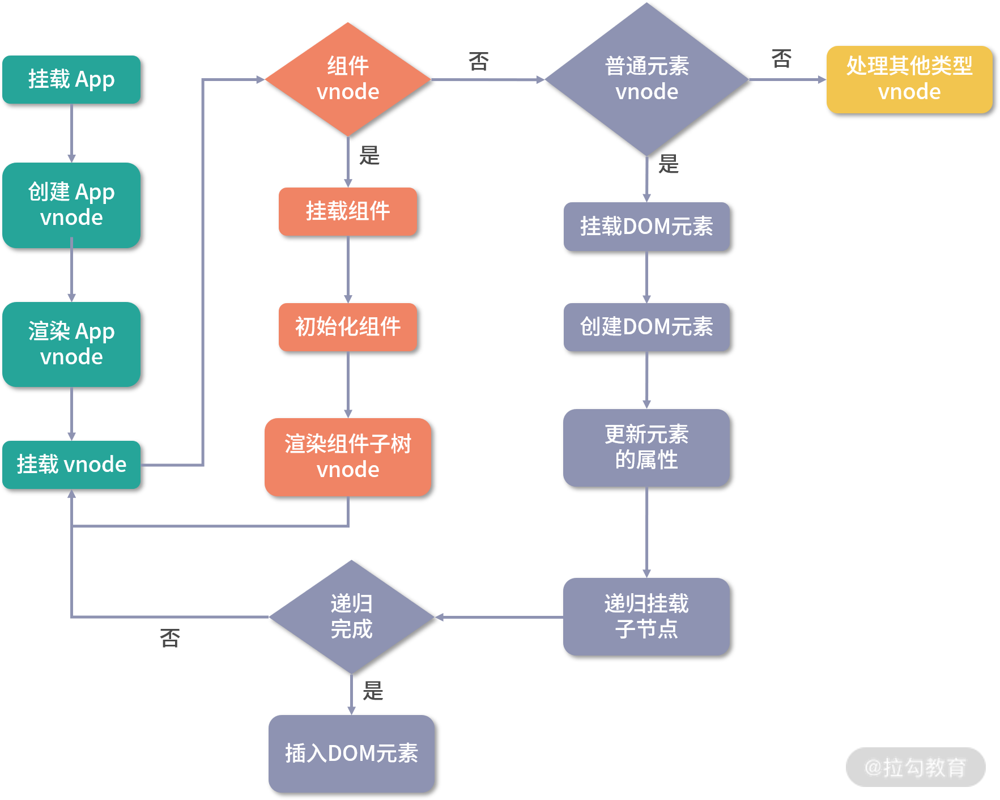

## diff 流程

​	**Diff 算法，在 Vue 里面就是叫做 `patch` ，它的核心参考Snabbdom，通过新旧虚拟 DOM 对比(即 patch 过程)，找出最小变化的地方转为进行 DOM 操作**。在已知旧子节点的 DOM 结构、vnode 和新子节点的 vnode 情况下，以较低的成本完成子节点的更新为目的，求解生成新子节点 DOM 的系列操作。

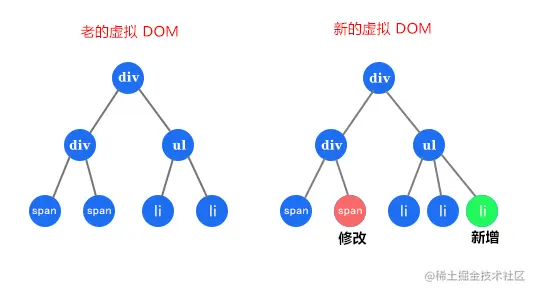

1. 同步头部节点：就是从头部开始，依次对比新节点和旧节点，如果它们相同的则执行 patch 更新节点；如果不同或者索引 i 大于索引 e1 或者 e2，则同步过程结束。可以看到，完成头部节点同步后：i 是 2，e1 是 3，e2 是 4。

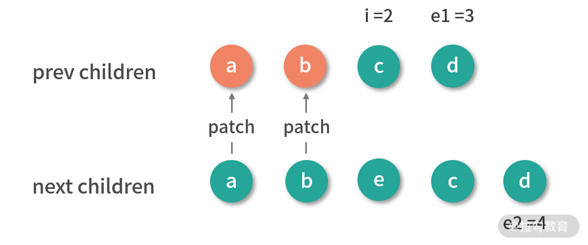

2. 同步尾部节点：就是从尾部开始，依次对比新节点和旧节点，如果相同的则执行 patch 更新节点；如果不同或者索引 i 大于索引 e1 或者 e2，则同步过程结束。可以看到，完成尾部节点同步后：i 是 2，e1 是 1，e2 是 2。


​	接下来只有 3 种情况要处理：

- 新子节点有剩余要添加的新节点；
- 旧子节点有剩余要删除的多余节点；
- 未知子序列。

3. 添加新节点：首先要判断新子节点是否有剩余的情况，如果满足则添加新子节点。

   - 如果索引 i 大于尾部索引 e1 且 i 小于 e2，那么从索引 i 开始到索引 e2 之间，我们直接挂载新子树这部分的节点。

   - 对我们的例子而言，同步完尾部节点后 i 是 2，e1 是 1，e2 是 2，此时满足条件需要添加新的节点。

     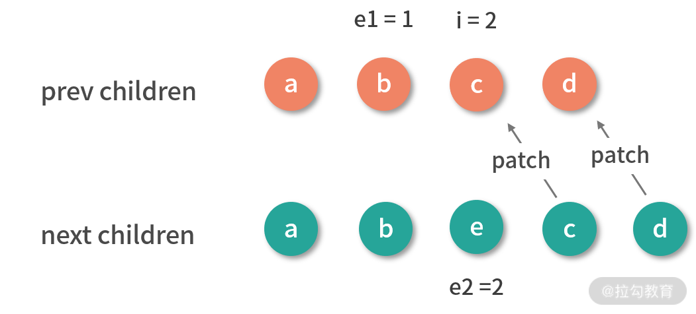

   - 添加完 e 节点后，旧子节点的 DOM 和新子节点对应的 vnode 映射一致，也就完成了更新。

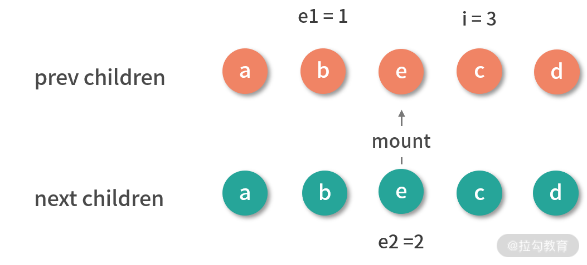

4. 删除多余节点：如果不满足添加新节点的情况，我就要接着判断旧子节点是否有剩余，如果满足则删除旧子节点。

- 从头部同步节点：

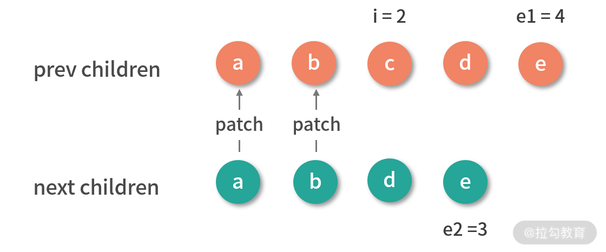

- 接着从尾部同步节点：
  - 此时的结果：i 是 2，e1 是 2，e2 是 1，满足删除条件，因此删除子节点中的多余节点。


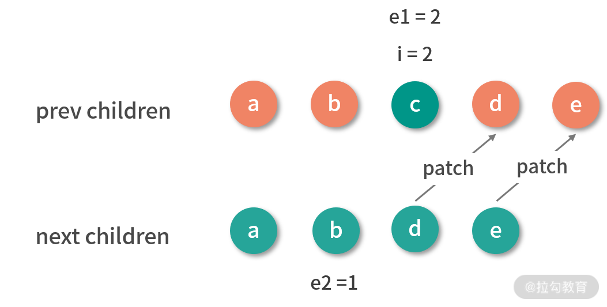

- 删除子节点中的多余节点：
  - 删除完 c 节点后，旧子节点的 DOM 和新子节点对应的 vnode 映射一致，也就完成了更新。


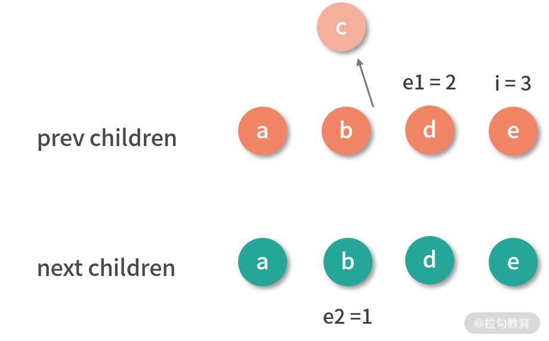

- 旧子节点的 DOM 和新子节点对应的 vnode 映射一致，也就完成了更新。
