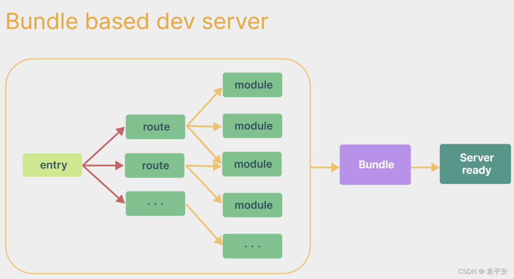

## 使用 vue-cli 创建

```bash
# 安装或者升级
npm install -g @vue/cli
# 保证 vue cli 版本在4.5.0以上
vue --version
# 创建项目
vue create my-project
cd my-project
npm run serve
```

## 使用 vite 创建

```bash
npm init vite-app <project-name>
cd <project-name>
npm install
npm run dev
```

- vite 是一个由原生 ESM 驱动的 Web 开发构建工具。在开发环境下基于浏览器原生 ES imports 开发

- 它做到了**本地快速开发启动**，在生产环境下**基于 Rollup 打包**

  - 快速的冷启动，不需要等待打包操作

  - 即时的热模块更新，替换性能和模块数量的解耦让更新飞起

  - 真正的按需编译，不再等待整个应用编译完成

​      webpack构建与vite构建对比图如下:



