​        在看任何开源库的源码之前，必须先了解它有哪些功能，这样才能针对性地分模块阅读源码。

# Vue CLI 简介

​         Vue CLI是Vue.js的官方命令行工具，它是一个基于Vue.js进行快速开发的完整系统。

​        通过Vue CLI，开发者可以快速搭建和开发Vue.js项目，提供了一整套完整的项目脚手架，包括项目初始化、开发服务器、构建工具等。

​      是一个交互式的项目脚手架，通过简单的命令行界面，开发者可以快速创建一个新的Vue.js项目，并且会自动配置好项目的基本结构和依赖，让开发者可以直接开始编写代码。

​      它还内置了一个开发服务器，可以在本地快速启动一个开发环境，并提供了一个强大的构建工具，可以将Vue.js项目打包成静态文件，用于部署到生产环境。

# 什么是脚手架？

​        脚手架在前端工程化中扮演着非常重要的角色。它不仅是一个快速生成项目结构的工具，更是一个完整的解决方案，为前端项目的整个生命周期提供了支持。

​        使用脚手架可以快速地使用配置好的模板来初始化一个新的项目，避免了手动创建项目结构和配置文件的繁琐过程。脚手架提供的模板通常是经过优化和配置的，包含了前端开发所需的各种文件和目录结构，例如代码、资源、测试等。

​        提供了一系列工具和规范以便更好地管理前端项目。这些工具和规范涵盖了前端项目的生命周期，包括搭建、开发、测试、部署等各个阶段，可以有效提高开发效率和质量。通过脚手架，开发人员可以避免做重复工作，更加专注于业务逻辑的实现，而不需要花费过多的时间和精力在项目的构建和管理上。

# 为什么要用脚手架？

​        使用脚手架的主要原因是为了提高开发效率和简化项目结构。随着前端技术的不断发展，项目的复杂性和规模也在逐渐增加，手动创建和管理项目变得越来越困难和耗时。脚手架作为前端工程化的解决方案，为开发人员提供了一种快速、高效的方式来初始化和管理项目。

​        脚手架的发展历程也反映了前端开发的演变和进步。

​       手动创建和配置项目。通过手动创建.html, .css, .js 文件，在 .html 里引入.css和.js文件。效率低下且容易出错。

​       模板托管。将项目模板代码托管到Git/SVN仓库等版本控制系统中，通过手动拉取和修改来快速创建项目。仍然存在一些繁琐的步骤和潜在的错误风险。

​       自动化脚本。通过自动化脚本可以快速拉取模板、配置项目信息等，减少手动操作的错误和时间。通常需要一定的技术门槛，且可扩展性和灵活性相对较低。

​       完整的脚手架。通过命令行 `vue-cli/ create-react-app` 初始化项目，为开发人员提供了一个更高级、更完整的解决方案。可以快速初始化项目、选择模板、配置插件等，大大简化了项目初始化的过程。同时，脚手架还提供了对前端项目生命周期的支持，包括开发、测试、部署等各个环节的工具和规范。

​       自定义扩展。在 Vue CLI 这种脚手架的基础上个性化定制，接入自定义模板、自动化 Git 流程等功能。通过可视化的交互和扩展性，开发人员可以根据自己的需求进行定制化的模板、插件等开发，实现更灵活、更高效的项目管理。

# 脚手架能解决什么核心问题？

​         脚手架解决的核心问题就是——帮助开发者更方便地初始化项目，从而提高开发效率和质量。这也就是为什么需要脚手架。

​        以前，初始化一个项目的流程较为繁琐复杂，而现在可以快速搞定；

​        同时，基于一套通用模板搭建多个系统，相同的项目结构有利于后期维护；

​        最后，针对重复性的工作实现自动化，如创建文件、配置项目信息等。

# Vue CLI 的核心思想

​        核心思想主要有2个，分别是预设管理和灵活的插件系统。

### 预设管理

​        在CLI内部，通过一个统一的实例对prompt（终端交互/提示）和preset（预设）进行管理。在初始化时，这些用于终端交互的配置就初始化在内存中，根据用户的选择触发不同的逻辑。

​       当用户运行vue create命令时，CLI会根据预设的配置进行初始化工作。用户可以根据提示选择不同的预设选项，这些选项会触发不同的逻辑，例如选择特定的插件、配置文件等。预设管理还允许开发者自定义预设，以适应不同的项目需求。

> ​        在源码中，Creator类负责初始化项目的过程。它使用一个预设管理器来加载和管理预设，并根据用户的选项和预设配置生成最终的项目结构。预设管理器会根据预设的配置生成一系列的提示，然后根据用户的输入和预设配置创建项目的骨架。

### 插件系统

​        将CLI的逻辑和生成代码的逻辑解耦，通过不同的插件去修改文件内容和配置，生成最终的代码。CLI插件是向Vue项目提供可选功能的npm包，可以集成Babel/TypeScript转译、ESLint、单元测试等功能。

​        当用户在项目内部运行`vue-cli-service`命令时，它会自动解析并加载package.json中列出的所有CLI插件。通过插件系统，开发者可以定制自己的项目配置，以满足特定的需求。

> ​        在源码中，Generator类负责生成最终的项目代码。它使用一个插件管理器来加载和管理插件。当用户选择特定的插件时，插件管理器会解析并加载相应的插件。插件可以修改生成代码的内容和配置，例如添加特定的文件、修改文件内容等。根据预设配置和插件修改的内容生成最终的项目代码。

# Vue CLI 交互流程

​        Vue CLI的整体交互也就是prompt的实现。Vue CLI将所有交互分为四大类：

​        从预设选项到具体feature选项，它们是一个层层递进的关系，不同的时机和选择会触发不同的交互。Vue CLI将各个交互维护在不同的模块中，通过一个统一的promptAPI实例，在Creator实例初始化时，插入到不同的prompt中，并且注册各自的回调函数。这样设计对于prompt而言是完全解耦的，删除某一项prompt 对于上下文几乎没有影响。

# 分析源码

​        围绕上面两个核心思想进行源码分析，源码中涉及到的核心类就是Creator和Generator。

## 整个生命周期

| 1    | 执行vue create                                  |
| ---- | ----------------------------------------------- |
| 2    | 实例化Creator，挂载所有交互配置                 |
| 3    | 调用creator实例上的create方法                   |
| 4    | 询问用户的自定义配置                            |
| 5    | 实例化Generator                                 |
| 6    | 初始化各种插件                                  |
| 7    | 执行插件的generator逻辑，写入package.json文件等 |
| 8    | 将文件写入硬盘，此时项目初始化完毕              |

## 用法

​        安装Vue CLI：首先，确保系统中已经安装了Node.js和npm。然后，通过npm全局安装Vue CLI。在终端中运行以下命令：

```bash
npm install -g @vue/cli
```

​       创建新项目：使用Vue CLI创建新的Vue项目。在终端中运行以下命令，并按照提示选择所需选项：

```bash
vue create my-project
```

​        通过预设和提示来统一管理用户在初始化项目时的交互。

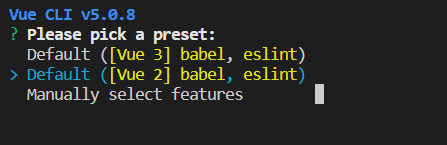

​        可以根据自己的项目需求(可以选择使用Babel进行转译，或者使用TypeScript来编写代码。你还可以选择是否集成ESLint、单元测试等其他功能)来自定义项目工程配置，这样会更加的灵活。

​       在选择完配置后，CLI会执行一系列命令来初始化项目。它首先会安装项目的依赖项，然后拷贝预设的模板文件到项目目录中。这些模板文件包含项目的基本结构和配置，使开发者可以快速开始开发工作。

## 入口

​        我们可以在@vue/cli/package.json里找到入口文件位置。

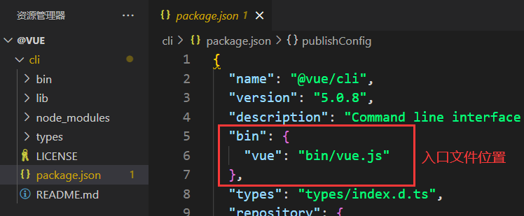

​    vue create命令的入口在@vue/cli/bin/vue.js中。可以看到，里面注册了create、add、ui等命令，vue使用commander库定义命令的配置项，并在配置中指明命令的执行文件。

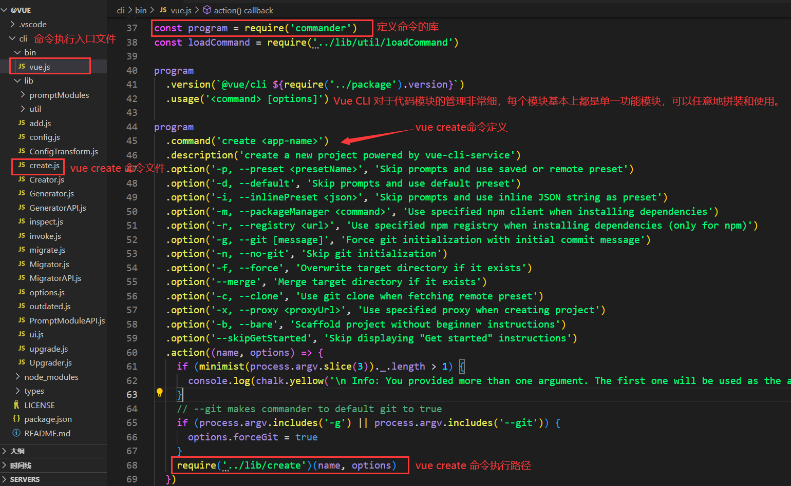

​       @vue/cli/bin/vue.js文件的执行流程：

- ①检查 Node.js 版本；
- ②定义所有 vue 命令;
- ③解析 shell 命令，并根据命令执行路径执行命令；

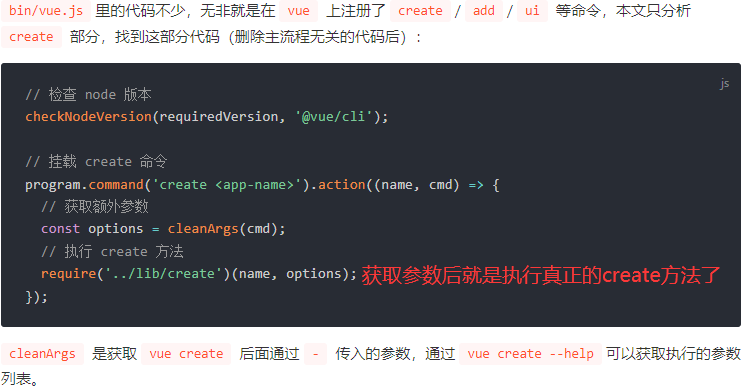

​        vue create命令支持一些参数配置，可以通过vue create --help获取详细的文档。

```
用法：create [options] <app-name>

选项：
  -p, --preset <presetName>       忽略提示符并使用已保存的或远程的预设选项
  -d, --default                   忽略提示符并使用默认预设选项
  -i, --inlinePreset <json>       忽略提示符并使用内联的 JSON 字符串预设选项
  -m, --packageManager <command>  在安装依赖时使用指定的 npm 客户端
  -r, --registry <url>            在安装依赖时使用指定的 npm registry
  -g, --git [message]             强制 / 跳过 git 初始化，并可选的指定初始化提交信息
  -n, --no-git                    跳过 git 初始化
  -f, --force                     覆写目标目录可能存在的配置
  -c, --clone                     使用 git clone 获取远程预设选项
  -x, --proxy                     使用指定的代理创建项目
  -b, --bare                      创建项目时省略默认组件中的新手指导信息
  -h, --help                      输出使用帮助信息 
```

### 基础验证

​        执行vue create命令时会加载cli/lib/create.js中的create函数。比较重要的是name和targetDir这两个，接下来执行函数validateProjectName利用npm包validate-npm-package-name 判断项目名称是否符合npm包名规范，并输出相应的errors或者warnings。

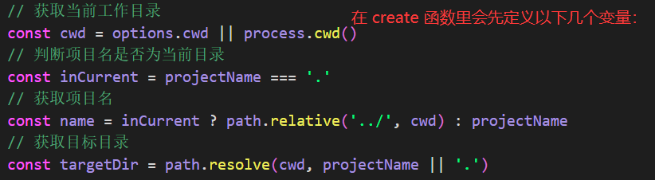

​        在验证包名之后，会判断项目目录是否与当前已有目录重复。就是判断target目录是否存在，然后通过交互询问用户是否覆盖(对应的是操作是删除原目录)。

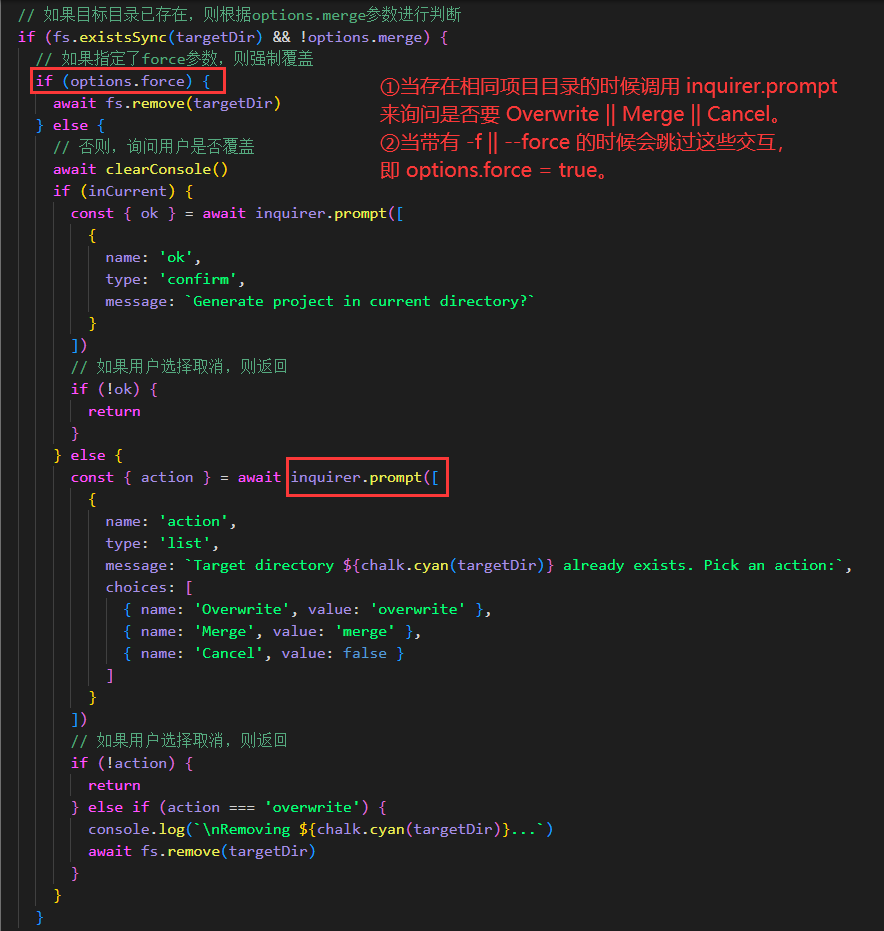

## Creator类

​        在基础验证完成以后会创建一个Creator实例。

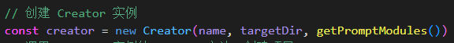

​        在创建一个Creator实例后，然后调用了create方法

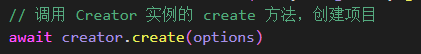

### constructor 构造函数

​       看一下Creator类的构造函数，主要将逻辑封装在resolveIntroPrompts/resolveOutroPrompts和PromptModuleAPI这几个方法中 。下面开始看一下初始化Creator实例发生了什么。

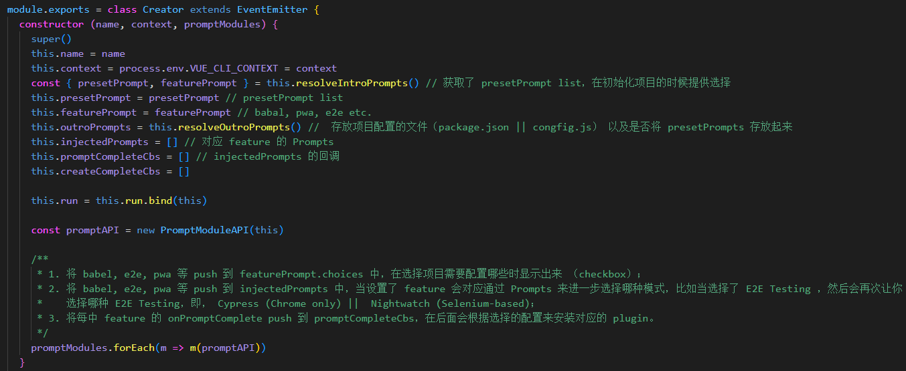

​       主要看一下PromptModuleAPI这个类是干什么的。

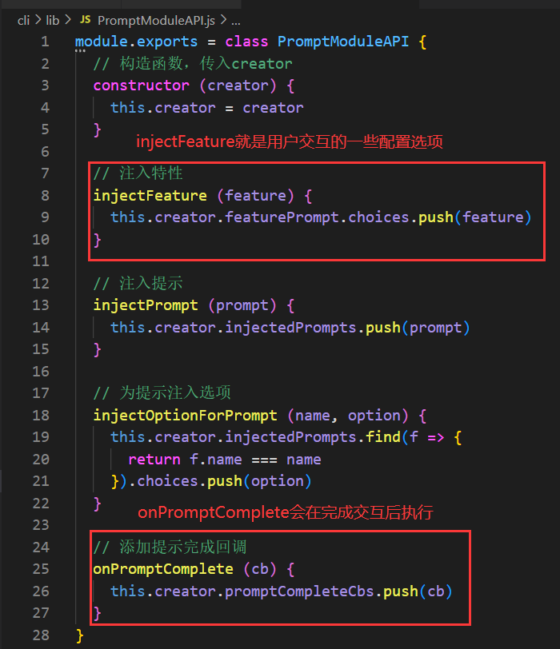

- PromptModuleAPI实例会先调用它的实例方法。
- 然后将injectFeature、injectPrompt、injectOptionForPrompt、onPromptComplete保存到 Creator实例对应的变量中。
- 最后遍历getPromptModules获取的promptModules，传入实例promptAPI，初始化Creator 实例中featurePrompt, injectedPrompts, promptCompleteCbs变量。

> featurePrompt：提供一个一级列表，当用户选择了Vue Version / Babel / TypeScript等选项之后，会弹出新的交互，比如Choose Vue version。
> injectedPrompts：就是存储的这些具体选项的列表，即getPromptModules在promptModules目录获取到的那些prompt模块。

​      vue-cli-preset：一个Vue CLI preset是一个包含创建新项目所需预定义选项和插件的JSON对象，让用户无需在命令提示中选择它们。

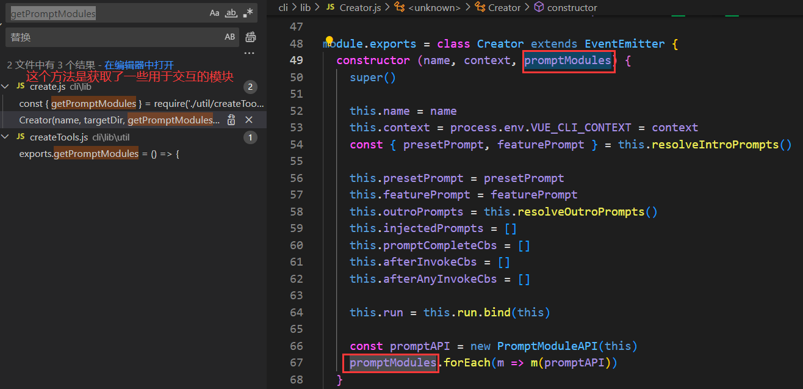

​        promptModules返回的是所有用于终端交互的模块，其中会调用injectFeature和injectPrompt来将交互配置插入进去，并且会通过onPromptComplete注册一个回调。onPromptComplete注册回调的形式是往promptCompleteCbs这个数组中push了传入的方法，在所有交互完成之后调用回调。

```javascript
module.exports = class Creator extends EventEmitter {
  constructor(name, context, promptModules) {
    const promptAPI = new PromptModuleAPI(this);
    promptModules.forEach(m => m(promptAPI));
  }
}; 
```

​         在Creator的构造函数中，实例化了一个promptAPI对象，并遍历promptModules把这个对象传入了promptModules中，说明在实例化Creator的时候就会把所有用于交互的配置注册好了。

### EventEmitter 事件模块

​        Creator类是继承于Node.js的EventEmitter类。events是Node.js中最重要的一个模块，而EventEmitter类就是其基础，是Node.js中事件触发与事件监听等功能的封装。Creator类继承自EventEmitter，应该就是为了方便在create过程中emit一些事件，主要就是以下8个事件：

```javascript
this.emit('creation', { event: 'creating' }); // 创建
this.emit('creation', { event: 'git-init' }); // 初始化 git
this.emit('creation', { event: 'plugins-install' }); // 安装插件
this.emit('creation', { event: 'invoking-generators' }); // 调用 generator
this.emit('creation', { event: 'deps-install' }); // 安装额外的依赖
this.emit('creation', { event: 'completion-hooks' }); // 完成之后的回调
this.emit('creation', { event: 'done' }); // create 流程结束
this.emit('creation', { event: 'fetch-remote-preset' }); // 拉取远程 preset 
```

​        事件emit 一定会有on的地方，这里是在@vue/cli-ui这个包里，也就是说，在终端命令行工具的场景下，不会触发到这些事件。

```javascript
const creator = new Creator('', cwd.get(), getPromptModules());
onCreationEvent = ({ event }) => {
  progress.set({ id: PROGRESS_ID, status: event, info: null }, context);
};
creator.on('creation', onCreationEvent); 著作权归「玩相机的程序员-axuebin」，转载请先联系微信 xb9207 
      链接：http://axuebin.com/articles/fe-solution/cli/vuecli.html
```

​        简单来说，就是通过vue ui启动一个图形化界面来初始化项目时，会启动一个server端，和终端之间是存在通信的。server端挂载了一些事件，在create的每个阶段，会从cli中的方法触发这些事件。

## Preset 预设

​       preset预设参数初始化：Preset是一个包含创建新项目所需预定义选项和插件的JSON对象，让用户无需在命令提示中选择它们。

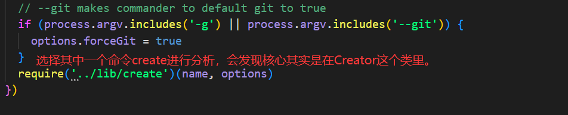

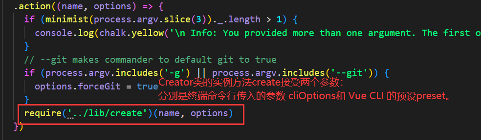

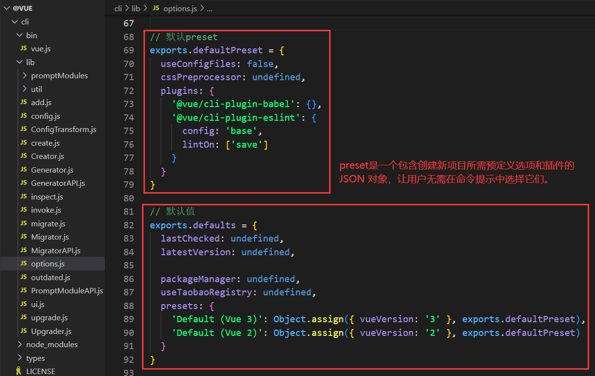

​        CLI中允许使用本地的preset和远程的preset。

### getPromptModules 获取交互模块

​         按照字面意思，这个方法获取了一系列用于和用户交互的模块，返回了一个数组。获取了babel，typescript，pwa，router，vuex，cssPreprocessors，linter，unit，e2e的Prompt的配置信息。

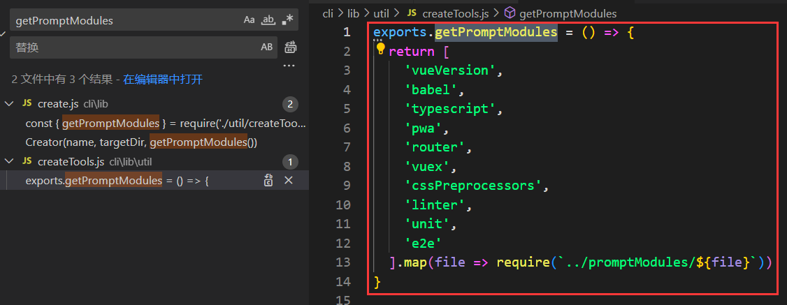

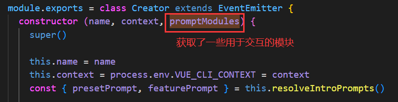

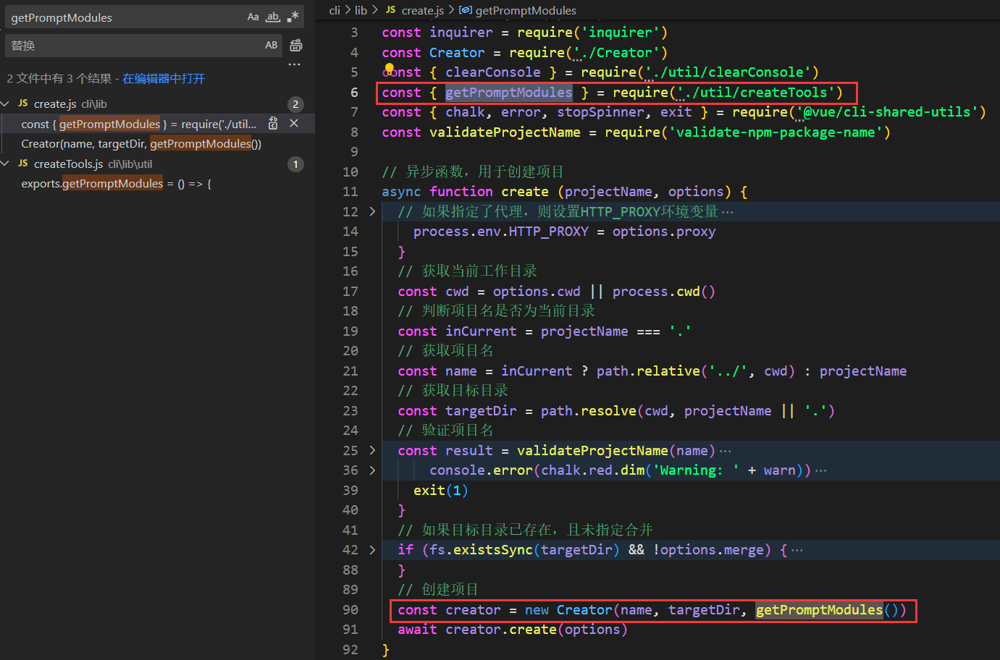

​       这些模块的代码格式基本都是统一的。以 unit 为例：

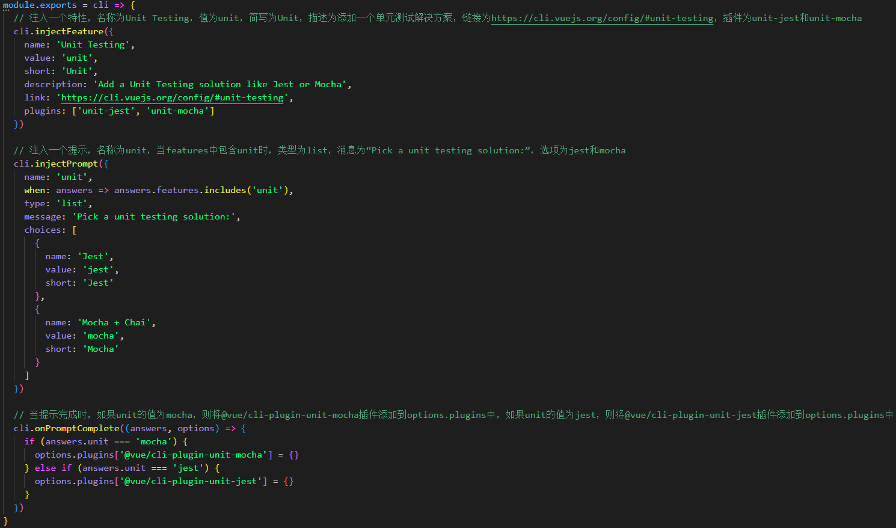

​      cli.injectFeature：用户交互的一些配置选项，注入featurePrompt，即初始化项目时选择babel，typescript，pwa等等。

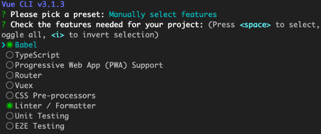

​       cli.injectPrompt：根据选择的featurePrompt然后注入对应的prompt。

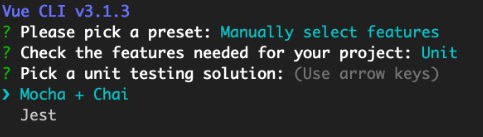

​       cli.onPromptComplete：就是一个回调方法，在完成交互后执行，会根据选择来添加对应的插件，当选择了mocha，那么就会添加 @vue/cli-plugin-unit-mocha 插件。

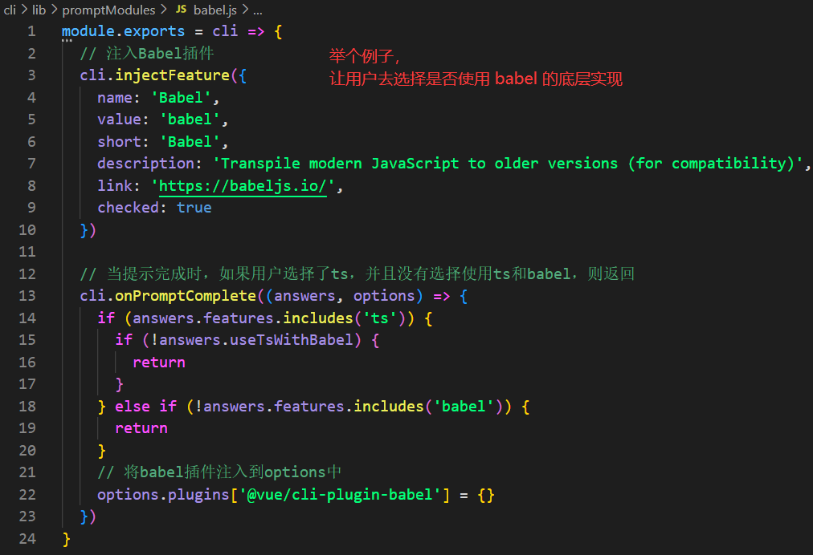

### getPreset 获取预设

​        在基础验证完成以后会创建一个Creator实例，然后调用实例方法create，创建项目的核心方法在Creator.create()中，最开始是获取preset预设参数初始化。

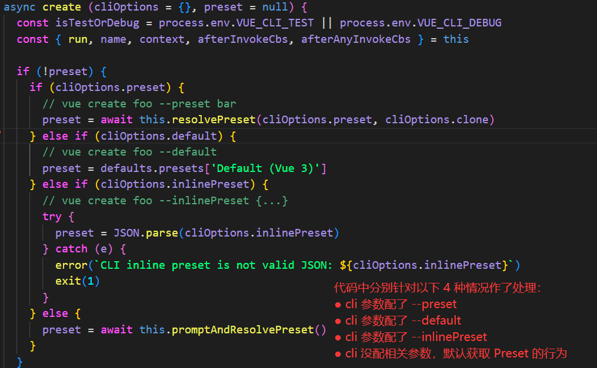

​        先判断 vue create 命令是否带有-p选项，如果有的话会调用resolvePreset去解析preset。

​        resolvePreset 函数会先获取 ～/.vuerc 中保存的preset， 然后进行遍历，如果里面包含了-p中的 `<presetName>`，则返回～/.vuerc中的preset。如果没有则判断是否是采用内联的JSON字符串预设选项，如果是就会解析.json文件，并返回preset，还有一种情况就是从远程获取preset(利用download-git-repo下载远程的preset.json)并返回。

### savePreset 保存预设

#### promptAndResolvePreset

​       promptAndResolvePreset()：在Vue CLI的最后，会让用户选择save this as a preset for future?，如果用户选择了Yes，就会执行相关逻辑将这次的交互结果保存下来。这部分的逻辑也是在promptAndResolvePreset中。

​       `this.resolveFinalPrompts()`：就是将在Creator的构造函数里初始化的那些prompts合到一起了。 

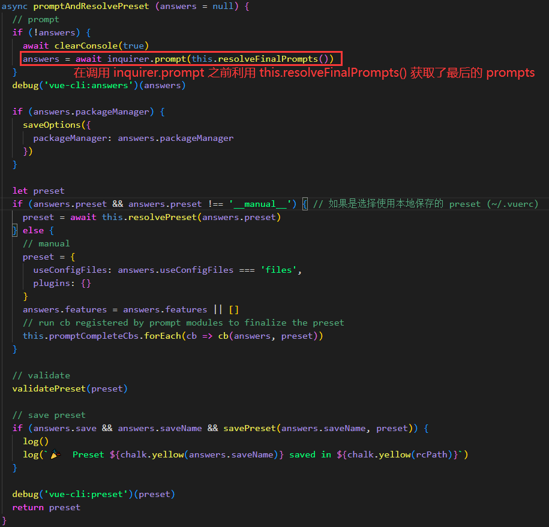

   inquirer.prompt执行完后返回answers，若选择本地保存的preset或default，则调用resolvePreset进行解析preset，否则遍历promptCompleteCbs执行injectFeature和injectPrompt的回调。

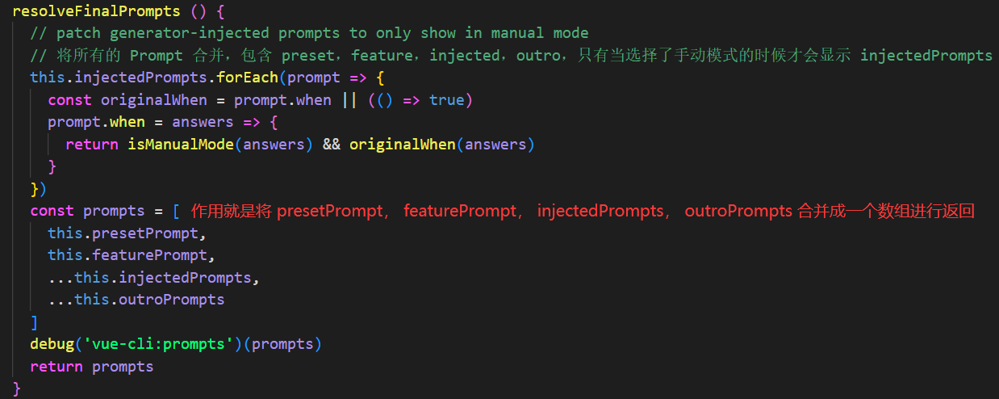

### 自定义配置加载

​        以上提到的四种prompt分别对应的是预设选项、自定义feature选择、具体feature选项和其它选项，它们之间存在互相关联、层层递进的关系。结合这四种prompt，就是Vue CLI展现在用户面前的所有交互了，其中也包含自定义配置的加载。

- presetPrompt：预设选项prompt。当上次以Manually模式进行了预设选项，并且保存到了 ~/.vuerc 中，那么在初始化项目时就会列出已经保存的preset，并提供选择。
- featurePrompt：自定义feature选择。如果在presetPrompt中选择Manually，则会继续选择 feature，featurePrompt就是存储的这个列表，项目的一些feature，就是选择babel，typescript，pwa，router，vuex，cssPreprocessors，linter，unit，e2e。
- injectedPrompts：具体feature选项。当选择了feature后，就会为对应的feature注入prompts，比如你选择unit，那么就会让你选择模式:Mocha+Chai还是Jest。featurePrompt 只是提供了一个一级列表，当用户选择了Vue Version/Babel/TypeScript等选项后，会弹出新的交互，比如Choose Vue version，injectedPrompts就是存储这些具体选项的列表，即通过getPromptModules()在promptModules目录获取到的那些prompt模块。 
- outroPrompts：其他prompt选项。这里存储的就是一些除了上述三类选项之外的选项，

​        目前包含三个：

- 将Babel、PostCSS、ESLint等配置文件存放在package.json中还是存放在config文件中；
- 是否需要将这次设置的preset保存到本地，如果需要则会进一步让你输入名称进行保存；
- 安装依赖是选择npm还是yarn。

​        在调用savePreset之前还会对预设进行解析、校验等，来看一下savePreset方法： 

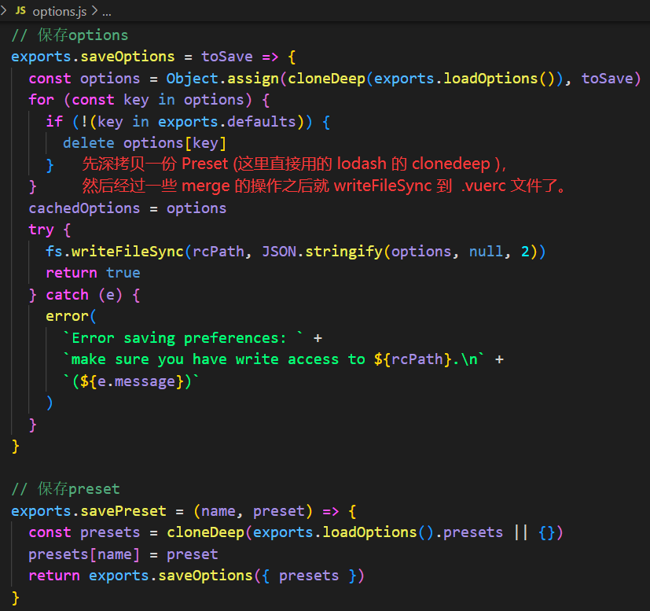

> `Creator.create()`方法主要执行项目的参数初始化、包管理初始化、npm初始化、仓库初始化，通过Generator生成项目文件并安装项目依赖。

## Generator类

​         Generator是vue create最核心的部分，这个类负责代码生成。

​        生成项目文件(解析插件对象并创建生成器实例生成项目文件)：在安装完依赖以后，就会调用resolvePlugins，作用就是加载每个插件的generator，并且如果插件需要进行命令行交互的话会执行`inquirer.prompt`获取option。 在此之后会实例化一个Generator。

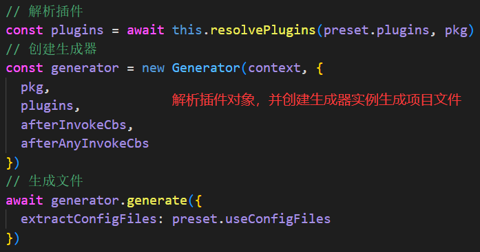

​        在实例化一个Generator的时候会初始化一些成员变量，最重要的就是调用插件的generators，Vue-cli3.0采用了一套基于插件的架构，到这里就会交给各个插件去执行了。Generator实例化代码：

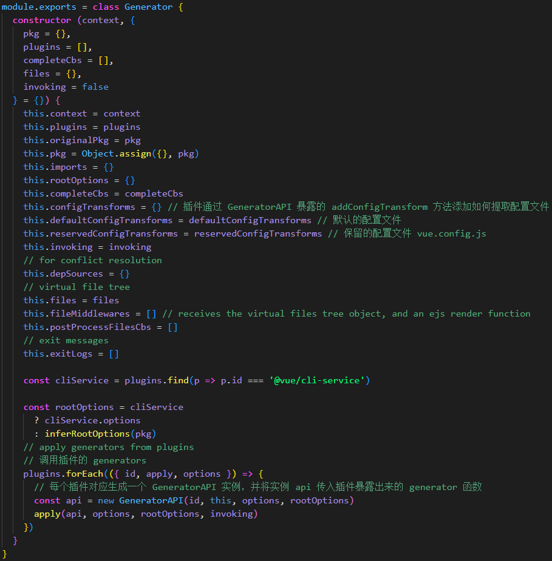

### 初始化插件 

​     实例化Generator后，就会调用实例的generate方法，此时就差不多进入到了生成项目文件的阶段。大致可分为三部分，extractConfigFiles(提取配置文件)， resolveFiles(模板渲染)和 writeFileTree(在磁盘上生成文件)。在generate方法中，最先执行的是initPlugins方法。

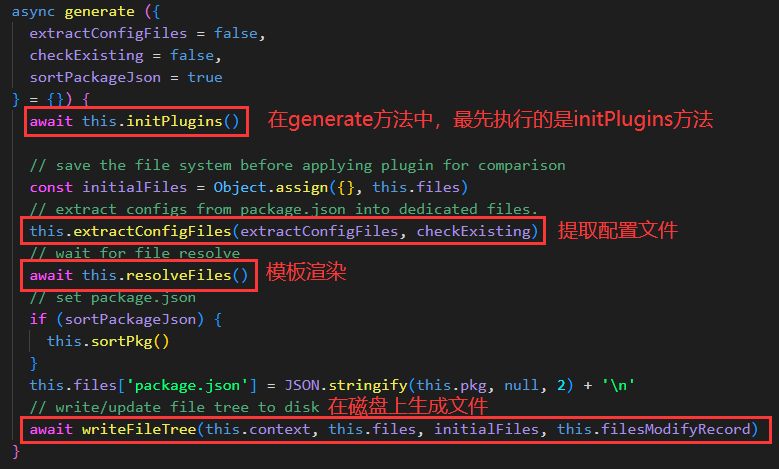

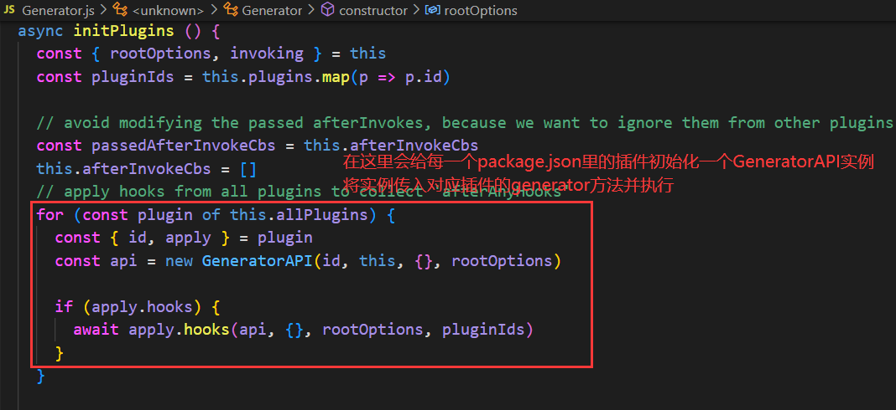

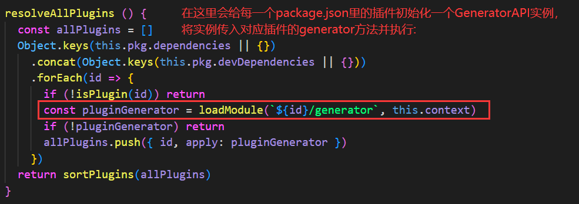

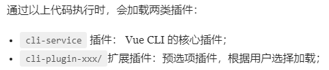

- 加载cli-service 核心插件：会执行 @vue/cli-service/generator/index.js 目录。
- 加载cli-plugin-xxx/扩展插件：会加载对应cli-plugin-xxx/generator.js插件的generator方法。

​      比如加载@vue/cli-plugin-babel插件的 @vue/cli-plugin-babel/generator.js：会在当前项目的 ./node_modules/@vue/cli-plugin-babel/ 目录下加载generator.js文件。

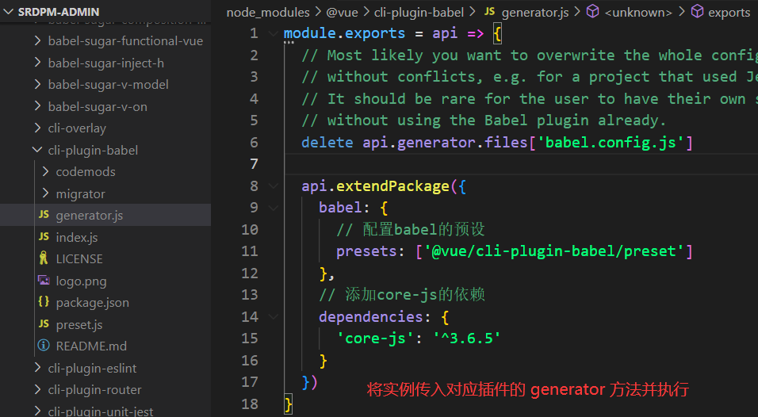

​        这里的api就是一个GeneratorAPI实例，这里用到了一个extendPackage方法，通过该方法加载cli-plugin-babel后，默认的package.json就变成：

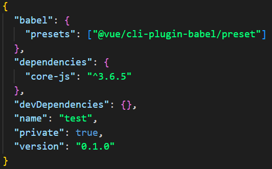

### GeneratorAPI

​        vue-cli使用了基于一套插件的架构，查看一个项目的package.json，会发现依赖都是以@vue/cli-plugin-开头的。插件可以修改webpack的内部配置，也可以向vue-cli-service注入命令。在项目创建的过程中，绝大部分列出的特性都是通过插件来实现的。

​        如果插件需要自定义项目模板、修改模板中的一些文件或者添加一些依赖，也有方法：@vue/cli插件所提供的generator向外暴露一个函数，接收的第一个参数api，然后通过该api提供的方法去完成应用的拓展工作，这里所说的api就是GeneratorAPI。

​       下面看一下GeneratorAPI提供了哪些方法。

- `hasPlugin`：判断项目中是否有某个插件
- `extendPackage`：拓展 package.json 配置
- `render`：利用 ejs 渲染模板文件
- `onCreateComplete`：内存中保存的文件字符串全部被写入文件后的回调函数
- `exitLog`：当 generator 退出的时候输出的信息
- `genJSConfig`：将 json 文件生成为 js 配置文件
- `injectImports`：向文件当中注入import语法的方法
- `injectRootOptions`：向 Vue 根实例中添加选项
- ...

​        对于vue-cli 3.0内置的插件，比如：@vue/cli-plugin-eslint、@vue/cli-plugin-pwa等等，以及其他第三方插件，他们的generator作用都是一样的，都可以向项目的package.json中注入额外的依赖或字段，并向项目中添加文件。

### extendPackage 

​     根据插件依赖生成package.json文件： 可以利用GeneratorAPI的extendPackage方法向package.json文件里面注入自定义内容，拓展配置。如scripts，eslintConfig以及devDependencies字段，另外也会根据选择的eslint模式添加对应的依赖和修改对应的配置文件。

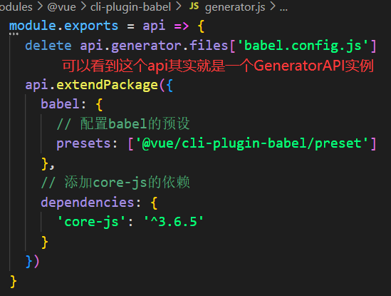

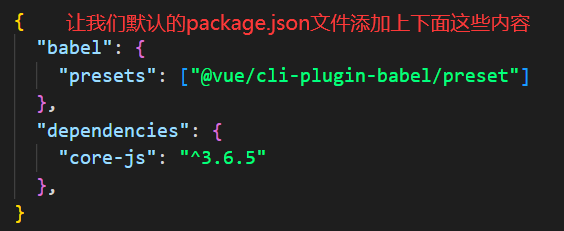

### extractConfigFiles 

​       根据包管理器自动判断NPM源，生成对应管理器的xxxrc文件：提取配置文件指的是将一些插件(如eslint，babel)的配置从package.json的字段中提取到专属的配置文件中。extractConfigFiles方法的具体实现主要是调用ConfigTransform实例的transform方法。也就是会将配置抽取成单独的文件。

​       下面以eslint为例进行分析：在初始化项目的时候，如果选择了eslint插件，在调用@vue/cli-plugin-eslint的generator的时候，就会向package.json注入eslintConfig字段。

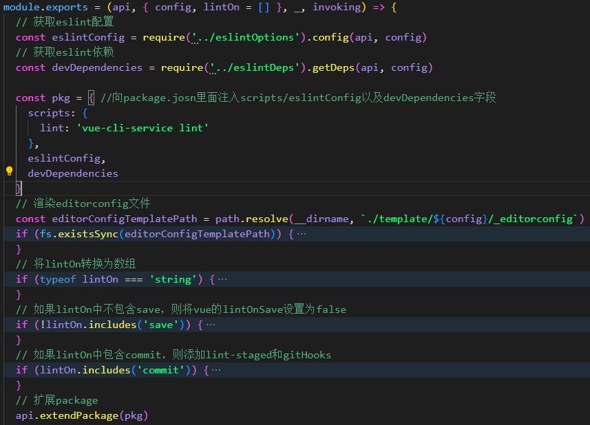

### resolveFiles

​        resolveFiles主要分为以下三个部分执行：

- fileMiddlewares：包含了ejs render函数，所有插件调用api.render时只是把对应的渲染函数push到了fileMiddlewares中，等所有的插件执行完以后才会遍历执行fileMiddlewares里面的所有函数，即在内存中生成模板文件字符串。
- injectImportsAndOptions：就是将generator注入的import和rootOption解析到对应的文件中，比如选择vuex，会在src/main.js中添加`import store from './store'`，在vue根实例中添加router选项。
- postProcessFilesCbs：是在所有普通文件在内存中渲染成字符串完成之后要执行的遍历回调。例如将@vue/cli-service/generator/index.js中的render放在了fileMiddlewares里面，而将@vue/cli-service/generator/router/index.js中将替换src/App.vue文件的方法放在了postProcessFiles里面，原因是对src/App.vue文件的一些替换一定是发生在render函数之后，如果在之前，修改后的src/App.vue在之后render函数执行时又会被覆盖，这样显然不合理。

### writeFileTree

​      执行了generate的所有逻辑后，内存中已经有了需要输出的各种文件，放在this.files里。generate的最后一步就是调用`writeFileTree`将内存中的所有文件写入到硬盘。

​      提取了配置文件和模板渲染后调用sortPkg对package.json的字段进行了排序并将package.json转化为json字符串添加到项目的files中。 此时整个项目的文件已经在内存中生成好了(在源码中就是对应的this.files)，接下来就调用writeFileTree方法将内存中的字符串模板文件生成在磁盘中。

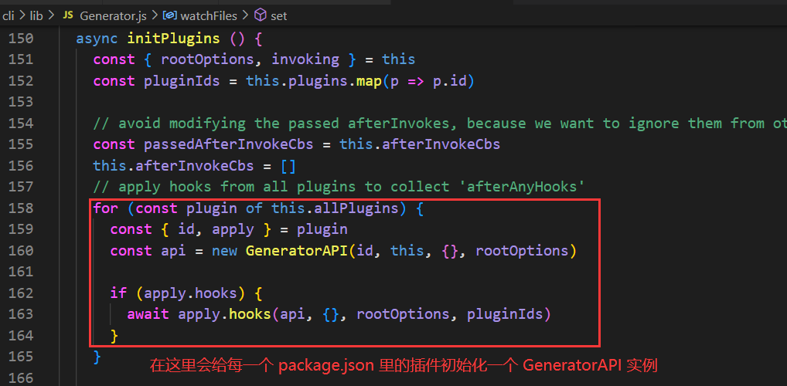

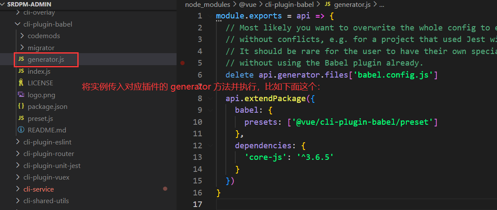

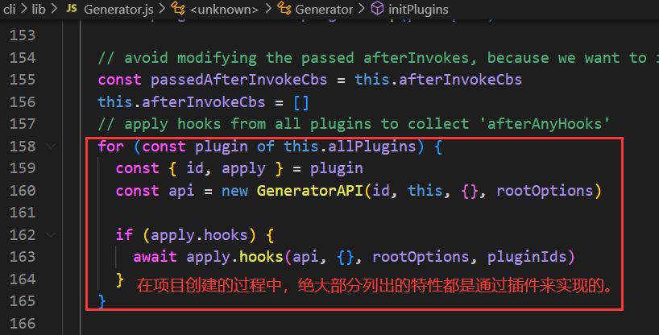

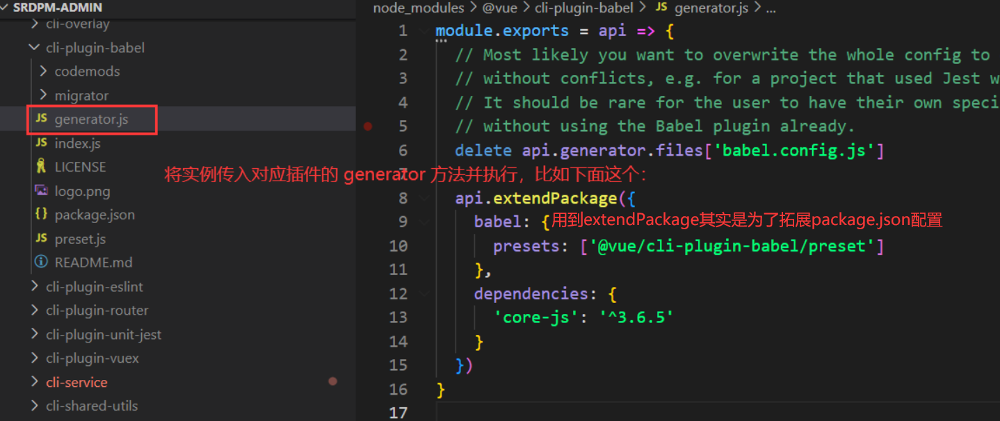

## installDeps依赖安装

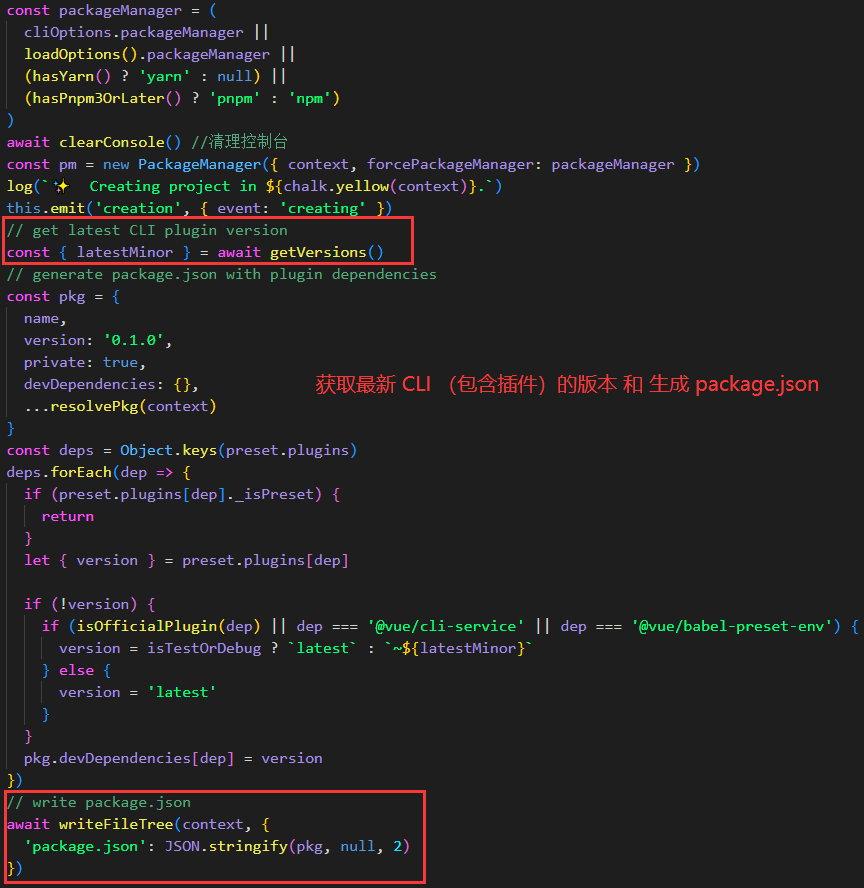

​        getVersions 的代码不多，看下比较核心的代码：

```javascript
module.exports = async function getVersions () {
  if (sessionCached) {
    return sessionCached
  }

  let latest
  const local = require('vue-cli-version-marker').devDependencies
  if (process.env.VUE_CLI_TEST || process.env.VUE_CLI_DEBUG) {
    return (sessionCached = {
      current: local,
      latest: local
    })
  }

  if (!fs.existsSync(fsCachePath)) {
    // if the cache file doesn't exist, this is likely a fresh install
    // then create a cache file with the bundled version map
    await fs.writeFile(fsCachePath, JSON.stringify(local))
  }

  const cached = JSON.parse(await fs.readFile(fsCachePath, 'utf-8'))
  const lastChecked = (await fs.stat(fsCachePath)).mtimeMs
  const daysPassed = (Date.now() - lastChecked) / (60 * 60 * 1000 * 24)
  if (daysPassed > 1) { // 距离上次检查更新超过一天
    // if we haven't check for a new version in a day, wait for the check
    // before proceeding
    latest = await getAndCacheLatestVersions(cached)
  } else {
    // Otherwise, do a check in the background. If the result was updated,
    // it will be used for the next 24 hours.
    getAndCacheLatestVersions(cached) // 后台更新
    latest = cached
  }

  return (sessionCached = {
    current: local,
    latest
  })
}
```

​       判断是否初始化Git仓库，并初始化Git仓库环境：这段代码会先调用 shouldInitGit 来判断是否需要 git 初始化。判断的情形有以下几种：

- 没有安装 git (!hasGit())：false；
- `vue create` 含有 --git 或者 -g 选项：true；
- `vue create` 含有 --no-git 或者 -n 选项：false；
- 生成项目的目录是否已经含有 git （!hasProjectGit(this.context)）：如果有，则返回 false，否则返回 true。

在判断完是否需要git初始化项目后，接下来就会调用installDeps安装依赖，看下installDeps的源码：

```javascript
exports.installDeps = async function installDeps (targetDir, command, cliRegistry) {
  const args = []
  if (command === 'npm') {
    args.push('install', '--loglevel', 'error')
  } else if (command === 'yarn') {
    // do nothing
  } else {
    throw new Error(`Unknown package manager: ${command}`)
  }

  await addRegistryToArgs(command, args, cliRegistry)

  debug(`command: `, command) // DEBUG=vue-cli:install vue create demo
  debug(`args: `, args)

  await executeCommand(command, args, targetDir)
}
```

​       判断是否为是测试或调试环境：是则调用setupDevProject启动开发服务；在开发过程中避免安装过程；否则根据package.json文件安装项目依赖。在生成package.json之后，我们继续看下面的代码：

```javascript
// intilaize git repository before installing deps
// so that vue-cli-service can setup git hooks.
const shouldInitGit = await this.shouldInitGit(cliOptions)
if (shouldInitGit) {
  logWithSpinner(`🗃`, `Initializing git repository...`)
  this.emit('creation', { event: 'git-init' })
  await run('git init')
}

// install plugins
stopSpinner()
log(`⚙  Installing CLI plugins. This might take a while...`)
log()
this.emit('creation', { event: 'plugins-install' })
if (isTestOrDebug) {
  // in development, avoid installation process
  await require('./util/setupDevProject')(context) // @vue/cli-service/bin/vue-cli-service
} else {
  await installDeps(context, packageManager, cliOptions.registry)
}
```

## 结尾分析

```javascript
// install additional deps (injected by generators)  安装额外依赖
log(`📦  Installing additional dependencies...`)
this.emit('creation', { event: 'deps-install' })
log()
if (!isTestOrDebug) {
  await installDeps(context, packageManager, cliOptions.registry)
}

// run complete cbs if any (injected by generators)  执行createCompleteCbs
logWithSpinner('⚓', `Running completion hooks...`)
this.emit('creation', { event: 'completion-hooks' })
for (const cb of createCompleteCbs) {
  await cb()
}

// generate README.md  生成README.md
stopSpinner()
log()
logWithSpinner('📄', 'Generating README.md...')
await writeFileTree(context, {
  'README.md': generateReadme(generator.pkg, packageManager)
})

// commit initial state  git初始化提交
let gitCommitFailed = false
if (shouldInitGit) {
  await run('git add -A')
  if (isTestOrDebug) {
    await run('git', ['config', 'user.name', 'test'])
    await run('git', ['config', 'user.email', 'test@test.com'])
  }
  const msg = typeof cliOptions.git === 'string' ? cliOptions.git : 'init'
  try {
    await run('git', ['commit', '-m', msg])
  } catch (e) {
    gitCommitFailed = true
  }
}

// log instructions  日志输出
stopSpinner()
log()
log(`🎉  Successfully created project ${chalk.yellow(name)}.`)
log(
  `👉  Get started with the following commands:\n\n` +
  (this.context === process.cwd() ? `` : chalk.cyan(` ${chalk.gray('$')} cd ${name}\n`)) +
  chalk.cyan(` ${chalk.gray('$')} ${packageManager === 'yarn' ? 'yarn serve' : 'npm run serve'}`)
)
log()
this.emit('creation', { event: 'done' })

if (gitCommitFailed) {
  warn(
    `Skipped git commit due to missing username and email in git config.\n` +
    `You will need to perform the initial commit yourself.\n`
  )
}

generator.printExitLogs()
```

### 安装额外依赖

​       安装由生成器实例注入的依赖：这里的依赖来源于preset的option，比如选择了scss、css预处理器，那么就需要额外安装node-sass和sass-loader两个依赖。

​        调用ProjectManage的install方法安装依赖，简单来说就是读取package.json然后分别安装npm的不同依赖。

​       自动判断NPM源 ：

​        关于安装依赖时使用的npm仓库源，如果用户没有指定安装源，Vue CLI会自动判断是否使用淘宝的NPM安装源。

### 执行 createCompleteCbs

​       运行初始化后的回调：所有文件都写在磁盘后遍历地执行回调。@vue/cli-plugin-eslint的generator就注入了 createCompleteCbs，源码如下：

```javascript
// lint & fix after create to ensure files adhere to chosen config
if (config && config !== 'base') {
  api.onCreateComplete(() => {
    require('../lint')({ silent: true }, api)
  })
} //作用就是对生成后的文件进行lint&fix，保证符合elsit所选的配置。
```

### 生成 README.md

​       生成README.md：这里需要注意的一点是，调用的generateReadme函数会根据package.json的script的字段生成生成对应的README.md。

​        项目的README.md会根据上下文动态生成，而不是写死的一个文档。

​         README.md会告知用户如何使用这个项目，除了npm install之外，会根据package.json里的scripts参数来动态生成使用文档，比如如何开发、构建和测试 

### git 初始化提交

​       暂存 git，拉取远程preset：git初始化提交主要就是调用shouldInitGit来判断是否需要git初始化提交，如果需要初始化提交就会执行`git add`和`git commmit`命令，只有在以下情况会git初始化提交：

- --git: vue create 含有 -g 或者 --git 选项

​        根据传入的参数和一系列的判断，会在目标目录下初始化Git环境，简单来说就是执行一下git init 

### 日志输出

​       打印创建结果：插件的generator可以利用GeneratorAPI暴露的exitLog方法在项目输出其他所有的message之后输出一些日志。

# CLI 服务

- 在vue-cli-service.js这个文件中，首先引入了lib目录下的Service并对其进行实例化，生成一个服务实例service。
- 然后通过process.argv读取nodejs执行时传入的变量，即在执行vue-cli-service时后面跟的serve。
- 然后使用执行vue-cli-service时传入的命令，即serve执行了service实例上的run方法。
- 至此，我们可以将vue-cli-service的执行简单概括为以下步骤
  - 服务实例化——new Service()
  - 解析执行命令——serve
  - 运行服务——service.run('serve')

​        `vue-cli-service`命令执行前，先创建了一个Service类，并通过`service.run()`方法执行执行命令。

## @vue/cli-service

​        该插件是Vue CLI的核心插件，和`create react app`的react-scripts类似，借助这个插件，能够更深刻地理解GeneratorAPI和Vue CLI的插件架构是如何实现的。来看一下@vue/cli-service这个包下的generator/index.js文件，将源码拆解成多段，其实也就是分别调用了GeneratorAPI实例的不同方法。

### 渲染 template

​        将template目录下的文件通过render渲染到内存中，这里用的是ejs作为模板渲染引擎。通过GeneratorAPI提供的实例方法，可以在插件中非常方便地对项目进行修改和自定义。

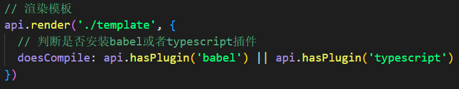

### 写package.json

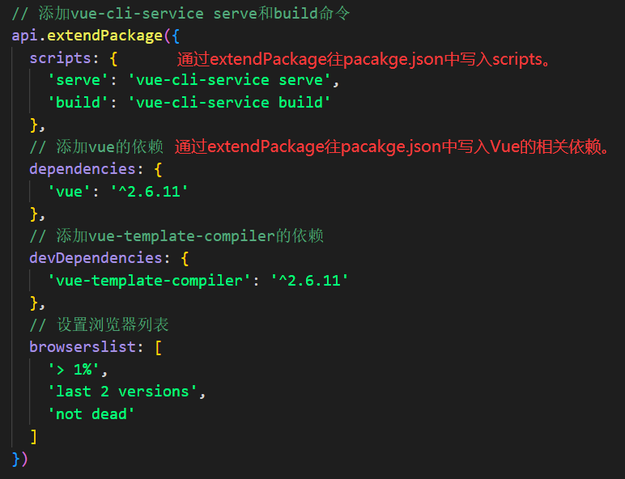

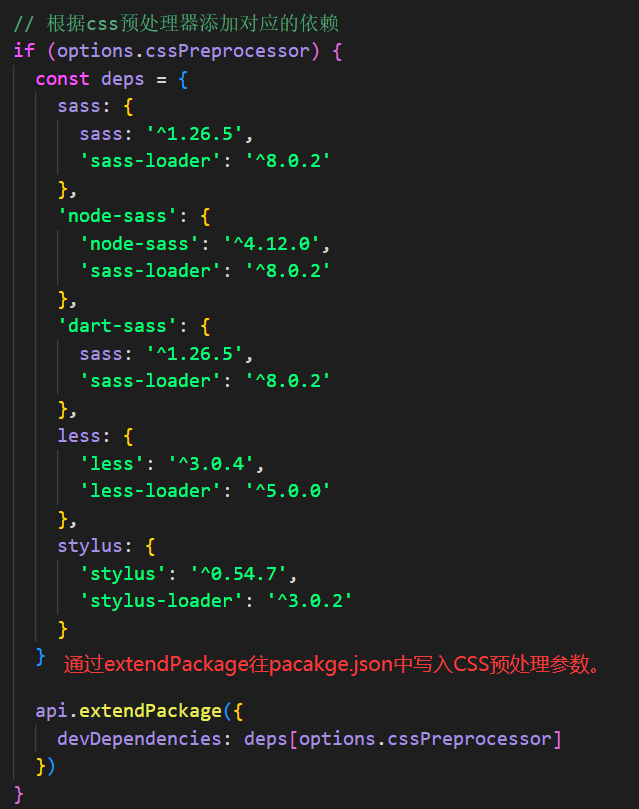

### 调用router插件和vuex插件

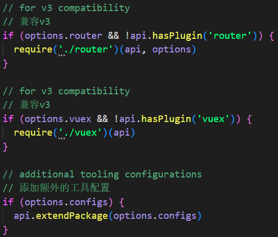

## 使用命令

​        在一个Vue CLI项目中，@vue/cli-service安装了一个名为vue-cli-service的命令。可以在`npm scripts`中以`vue-cli-service`，或从终端中以`./node_modules/.bin/vue-cli-service`访问这个命令。

​        这是使用默认preset的项目的package.json。可以通过npm或Yarn调用这些script。

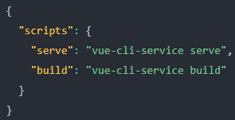

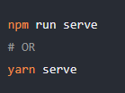

## vue-cli-service serve

​        会启动一个开发服务器(基于webpack-dev-server)并附带开箱即用的模块热重载。npm run serve对应的实际是vue-cli-service serve的执行。

```javascript
用法：vue-cli-service serve [options] [entry]

选项：
  --open    在服务器启动时打开浏览器
  --copy    在服务器启动时将 URL 复制到剪切版
  --mode    指定环境模式 (默认值：development)
  --host    指定 host (默认值：0.0.0.0)
  --port    指定 port (默认值：8080)
  --https   使用 https (默认值：false)
```

​        除了通过命令行参数，也可以使用vue.config.js里的devServer字段配置开发服务器。

​        命令行参数[entry]将被指定为唯一入口(默认值：src/main.js，TypeScript项目则为src/main.ts)，而非额外的追加入口。尝试使用[entry]覆盖config.pages中的entry将可能引发错误。

## vue-cli-service build

​       会在dist/目录产生一个可用于生产环境的包，用webpack对项目进行构建，带有JS/CSS/HTML的压缩和为更好的缓存而做的自动的vendor chunk splitting。它的chunk manifest会内联在HTML里。

```javascript
用法：vue-cli-service build [options] [entry|pattern]

选项：
  --mode        指定环境模式 (默认值：production)
  --dest        指定输出目录 (默认值：dist)
  --modern      面向现代浏览器带自动回退地构建应用
  --target      app | lib | wc | wc-async (默认值：app)
  --name        库或 Web Components 模式下的名字 (默认值：package.json 中的 "name" 字段或入口文件名)
  --no-clean    在构建项目之前不清除目标目录的内容
  --report      生成 report.html 以帮助分析包内容
  --report-json 生成 report.json 以帮助分析包内容
  --watch       监听文件变化
```

​        这里还有一些有用的命令参数：

- --modern：使用现代模式构建应用，为现代浏览器交付原生支持的ES2015代码，并生成一个兼容老浏览器的包用来自动回退。
- --target：允许你将项目中的任何组件以一个库或Web Components组件的方式进行构建。
- --report 和 --report-json：会根据构建统计生成报告，它会帮助分析包中包含的模块们的大小。

## vue-cli-service inspect

​        可以使用vue-cli-service inspect来审查一个Vue CLI项目的webpack config。

```javascript
用法：vue-cli-service inspect [options] [...paths]

选项：
  --mode    指定环境模式 (默认值：development)
```

# webpack 相关

## 简单的配置方式

​         在vue.config.js中的configureWebpack选项提供一个对象：

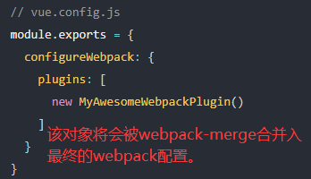

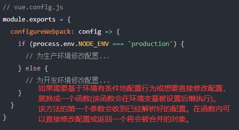

## 链式操作 (高级)

​        Vue CLI内部的webpack配置是通过webpack-chain维护的。这个库提供了一个webpack原始配置的上层抽象，使其可以定义具名的loader规则和具名插件，并有机会在后期进入这些规则并对它们的选项进行修改。它允许我们更细粒度地控制其内部配置。

## 审查项目的 webpack 配置

​        因为@vue/cli-service对webpack配置进行了抽象，所以理解配置中包含的东西会比较困难。vue-cli-service暴露了inspect命令用于审查解析好的webpack配置。那个全局的vue可执行程序同样提供了inspect命令，这个命令只是简单的把vue-cli-service inspect代理到了项目中。该命令会将解析出来的webpack配置，包括链式访问规则和插件的提示打印到stdout。