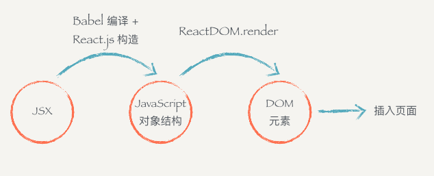
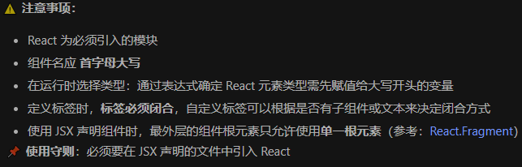
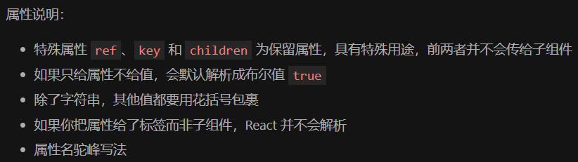
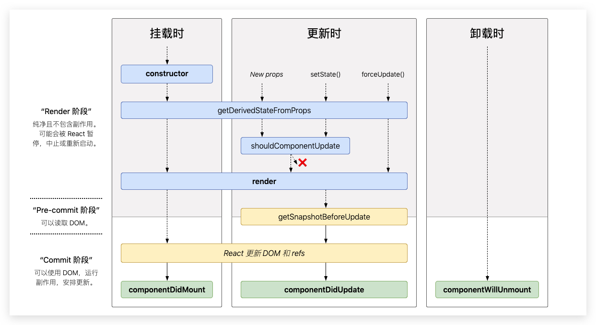

## 特性

​       React 的三大特性：

- 数据驱动 -> 单向数据流
  - 在React中，一切皆数据。要想改变界面元素或更改DOM节点，只需修改数据即可。但不要轻易操作DOM节点。
  - 所有的数据都用state来管理，分为组件state和全局state。
  - 数据只能从State流向DOM，不能逆向更改。
- 函数式编程(声明式编程) = 组件化 + JSX
  - 纯函数：函数的输出不受外部环境影响，同时也不影响外部环境。
  - 非纯函数：输入相同，输出不同的函数。
  - 函数的柯里化：将一个低阶函数转换为高阶函数的过程。
  - 组件化开发：把数据组织起来的表现形式。`() => 'My Component';`
  - JSX语法：在JavaScript中可以编辑HTML片段。`() => <div>我也是一个组件</div>;`
- 虚拟 DOM -> 跨平台
  - 服务端渲染：在服务端提前渲染成静态HTML页面。
  - 性能：每次数据更新后，重新计算Virtual DOM并和上次做对比，对发生变化的部分做批量更新。还提供了shouldComponentUpdate生命周期函数，减少数据变化后不必要的对比过程，保证性能。
  - 虚拟节点(DOM)：是在DOM的基础上建立一个抽象层，其实质是一个JavaScript对象，当数据和状态发生变化，都会被自动高效的同步到虚拟DOM中，最后再将仅变化的部分同步到真实DOM中。
  - 差异化算法：将虚拟DOM转化为真实DOM的算法，分为三级。Tree、Component、Element

## JSX 

​        JSX是一个JavaScript的语法扩展，可以很好地描述UI应该呈现出它应有交互的本质形式。JSX可能会使人联想到模板语言，但它具有JavaScript的全部功能。

​        **React将JSX映射为虚拟元素，并通过创建与更新虚拟元素来管理整个Virtual DOM系统。**JSX只是为React.createElement(component, props, ...children)提供的一种语法糖。React.createElement会构建一个JavaScript对象来描述HTML结构的信息，包括标签名、属性、还有子元素等。

> 每个DOM元素的结构都可以用JavaScript的对象来表示，一个DOM元素包含的信息其实只有三个：
>
> - 标签名 `tagName`
> - 属性 `props`
> - 子元素 `children`





### 在 JSX 中嵌入表达式

​         在JSX语法中，可以在大括号内放置任何有效的JavaScript表达式。

```react
const name = 'Josh Perez';const element = <h1>Hello, {name}</h1>;
ReactDOM.render(
  element,
  document.getElementById('root')
); 
```

### JSX 也是一个表达式

​       在编译之后，JSX表达式会被转为普通JavaScript函数调用，并且对其取值后得到JavaScript对象。

​       也就是说，可以在if语句和for循环的代码块中使用JSX，将JSX赋值给变量，把JSX当作参数传入，以及从函数中返回JSX。

```react
function getGreeting(user) {
  if (user) {
    return <h1>Hello, {formatName(user)}!</h1>;  }
  return <h1>Hello, Stranger.</h1>;}
```

### JSX 中指定属性

​        可以使用引号，来将属性值指定为字符串字面量，也可以使用大括号，来在属性值中插入一个JavaScript表达式(不要在大括号外面加上引号)。

> 注意：
> 仅使用引号(对于字符串值)或大括号(对于表达式)中的一个，对于同一属性不能同时使用这两种符号。
> 因为JSX语法上更接近JavaScript而不是HTML，所以React DOM使用camelCase(小驼峰命名)来定义属性的名称，而不使用HTML属性名称的命名约定。

```react
const element = <div tabIndex="0"></div>; //引号，将属性值指定为字符串字面量
const element = </img>; // 大括号，在属性值中插入JS表达式
```

### 使用 JSX 指定子元素

​        假如一个标签里面没有内容，可以使用 /> 来闭合标签，就像XML语法一样。JSX标签里能够包含很多子元素。

```react
const element = ;
const element = (
  <div>
    <h1>Hello!</h1>
    <h2>Good to see you here.</h2>
  </div>
);
```

### JSX 防止注入攻击

​        React DOM在渲染所有输入内容之前，默认会进行转义。它可以确保在应用中，永远不会注入那些并非自己明确编写的内容。所有的内容在渲染之前都被转换成了字符串。可以有效地防止XSS(cross-site-scripting, 跨站脚本)攻击。

```react
const title = response.potentiallyMaliciousInput; //可安全地在JSX中插入用户输入内容
const element = <h1>{title}</h1>; //直接使用是安全的
```

### JSX 表示对象

​        Babel会把JSX转译成一个名为React.createElement()函数调用。

```react
// 以下两种示例代码完全等效
const element = (
  <h1 className="greeting">
    Hello, world!
  </h1>
);
const element = React.createElement(
  'h1',
  {className: 'greeting'},
  'Hello, world!'
);
```

​        React.createElement()会预先执行一些检查，以帮助你编写无错代码，但实际上它创建了一个这样的对象。这些对象被称为React元素，它们描述了你希望在屏幕上看到的内容。React通过读取这些对象，然后使用它们来构建DOM以及保持随时更新。

```react
// 注意：这是简化过的结构
const element = {
  type: 'h1',
  props: {
    className: 'greeting',
    children: 'Hello, world!'
  }
};
```

## 元素渲染

​        元素是构成React应用的最小砖块。元素描述了你在屏幕上想看到的内容。与浏览器的DOM元素不同，React元素是创建开销极小的普通对象。React DOM会负责更新DOM来与React元素保持一致。

### 将一个元素渲染为 DOM

> 假设你的HTML文件某处有一个<div>，将其称为根DOM节点，因为该节点内的所有内容都将由React DOM管理。仅使用React构建的应用通常只有单一的根DOM节点。如果你在将React集成进一个已有应用，那么你可以在应用中包含任意多的独立根DOM节点。

​        想要将一个React元素渲染到根DOM节点中，只需把它们一起传入ReactDOM.render()：

```react
const element = <h1>Hello, world</h1>;
ReactDOM.render(element, document.getElementById('root'));
```

### 更新已渲染的元素

​        React元素是不可变对象。一旦被创建，就无法更改它的子元素或者属性。一个元素就像电影的单帧：它代表了某个特定时刻的UI。根据我们已有的知识，更新UI唯一的方式是创建一个全新的元素，并将其传入ReactDOM.render()。

```react
function tick() {
  const element = (
    <div>
      <h1>Hello, world!</h1>
      <h2>It is {new Date().toLocaleTimeString()}.</h2>
    </div>
  );
  ReactDOM.render(element, document.getElementById('root'));}
setInterval(tick, 1000);
```

### React 只更新它需要更新的部分

​        React DOM会将元素和它的子元素与它们之前的状态进行比较，并只会进行必要的更新来使DOM达到预期的状态。

## 组件

​        组件，从概念上类似于JavaScript函数。它接受任意的入参(即props)，并返回用于描述页面展示内容的React元素。

### 函数组件与 class 组件

​        定义组件最简单的方式就是编写JavaScript函数，接收唯一带有数据的 props(代表属性)对象与并返回一个React元素。这类组件被称为函数组件，因为它本质上就是JavaScript函数。

​        还可以使用ES6的class来定义组件。

```react
// 以下两个组件在 React 里是等效的
function Welcome(props) {
  return <h1>Hello, {props.name}</h1>;
}
class Welcome extends React.Component {
  render() {
    return <h1>Hello, {this.props.name}</h1>;
  }
} 
```

### 渲染组件

​        当React元素为用户自定义组件时，它会将JSX所接收的属性(attributes)以及子组件(children)转换为单个对象传递给组件，这个对象被称为props。

> 组件名称必须以大写字母开头。React会将以小写字母开头的组件视为原生DOM标签。

```react
function Welcome(props) {  return <h1>Hello, {props.name}</h1>;   }
const element = <Welcome name="Sara" />;ReactDOM.render(
  element,
  document.getElementById('root')
);
```

### 组合组件

​        组件可以在其输出中引用其他组件，这就可以让我们用同一组件来抽象出任意层次的细节。

### 提取组件

​        将组件拆分为更小的组件。提取组件可能是一件繁重的工作，但是，在大型应用中，构建可复用组件库是完全值得的。

## Props

Props是一个从外部传入组件的参数，主要用于从父组件向子组件传递数据。它具有只读性和不可变属性，组件内部无法控制也无法修改。除非外部组件主动传入新的Props来重新，否则组件的Props永远保持不变。



### Props 的只读性

​        组件无论是使用函数声明还是通过class声明，都不能修改自身的props。所有的React组件都必须像纯函数一样使用它们的props，保护props不被更改。

> 在不违反上述规则的情况下，state允许React组件随用户操作、网络响应或者其他变化而动态更改输出内容。

## State 

> State主要用于组件保存、控制、修改**自身的可变状态**。State在组件内部初始化，可以被组件自身修改，外部不能访问也不能修改。State是一个局部的、只能被组件自身控制的数据源。State中状态可通过setState方法进行更新，数据的更新会导致组件重新渲染。
>
> ⚠️ 并不是组件中用到的所有变量都是组件的状态！当存在多个组件共同依赖一个状态时，一般的做法是状态提升，将这个状态放到这几个组件的公共父组件中。

### 不可变对象

React官方建议把State当做不可变对象(Immutable)，State中包含的所有状态都应该是**不可变对象**，当State中的某个状态发生变化，我们应该重新创建这个状态对象，而不是直接修改原来的状态。

State根据状态类型可以大致分为三种：

- 基本数据类型：

  - Number、String、Boolean、Null、Undefined 这五种不可变类型

  - 由于其本身就是不可变的，如果要修改状态时，直接赋新值即可

  - ```react
    this.setState({
      number: 1,
      string: 'hello',
      boolean: true,
    });
    ```

- 数组类型：

  - 数组类型为可变类型。假如有一个数组类型的State需要新增一个数组元素，应使用数组的`concat`方法或ES6的数组扩展语法

  - ```react
    // 方法一：将 state 先赋值给另外的变量，然后使用 concat 创建新数组
    let students = this.state.students;
    this.setState({
      students: students.concat(['xiaoming']),
    });
    // 方法二：使用 prevState、concat 创建新数组
    this.setState(preState => {
      students: preState.books.concat(['xiaoming']);
    });
    // 方法三：ES6 扩展语法
    this.setState(preState => {
      students: [...preState.students, 'xiaoming'];
    });
    ```

  - 从数组中截取部分作为新状态时，应使用`slice()`方法，当从数组中过滤部分元素后，作为新状态时，使用`filter()`方法

  - 不应该使用`push()`、`pop()`、`shift()`、`unshift()`、`splice()`等数组的突变方法修改数组类型的状态，因为这些方法都是在**原数组**的基础上修改的

- 对象类型：

  - 对象也是可变类型，修改对象类型的`state`时，应该**保证不会修改原来的**`state`。可以使用ES6的`Object.assign`方法或者对象扩展语法。

  - ```react
    // Obejct.assign() 方法
    this.setState(preState => {
        school: Obejct.assign({}, preState.school, {classNum: 10})
    })
    // 对象扩展语法
    let school = this.state.school
    this.setState({
        school: {
            ...school,
            {classNum: 10}
        }
    })
    ```

  - 创建新的状态对象的关键是，避免使用会直接修改原对象的方法，而是使用可以返回一个新对象的方法。也可以使用一些不可变对象的JavaScript库

### 无状态组件

没有State的组件叫无状态组件，设置了State的叫有状态组件。因为状态会带来管理的复杂性，我们尽量多地写无状态组件，尽量少地写有状态的组件。这样会降低代码维护的难度，也会在一定程度上增强组件的可复用性。

## 生命周期




## 事件处理

​        React元素的事件处理和DOM元素的很相似，但是有一点语法上的不同：

- React事件的命名采用小驼峰式(camelCase)，而不是纯小写。
- 使用JSX语法时需要传入一个函数作为事件处理函数，而不是一个字符串。
- 不能通过返回false的方式阻止默认行为，必须显式使用preventDefault。


## 条件渲染


## 列表 & Key


## 表单


## 状态提升


## 组合 vs 继承


## React 哲学