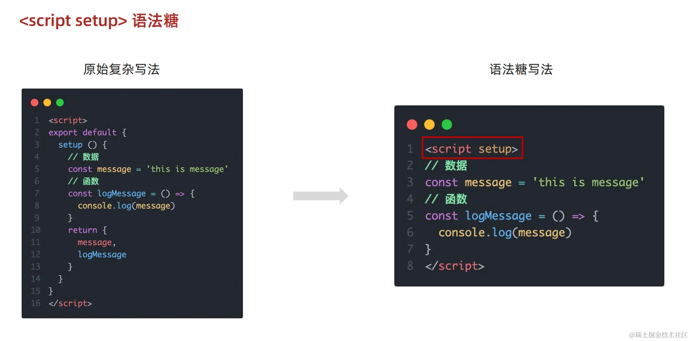
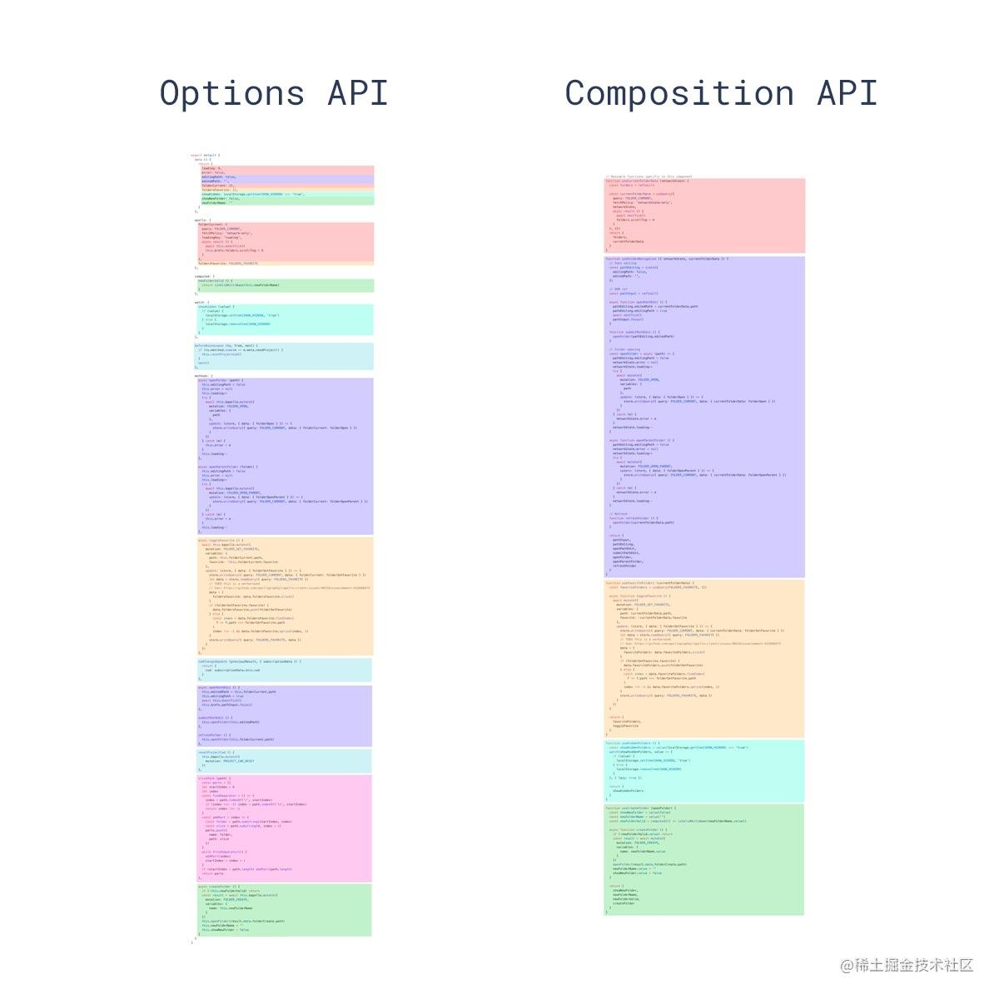

- Vue2的API设计是Options(选项式)风格的。Vue3的API设计是Composition(组合式)风格的。

- Options API的弊端：数据、方法、计算属性等是分散在data、methods、computed中的，若要新增或者修改一个需求，就需要分别修改data、methods、computed，滚动条反复上下移动，不便于维护和复用。

- Composition API的优势：用函数的方式更优雅地组织代码，让相关功能的代码更有序地组织在一起。






# 一、常用Composition API

## 拉开序幕的setup

-  Vue3.0 中一个新的配置项option，值为一个函数，所有的组合 API 函数都在此使用，**只在初始化时执行一次**，组件中所用到的数据、方法等等，均要配置在setup中。
- setup函数的两种返回值：
  - 若返回一个对象，则对象中的属性、方法等内容，均可以在模板中**直接使用**
  - 若返回一个渲染函数，则可以自定义渲染内容
- 注意点
  - 尽量不要与Vue2.x配置混用
    - Vue2.x配置(data、methods、computed…)中可以访问到setup提供的属性和方法，但在setup中不能访问到Vue2.x配置(data、methods、computed…)
    - 如果与Vue2冲突，则setup优先
  - setup不能是一个async函数，因为返回值不再是return的对象，而是promise，模板看不到return对象中的属性。(后期也可返回一个Promise实例，但需要Suspense和异步组件的配合)
- setup执行的时机
  - 在`beforeCreate`之前执行一次，此时组件对象还没有创建
  - this是undefined，不能通过this来访问 data/computed/methods/props
  - 其实所有的 composition API 相关回调函数中也都不可以
- setup的参数
  - props：值为对象，父组件传给子组件的属性，即在子组件中通过props声明过的属性（包含 props 配置声明且传入了的所有属性的对象）
  - context：上下文对象
    - attrs：值为对象，组件外部传递进来但没有在props中声明过的属性，相当于this.$attrs（包含没有在 props 配置中声明的属性的对象）
    - slots： 收到的插槽内容，相当于this.$slots（包含所有传入的插槽内容的对象）
    - emit： 分发自定义事件的函数，相当于this.$emit（用来分发自定义事件的函数）
- setup 的返回值
  - 一般都返回一个对象：为模板提供数据，即模板中可以直接使用此对象中的所有属性/方法
  - 返回对象中的属性会与data函数返回对象的属性合并成为组件对象的属性
  - 返回对象中的方法会与methods中的方法合并成为组件对象的方法
  - 如果有重名，setup 优先。

## 响应式原理

### vue2.x的响应式实现原理

- 对象类型：通过`Object.defineProperty()`对对象已有属性值的读取、修改进行拦截 (数据劫持)
- 数组类型：通过重写更新数组的一系列方法来实现拦截 (对数组的变更方法进行了包裹)

> 原理：在vue2中利用的是原生javascript中的Object.defineProperty()进行数据劫持，给每个初始数据都形成了get和set的写法，再通过getter和setter方法，进行查看和数据的修改，通过发布、订阅者模式进行数据与视图的响应式。

```javascript
const initData = {
  value: 1,
};
const data = {};
Object.keys(initData).forEach(key => {
  Object.defineProperty(data.key, {
    get() {
      console.log('访问', key);
      return initData[key];
    },
    set(newVal) {
      console.log('修改', key);
      initData[key] = newVal
    },
  })
})
```

```typescript
// 由于vue2是针对属性的监听，所以必须深度遍历每一个属性，所以在vue2里就有一个observe()，在操作这个对象之前，先对它进行监听
function observe(obj) {
  if (!obj || typeof obj !== 'object') {
    return;
  }
  Object.keys(obj).forEach(function(key) { // 递归地对data对象的属性进行数据劫持
    defineReactive(obj, key, obj[key]); 
  });
}
function defineReactive(obj, key, val) {
  observe(val);  // 递归地对data对象的属性进行数据劫持
  // 对data对象的每个属性进行劫持，定义了属性的getter和setter方法
  Object.defineProperty(obj, key, {
    get: function() {
      return val; // 返回属性的值
    },
    set: function(newValue) {
      if (newValue !== val) { // 判断新值是否与旧值不同，如果不同，则更新属性的值，并触发依赖更新
        val = newValue;
        // 触发依赖更新
        updateView();
      }
    }
  });
}
function updateView() {
  document.querySelector('h1').innerText = vm.message;
}

// 初始化数据劫持，使得Vue能够捕获到对data对象属性的访问和修改操作，并触发相应的依赖更新
observe(vm.$data);
```

存在问题：

- 直接通过下标修改数组元素或更新length，界面不会自动更新。可以通过重写数组原型上的方法(push、shift、pop、splice、unshift、sort、reverse)来解决。
- 检测不到对象属性的添加和删除，界面不会自动更新。需要对每个属性进行遍历监听，如果嵌套对象，需要深层监听，造成性能问题，不允许在已创建的实例上动态添加新的响应式属性，三种解决方案：Vue.set()、Object.assign()、$forceUpdated()。

### Vue3.0的响应式实现原理

- 通过Proxy(代理)：拦截对象中任意属性的变化(任意操作)，包括属性值的读写、属性的添加删除等。
- 通过Reflect(反射)：动态对源对象的相应属性进行特定操作。
- **要真正监听深层次对象属性的变化，我们需要确保所有内部对象都是代理对象，并且所有对这些对象的操作都是通过代理进行的。**
- 惰性响应性：最初只会为复杂数据类型执行第一层的响应性；如果存在多层的复杂数据类型嵌套时，则会在读取深层数据对象，触发深层响应式对象的 getter 方法中，为深层数据对象创建新的 Proxy 代理对象。

> 原理：
>
> 对于基本数据类型来说，响应式依然是靠Object.defineProperty()的get和set来完成的。
>
> 对于对象类型的数据：通过Proxy代理：拦截对象中任意属性的变化，包括属性值得读写、添加、删除等操作等；通过Reflect反射函数进行操作。

```javascript
const initData = {
  value: 1,
};
const proxy = new Proxy(initData, { //Proxy相当于在对象外层加拦截
  // 数据依赖收集(拦截读取属性值)
  get(target, key) { // 读的时候 运行get
    console.log('访问', key);
    return Reflect.get(target, key);
  },
  // 数据更新或添加新属性(拦截设置属性值或添加新属性)
  set(target, key, value) { // 赋值的时候，运行set
    console.log('修改', key);
    return Reflect.set(target, key, value);
  },
  // 拦截删除属性
  deleteProperty(target, key) {
    return Reflect.deleteProperty(target, key)
  }
})
```

```javascript
// 判断是不是Object
function isObject(v) {
	return typeof v === 'object' && v !==  null
}
// 观察 在这一步完成监听
function observe(obj){
	const proxy = new Proxy(obj, {
        // 使用get和set陷阱函数来手动实现监听深层次对象变化
		get (target, k) { // 读的时候 运行get
			console.log('k', '读取')
			let v = target[k]
	        if (isObject(v)) { // 虽然是递归，但不会影响一开始的效率，因为是按需加载的方式
	        	v = observe(v) // 只有当对象的某个属性被实际访问，并且这个属性的值本身也是一个对象时，才会对这个内部对象进行递归的observe调用，而不是在创建Proxy时立即执行
	        }
	        return v
	    },
	    set (target, k, val) { // 赋值的时候，运行set
	        if (target[k] !== val) {
	            console.log('k', '更改')
	            target[k] = val
	        }
	    }
	})
	return proxy 
}
```

## ref函数

- 作用: 定义**一个**数据的响应式。一般用来定义一个**基本类型**的响应式数据。

- 语法: `const xxx = ref(initValue)`

  - 创建一个包含响应式数据的引用对象(reference对象，简称ref对象)

  - JS中操作数据： 需要用`xxx.value`
  - 模板中读取数据: 不需要用 .value，直接使用`<div>{{xxx}}</div>`即可

- 备注：
  - ref接收的数据可以是基本类型，也可以是对象类型
  - 接收的是基本类型的数据：响应式依然是靠 Object.defineProperty() 的 get 与 set 完成的
  - 接收的是对象类型的数据：内部其实也调用了 reactive 函数

```javascript
function ref(value) {
  const refObject = {
    get value() {
      track(refObject, 'value')
      return value
    },
    set value(newValue) {
      value = newValue
      trigger(refObject, 'value')
    }
  }
  return refObject
}
```

> **ref 函数用于创建一个响应式的、可变的引用对象，该对象有一个 .value 属性来存储和访问内部值。RefImpl 类（或其等效实现）封装了这个值和相关的响应式逻辑，包括依赖收集和触发更新。**
>
> ref中声明了一个RefImpl类，初始化时传入参数init。
>
> - get
>
>   追踪变量，收集依赖
>
>   返回初始化变量的值
>
> - set
>
>   修改旧值，赋新值
>
>   trigger 更新
>
> ```typescript
> export function ref(init) {
> 	class RefImpl {
> 		constructor(init) {
> 		// 接收传过来的参数
> 			this.__value = init;
> 		}
> 		//获取数据，直接返回传过来的数据
> 		get value() {
> 			track(this, 'value')
> 			return this.__value
> 		}
> 		//更新数据
> 		set value(newVal) {
> 			this.__value = newVal;
> 			trigger(this, 'value')
> 		}
> 	}
> 	return new RefImpl(init);
> }
> ```

​	RefImpl提供了响应式引用的封装，ReactiveEffect管理了副作用函数的执行和依赖收集/触发，而effect则是连接这两者的桥梁。

### effect

​	effect第一个参数是函数，如果这个函数中有使用 ref/reactive 对象，当该对象的值改变的时候effect就会执行。通过effect创建的函数能够自动收集依赖（即它访问的响应式数据），并在这些数据变化时自动触发重新执行。

```typescript
function effect(fn,option={}){
   //effect 数据类型为ReactiveEffect，一上来就会执行run方法，之后可以自定义执行run方法，即设置option的内容
  let __effect = new ReactiveEffect(fn);
  if(!option.lazy){
	  __effect.run();
  }
  return __effect
}
```

### ReactiveEffect

​	声明ReactiveEffect类，间接定义effect的数据类型。ReactiveEffect类是effect函数内部实际创建的类实例，用于封装副作用函数及其相关的依赖收集（deps）、触发逻辑等，并在响应式数据变化时触发副作用函数的重新执行。

```typescript
class ReactiveEffect{
	constructor(fn){
		this.fn = fn;
	}
	// 依赖收集之前触发
	run(){
		activeEffect = this;
		return this.fn()
	}
}
```

## reactive函数

- 作用：定义**多个**数据的响应式。定义一个对象类型的响应式数据(基本类型不要用它，要用ref函数，否则报错)。可声明副作用变量，如果该变量没有值就不进行追踪。
- 语法：`const proxy=reactive(obj)`，接收一个普通对象(或数组)，返回一个响应式代理器对象（Proxy的实例对象）
- reactive 定义的响应式数据是深层次的，会影响对象内部所有嵌套的属性
- 当使用 reactive 创建的数组时，通过索引改变数组元素的值，是可以检测到的
- 内部基于 ES6 的 Proxy 实现，通过代理对象操作源对象内部数据都是响应式的
- 原理：当 reactive 方法获取到的属性值是对象，则会为该对象再次执行 reactive 方法，为该属性生成一个新的 Proxy 对象。因此只有在读取到深度数据时，才会创建深度数据的响应式 Proxy 对象。
  - 惰性相应：Reactive 最初只会为复杂数据类型执行**第一层**的响应性。如果存在多层的复杂数据类型嵌套时，则会在**读取**深层数据对象时，触发深层响应式对象的 getter 方法中，为深层数据对象创建新的 Proxy 代理对象


```javascript
function reactive(obj) {
  return new Proxy(obj, {
    get(target, key) {
      track(target, key)
      return target[key]
    },
    set(target, key, value) {
      target[key] = value
      trigger(target, key)
    }
  })
}
```

> **reactive函数内部通过Proxy和Reflect API来实现对对象属性的拦截和重定义，从而能够追踪对象属性的变化。**
>
> 声明reactive函数，返回proxy实例，proxy支持get、set、deleteProperty、has、ownKeys等方法。
>
> - get：
>
>   通过Reflect.get(target, key, receiver)获取到属性为key的值
>
>   track收集依赖
>
>   ret为对象则递归为对象创建proxy代理
>
> - set：
>
>   Reflect.set(target, key, value, receiver)设置属性为key的值
>
>   trigger 执行更新
>
>   receiver代表当前proxy对象或者继承proxy的对象，保证传递正确的this 给 getter、setter。
>
> ```typescript
> export function reactive(data) {
>     //判断是否为对象 不是对象或数组 则返回
> 	if (!isObject(data)) return 
> 	// 返回proxy实例
> 	return new Proxy(data, { 
> 		get(target, key, receiver) {
> 			const ret = Reflect.get(target, key, receiver);
> 			// 收集依赖
> 			track(target, key)
> 			//如果获取的数据还是对象的话就递归，继续为此对象创建 Proxy 代理
> 			return isObject(ret) ? reactive(ret) : ret // 递归 深度监听 提升性能  !!!!!关键
> 		},
> 		//set修改数据，需要返回一个布尔值
> 		set(target, key, value,receiver) {
>            // 首先获取旧值
>             const oldValue = Reflect.get(target, key, receiver)
>             // 判断新值和旧值是否一样来决定是否更新setter
>             let result = true;
>             // 当新值不等于旧值的时候执行更新草错
>             if (oldValue !== value) {
>                 result = Reflect.set(target, key, value, receiver)
>                 // 更新操作
>                 trigger(target, key)
>             }
>             //返回布尔类型
>             return result
> 		},
> 		deleteProperty(target, key) {
> 		    //首先需要判断是否有要删除的key
> 		    const hasK = hasKey(target, key)
> 		    const ret = Reflect.deleteProperty(target, key)
> 		    //存在key且有值则更新
> 		    if(hasK&&ret){
> 		    //更新
> 			 trigger(target, key)
> 		    }
> 			return ret
> 		},
> 		has(target, key) {
> 			track(target, key)
> 			return Reflect.has(target, key)
> 		},
> 		ownKeys(target, key) { // 只处理本身（非原型的）属性
> 			track(target)
> 			return Reflect.ownKeys(target)
> 		},
> 	})
> }
> // 判断对象中key是否存在
> const hasKey = (target, key) => Object.prototype.hasOwnProperty.call(target, key)
> ```

​	reactive用于创建响应式对象，track用于收集依赖，而trigger则用于触发依赖的更新。	

### track

​	track里面会收集各种依赖，把依赖关系做成各种映射的关系，映射关系就叫 targetMap，内部拿到这个key，就可以通过映射关系找到对应的value，就可以影响这个执行函数。

> track是Vue 3内部用于收集依赖的函数。当访问响应式对象的属性时，track函数会被触发，用于将当前正在执行的副作用函数添加到该属性的依赖列表中。

```typescript
function track(target, key) {
	// 如果当前没有effect就不执行追踪
    if (!activeEffect) return
    //找target有么有被追踪
	let depsMap = targetMap.get(target);
	//判断target是否为空，如果target为空则没被追踪，则set设置一个值
	if (!depsMap) targetMap.set(target, (depsMap = new Map()));
	//判断depsMap中有没有key，没有key就set一个（判断target.key有没有被追踪）
	let dep = depsMap.get(key)
	// 如果key没有被追踪，那么添加一个
	if (!dep) depsMap.set(key, (dep = new Set()))
	//触发副作用函数
	trackEffect(dep)
}
```

```typescript
//副作用函数
function trackEffect(dep) {
	//相当于 Dep.target && dep.add(Dep.target)
	//如果key没有添加activeEffect，则添加一个
	if (!dep.has(activeEffect)) dep.add(activeEffect);
}
```

### trigger

​	修改数据时通过 trigger目标对象找到key，根据映射关系找到cb函数执行更新视图。

> trigger是Vue 3内部用于触发依赖的函数。当响应式对象的属性发生变化时，trigger函数会被调用，它会遍历该属性的依赖列表，并通知所有依赖该属性的副作用函数重新执行。

```typescript
function trigger(target, key) {
    // 获取依赖数据，对依赖数据循环，
	const depsMap = targetMap.get(target)
	console.log(depsMap,'depsMap')
	if (!depsMap) return
	//如果effect存在则执行run方法，run方法就是执行的视图更新回调
	depsMap.get(key).forEach(effect =>
		effect && effect.run()
	);
}
```

## reactive对比ref

- 从定义数据角度对比：
  - ref 用来定义基本类型数据，reactive用来定义对象或数组类型数据(递归深度响应式)
  - 备注：如果用 ref 对象/数组，内部会自动将对象/数组转换为 reactive 的代理对象
- 从原理角度对比：
  - ref 通过`Object.defineProperty()` 的 get 与 set (给属性添加getter/setter)实现对数据的劫持
  - reactive 通过使用`Proxy`来实现对对象内部所有数据的劫持，并通过 Reflect 操作源对象内部的数据
- 从使用角度对比：
  - ref定义的数据：操作数据需要.value，读取数据时模板中直接读取不需要.value
  - reactive定义的数据：操作数据与读取数据均不需要.value
- 修改整个对象时：
  - reactive重新分配一个新对象，会失去响应式(可以使用Object.assign去整体替换)


- 使用原则：
  - 若需要一个基本类型的响应式数据，必须使用ref
  - 若需要一个响应式对象，层级不深，ref、reactive都可以
  - reactive定义的响应式的数据是**深层次的**，若需要一个响应式对象，且层级较深，推荐使用reactive。做表单相关的数据，推荐使用reactive

## 计算属性与监视

### computed计算属性

- 与Vue2.x中computed配置功能一致，可以根据已有数据计算出新数据
- 底层借助了`Object.defineproperty`方法提供的getter和setter
- 具有缓存效果，提高了性能，当依赖数据未发生变化，调用的是缓存的数据，对于任何包含响应式数据的复杂逻辑，都应该使用计算属性

```javascript
import {computed} from 'vue'
setup(){
    ...
    //计算属性——简写
    let fullName = computed(()=>{
        return person.firstName + '-' + person.lastName
    })
    //计算属性——完整
    let fullName = computed({
        get(){
            return person.firstName + '-' + person.lastName
        },
        set(value){
            const nameArr = value.split('-')
            person.firstName = nameArr[0]
            person.lastName = nameArr[1]
        }
    })
}
```

```javascript
export function computed(fn){
//只考虑函数情况
let __computed;
const e = effect(fn,{lazy:true })
__computed = {
	get value(){
		return e.run();
	}
}
return __computed
}

```

### watch监听函数

- 与Vue2.x中watch配置功能一致，监视指定的一个或多个响应式数据，一旦数据变化，就自动执行监视回调
- Vue3中的watch只能监视以下四种数据：
  - ref定义的数据
  - reactive定义的数据
  - 一个函数，返回一个值(getter函数)
  - 由以上类型的值组成的数组
- 注意：
  - 默认初始时不执行回调，只有值发生变化时才会执行，但可通过配置immediate为true来指定初始时立即执行第一次
  - watch既要指明监视的属性，也要指明监视的回调。watch是惰性的，你让它监视谁它才监视谁
  - 对象和数组都是引用类型，引用类型变量存的是地址，地址没有变，所以不会触发watch，但可通过配置deep为true来指定深度监视
    - deep: true：侦听器会层层往下遍历，给对象的所有属性都加上这个监听器，性能开销大，修改对象中的任意一个属性都会触发侦听器中的handler。如果只需对对象的某个属性进行侦听，可通过computed作为中间层进行侦听，或使用字符串的形式定义侦听器侦听的属性
  - 监视reactive定义的**数据**时：oldValue无法正确获取、强制开启了深度监视(deep配置失效)
  - 监视reactive定义的数据中**某个属性**时，deep配置有效
  - 监视对象里的属性，最好写函数式。监视地址值，需要关注对象内部和手动开启深度监视

```javascript
//情况一：监视 ref 定义的 基本类型 数据
watch(sum,(newValue,oldValue)=>{
    console.log('sum变化了',newValue,oldValue)
},{immediate:true})

//情况二：监视 多个ref定义的响应式数据
watch([sum,msg],(newValue,oldValue)=>{
    console.log('sum或msg变化了',newValue,oldValue)
}) 

/* 情况三：监视 ref 定义的 对象类型 数据，监视的是对象的地址值，只有整个对象改变时才会被监视到
   若想监视对象内部属性的变化，需要手动开启深度监视
   watch的第一个参数是：被监视的数据
   watch的第二个参数是：监视的回调
   watch的第三个参数是：配置对象（deep、immediate等等.....） */
watch(person,(newValue,oldValue)=>{
    console.log('person变化了',newValue,oldValue)
},{deep:true})

/* 情况四：监视 reactive 定义的 对象类型 数据，无法正确获得oldValue！！
          因为默认强制开启了深度监视(deep配置失效，该深度监视没法关闭 */
watch(person,(newValue,oldValue)=>{
    console.log('person变化了',newValue,oldValue)
},{immediate:true,deep:false}) //此处的deep配置不再奏效

//情况五：监视 reactive 定义的响应式对象中的 某个属性，deep配置有效
watch(()=>person.job,(newValue,oldValue)=>{
    console.log('person的job变化了',newValue,oldValue)
},{immediate:true,deep:true})

//情况六：监视reactive定义的响应式数据中的 多个属性
watch([()=>person.job,()=>person.name],(newValue,oldValue)=>{
    console.log('person的job变化了',newValue,oldValue)
},{immediate:true,deep:true})
```

## watchEffect函数

- 立即运行一个函数，同时响应式地追踪其依赖，并在依赖更改时重新执行该函数。**默认初始时就会执行第一次**，从而可以自动收集依赖，当收集到的依赖数据发生变化时，就再次执行回调函数(监视数据发生变化时回调)
- watchEffect对比watch：
  - watchEffect会先执行一次用来自动收集依赖
  - watchEffect不用指明监视哪个属性，只要指定一个回调函数，监视的回调中用到哪个属性，就监视哪个属性
  - watchEffect 无法获取到变化前的值，只能获取变化后的值
- watchEffect有点像computed：
  - 但computed注重的是计算出来的值(回调函数的返回值)，所以必须要写返回值
  - 而watchEffect更注重的是过程(回调函数的函数体)，所以不用写返回值

```javascript
//watchEffect所指定的回调中用到的数据只要发生变化，则直接重新执行回调。
watchEffect(()=>{
    const x1 = sum.value
    const x2 = person.age
    console.log('watchEffect配置的回调执行了')
})
```

## 自定义hook函数

- hook本质是一个函数，使用 Vue3 的组合 API 封装的可复用的功能函数
- 自定义 hook 的作用类似于 vue2 中的 mixin 技术
- 自定义 Hook 的优势: 很清楚复用功能代码的来源, 更清楚易懂

> 收集用户鼠标点击的页面坐标：
>
> ```typescript
> import { ref, onMounted, onUnmounted } from 'vue'
> /* 
> 收集用户鼠标点击的页面坐标
> */
> export default function useMousePosition() {
>   // 初始化坐标数据
>   const x = ref(-1)
>   const y = ref(-1)
>   // 用于收集点击事件坐标的函数
>   const updatePosition = (e: MouseEvent) => {
>     x.value = e.pageX
>     y.value = e.pageY
>   }
>   // 挂载后绑定点击监听
>   onMounted(() => {
>     document.addEventListener('click', updatePosition)
>   })
>   // 卸载前解绑点击监听
>   onUnmounted(() => {
>     document.removeEventListener('click', updatePosition)
>   })
>   return { x, y }
> }
> ```
>
> ```typescript
> <template>
>   <div>
>     <h2>x: {{ x }}, y: {{ y }}</h2>
>   </div>
> </template>
> 
> <script>
>   import { ref } from 'vue'
>   /* 
> 在组件中引入并使用自定义hook
> 自定义hook的作用类似于vue2中的mixin技术
> 自定义Hook的优势: 很清楚复用功能代码的来源, 更清楚易懂
> */
>   import useMousePosition from './hooks/useMousePosition'
> 
>   export default {
>     setup() {
>       const { x, y } = useMousePosition()
>       return {
>         x,
>         y,
>       }
>     },
>   }
> </script>
> ```

- 利用 TS 泛型强化类型检查

> 封装发 ajax 请求的 hook 函数：
>
> ```typescript
> import { ref } from 'vue'
> import axios from 'axios'
> /* 
> 使用axios发送异步ajax请求
> */
> export default function useUrlLoader<T>(url: string) {
>   const result = ref<T | null>(null)
>   const loading = ref(true)
>   const errorMsg = ref(null)
>   axios
>     .get(url)
>     .then(response => {
>       loading.value = false
>       result.value = response.data
>     })
>     .catch(e => {
>       loading.value = false
>       errorMsg.value = e.message || '未知错误'
>     })
>   return {
>     loading,
>     result,
>     errorMsg,
>   }
> }
> ```
>
> ```typescript
> <template>
>   <div class="about">
>     <h2 v-if="loading">LOADING...</h2>
>     <h2 v-else-if="errorMsg">{{ errorMsg }}</h2>
>     <!-- <ul v-else>
>     <li>id: {{result.id}}</li>
>     <li>name: {{result.name}}</li>
>     <li>distance: {{result.distance}}</li>
>   </ul> -->
> 
>     <ul v-for="p in result" :key="p.id">
>       <li>id: {{ p.id }}</li>
>       <li>title: {{ p.title }}</li>
>       <li>price: {{ p.price }}</li>
>     </ul>
>     <!--  -->
>   </div>
> </template>
> 
> <script lang="ts">
>   import { watch } from 'vue'
>   import useRequest from './hooks/useRequest'
>   // 地址数据接口
>   interface AddressResult {
>     id: number
>     name: string
>     distance: string
>   }
>   // 产品数据接口
>   interface ProductResult {
>     id: string
>     title: string
>     price: number
>   }
>   export default {
>     setup() {
>       // const {loading, result, errorMsg} = useRequest<AddressResult>('/data/address.json')
>       const { loading, result, errorMsg } = useRequest<ProductResult[]>('/data/products.json')
>       watch(result, () => {
>         if (result.value) {
>           console.log(result.value.length) // 有提示
>         }
>       })
>       return {
>         loading,
>         result,
>         errorMsg,
>       }
>     },
>   }
> </script>
> ```

## toRef和toRefs

### toRef

- 作用：创建一个ref对象，其value值指向另一个对象中的某个属性，二者内部操作的是同一个数据值，更新时二者是同步的
- 语法：const name = toRef(person,'name')
- 应用：要将响应式对象的某个属性单独提供给外部使用时。要将某个prop的ref传递给复合函数时

### toRefs

- 作用：用于将一个响应式对象中的每一个属性转换为 ref 对象
- 扩展：toRefs与toRef功能一致，但toRefs可以批量创建多个ref对象，语法：toRefs(person)
- 应用: 当从合成函数返回响应式对象时，toRefs 非常有用，这样消费组件就可以在不丢失响应式的情况下对返回的对象进行分解使用
- 问题: reactive 对象取出的所有属性值都是非响应式的
- 解决: 利用 toRefs 可以将一个响应式 reactive 对象的所有原始属性转换为响应式的 ref 属性（把一个响应式对象转换成普通对象，该普通对象的每个 property 都是一个 ref）

## storeToRefs

- 借助storeToRefs将store中的数据转为ref对象，方便在模板中使用。
- 注意：pinia提供的storeToRefs只会将数据做转换，而不关注store里的方法。而Vue的toRefs会转换store中的所有数据包括方法。


## Props 和 emit

​	在Vue3 中，父组件可以通过 props 向子组件传递数据，子组件通过 defineProps 或 props 来定义它接收的属性，这些属性在子组件中可以直接使用。

可以传递静态或动态的props。下面的`title`脱离了Vue的管理，是个静态的纯写死的赋值

```html
<blog-post title="My journey with Vue"></blog-post>
```

我们可以通过 `v-bind` 动态赋值，例如：我们传入的最终值都是字符串类型的，但它们是由Vue控制并生成的，不是单纯的字符串，可以动态变化

```html
<!-- 动态赋予一个变量的值 -->
<blog-post :title="post.title"></blog-post>
<!-- 动态赋予一个复杂表达式的值 -->
<blog-post :title="post.title + ' by ' + post.author.name"></blog-post>
```

- 单向数据流
  - 所有的 prop 都使得父子组件之间形成了一个单向下行绑定：父级 prop 的更新会向下流动到子组件中，但是反过来则不行。这样可以防止子组件意外变更父级组件的状态，从而导致你的应用的数据流向难以理解。
  - 每次父级组件发生变更时，子组件中所有的 prop 都将会刷新为最新的值。这意味着你不应该在一个子组件内部改变 prop。如果你这样做了，Vue 会在浏览器的控制台中发出警告。

props 解构

- 直接解构会丢失响应式，解构 props 需要使用 toRefs 或 toRef


useAttrs 和 props 的区别：

- props：只会接收类型定义的属性。只能接收到**在组件中声明的属性**，但能够对接收到的属性进行类型校验和默认值设置，使得组件能够更加健壮
- useAttrs：只会接收非 props 类型定义的属性。能够接收到**所有属性**，包括未在组件中声明的属性，但不能够对接收到的属性进行类型校验和默认值设置
- 使用useAttrs函数可以接收父组件传递的属性和事件，在组件中可以直接使用这些属性和事件，无需在props和emits中声明
- 注意：useAttrs 并不会自动将横杆命名的属性转成驼峰命名属性，但是 props 是会的

emit 

- 在子组件中，emit用于在子组件中触发一个事件，并在父组件中监听这些事件，可以传递数据给父组件，这是子组件向父组件通信的一种方式
- 父组件通过v-on指令（或其简写形式@）来监听子组件触发的事件，并可以定义相应的方法来处理这些事件和接收传递的数据

## 插槽

​	插槽在Vue.js中是一种分发内容的机制，允许我们在子组件中插入父组件的任何内容。它允许开发者在组件之间灵活地传递和渲染内容。

​	插槽的分类：

- **默认插槽**：指在组件中没有特定命名的插槽，也就是没有使用v-slot指令进行命名的插槽。
  - 它用于接收父组件中未指定插槽名称的内容。
  - 适用于子组件中只有一个内容区域需要被父组件替换的情况。
  - 示例：在子组件中使用`<slot></slot>`定义默认插槽，父组件中直接放在子组件标签内的内容将传递给这个插槽。
- **具名插槽**：允许我们在子组件中定义多个插槽，并通过名称来区分它们。
  - 在子组件中，通过给`<slot>`元素添加name属性来定义具名插槽。
  - 适用于子组件中有多个内容区域需要被父组件替换，且这些区域在组件中的位置不固定的情况。
  - 在父组件中，通过`v-slot:插槽名称`或`#插槽名称`的语法来指定要插入哪个具名插槽的内容。
  - 示例：在子组件中定义`<slot name="header"></slot>`和`<slot name="footer"></slot>`，父组件中使用`<template v-slot:header>...</template>`和`<template v-slot:footer>...</template>`来插入内容。
- **作用域插槽**：是一种特殊类型的插槽，它允许子组件向父组件传递数据，并在父组件的插槽模板中使用这些数据。
  - 在子组件中，通过给`<slot>`元素添加`v-bind（或简写为:）`来绑定要传递给父组件的数据。
  - 适用于子组件需要向父组件传递数据，并在父组件的插槽模板中使用这些数据的情况。
  - 在父组件中，通过`v-slot:插槽名称="slotProps"`的语法来接收这些数据，其中slotProps是一个对象，包含了子组件传递的所有数据。
  - 示例：子组件中`<slot :user="user"></slot>`，父组件中`<template v-slot:default="slotProps">{{ slotProps.user.name }}</template>`。

​	原理：
- 模板编译

  Vue.js的模板在浏览器端被编译成虚拟DOM渲染函数。在这个过程中，Vue编译器会识别模板中的特殊指令和结构，如插槽（`<slot>`元素）。当编译器遇到`<slot>`元素时，它会进行特殊处理，以便在组件的渲染过程中能够接收并渲染来自父组件的内容。
- 插槽的占位

  在子组件的模板中，`<slot>`元素作为插槽的占位符。这个占位符告诉Vue：“在这里，我期望接收来自父组件的内容，并将其渲染出来。”`<slot>`元素可以有`name`属性来定义具名插槽，也可以不带`name`属性作为默认插槽。

- 父组件的内容分发

  当父组件引用子组件时，父组件可以通过在子组件标签内部放置HTML、其他组件或文本等内容来向子组件的插槽传递内容。这些内容在编译阶段被Vue识别，并标记为将要被分发到子组件的某个插槽中。

- 渲染过程

  在组件的渲染过程中，Vue会执行组件的渲染函数，并生成对应的虚拟DOM树。对于包含插槽的子组件，Vue会检查父组件是否通过插槽传递了内容。如果有，Vue会将这些内容“插入”到子组件模板中对应`<slot>`元素的位置。

  - 对于默认插槽，Vue会查找父组件传递给子组件的、未明确指定插槽名称的内容，并将其渲染到子组件中所有未命名的`<slot>`元素位置。
  - 对于具名插槽，Vue会根据插槽的名称来匹配父组件中通过`v-slot:插槽名称`或`#插槽名称`指定的内容，并将其渲染到对应的`<slot name="插槽名称">`元素位置。

- 作用域插槽

  作用域插槽是一种特殊类型的插槽，它允许子组件向插槽传递数据（即作用域），这些数据可以在父组件的插槽模板中被访问和使用。在渲染作用域插槽时，Vue会创建一个临时的子作用域，该作用域包含了子组件传递给插槽的数据，并将这个作用域与父组件的插槽模板合并，以生成最终的渲染结果。

# 二、其它Composition API

## shallowReactive 与 shallowRef

​        通过使用shallowRef()和shallowReactive()来绕开深度响应。浅层式API创建的状态只在其顶层是响应式的，对所有深层的对象不会做任何处理，避免了对每一个内部属性做响应式所带来的性能成本，这使得属性的访问变得更快，可提升性能。

- shallowReactive：只处理了对象内最外层属性的响应式。如果有一个对象数据，结构比较深，但变化时只是外层属性变化
- shallowRef：只处理了value的响应式，不进行对象的reactive处理。如果有一个对象数据，后续功能不会修改该对象中的属性，而是产生新的对象来替换 

### shallowReactive 

- shallowReactive：只处理对象最外层属性的响应式(浅响应式)
- 作用：创建一个浅层响应式对象，只会使对象的最顶层属性变成响应式的，对象内部的嵌套属性则不会变成响应式的
- 用法：const myObj = shallowReactive({ ... })
- 特点：对象的顶层属性是响应式的，但嵌套对象的属性不是

###  shallowRef

- shallowRef：只处理基本数据类型的响应式, 不进行对象的响应式处理（ 只处理了 value 的响应式，不进行对象的 reactive 处理）
- 作用：创建一个响应式数据，但只对顶层属性进行响应式处理，只能处理第一层的数据
- 用法： let myVar = shallowRef(initialValue)
- 如果想关注的是整体修改，用的是shallowRef。用ref会把被包裹住的所有属性都变成响应式的
- 特点：只跟踪引用值的变化，不关心值内部的属性变化

## readonly 与 shallowReadonly

> 在某些特定情况下，可能不希望对数据进行更新的操作，那就可以包装生成一个只读代理对象来读取数据，而不能修改或删除

### readonly

- 让一个响应式数据变为只读的(深度只读数据)，对象的所有嵌套属性都将变为只读
- 特点：
  - 获取一个对象 (响应式或纯对象) 或 ref 并返回原始代理的只读代理
  - 只读代理是深层的：访问的任何嵌套 property 也是只读的
  - 任何尝试修改这个对象的操作都会被阻止(在开发模式下，还会在控制台中发出警告)
-  应用场景：
  - 创建不可变的状态快照
  - 保护全局状态或配置不被修改

### shallowReadonly

- 让一个响应式数据变为只读的(浅只读数据)，只作用于对象的顶层属性。创建一个代理，使其自身的property为只读，但不执行嵌套对象的深度只读转换
- 特点：
  - 只将对象的顶层属性设置为只读，对象内部的嵌套属性仍然是可变的
  - 适用于只需保护对象顶层属性的场景

## toRaw 与 markRaw

- toRaw
  - 作用：将一个由reactive或readonly生成的响应式代理对象转为普通对象。返回的对象不再是响应式的，不会触发视图更新
  - 使用场景：临时读取响应式对象对应的普通对象，对这个普通对象的所有操作不会引起页面更新
- markRaw
  - 作用：标记一个对象，使其永远不会再成为响应式对象。返回对象本身
  - 应用场景:
    - 有些值不应被设置为响应式的，例如复杂的第三方类库或Vue组件对象等
    - 当渲染具有不可变数据源的大列表时，跳过响应式转换可以提高性能

## customRef

- 作用：创建一个自定义的 ref，并对其依赖项跟踪和更新触发进行显式控制
- customRef中最核心的就是track和trigger，track是持续跟踪，trigger是通知你完成了
- 实现防抖效果：
  - useSumRef.ts

```javascript
<template>
    <input type="text" v-model="keyword">
    <h3>{{keyword}}</h3>
</template>

<script>
    import {ref,customRef} from 'vue'
    export default {
        name:'Demo',
        setup(){
            // let keyword = ref('hello') //使用Vue准备好的内置ref
            //自定义一个myRef
            function myRef(value,delay){
                let timer
                //通过customRef去实现自定义
                return customRef((track,trigger)=>{
                    return{
                        get(){
                            track() //跟踪，告诉Vue这个value值是需要被“追踪”的
                            return value
                        },
                        set(newValue){
                            clearTimeout(timer)
                            timer = setTimeout(()=>{
                                value = newValue
                                trigger() //触发，告诉Vue去更新界面
                            },delay)
                        }
                    }
                })
            }
            let keyword = myRef('hello',500) //使用程序员自定义的ref
            return {
                keyword
            }
        }
    }
</script>
```

- 在组件中使用（ref 获取元素）：利用 ref 函数获取组件中的标签元素

```javascript
<template>
    <div class="app">
        <h2>{{ msg }}</h2>
        <input type="text" v-model="msg">
    </div>
</template>
 
<script setup lang="ts" name="App">
    import {ref} from 'vue'
    import useMsgRef from './useMsgRef'
    // 使用Vue提供的默认ref定义响应式数据，数据一变，页面就更新
    // let msg = ref('你好')
    // 使用useMsgRef来定义一个响应式数据且有延迟效果
    let {msg} = useMsgRef('你好',2000)
</script>
```

​	输入框自动获取焦点

```javascript
<template>
  <h2>App</h2>
  <input type="text" />---
  <input type="text" ref="inputRef" />
</template>

<script lang="ts">
  import { onMounted, ref } from 'vue'
/* 
ref获取元素: 利用ref函数获取组件中的标签元素
功能需求: 让输入框自动获取焦点
*/
  export default {
    setup() {
      const inputRef = ref<HTMLElement | null>(null)
      onMounted(() => {
        inputRef.value && inputRef.value.focus()
      })
      return {
        inputRef,
      }
    },
  }
</script>
```

## provide 与 inject

>  提供依赖注入，功能类似 2.x 的 provide/inject

- 作用：实现跨层级组件（祖孙）间的通信
- 套路：父组件有一个 provide 选项来提供数据，后代组件有一个 inject 选项来开始使用这些数据

父组件：

```javascript
<template>
  <h1>父组件</h1>
  <p>当前颜色: {{ color }}</p>
  <button @click="color = 'red'">红</button>
  <button @click="color = 'yellow'">黄</button>
  <button @click="color = 'blue'">蓝</button>

  <hr />
  <Son />
</template>

<script lang="ts">
  import { provide, ref } from 'vue'
  /* 
- provide` 和 `inject` 提供依赖注入，功能类似 2.x 的 `provide/inject
- 实现跨层级组件(祖孙)间通信
*/
  import Son from './Son.vue'
  export default {
    name: 'ProvideInject',
    components: {
      Son,
    },
    setup() {
      const color = ref('red')
      provide('color', color)
      return {
        color,
      }
    },
  }
</script>
```

子组件：

```javascript
<template>
  <div>
    <h2>子组件</h2>
    <hr />
    <GrandSon />
  </div>
</template>

<script lang="ts">
  import GrandSon from './GrandSon.vue'
  export default {
    components: {
      GrandSon,
    },
  }
</script>
```

孙组件：

```javascript
<template>
  <h3 :style="{ color }">孙子组件: {{ color }}</h3>
</template>

<script lang="ts">
  import { inject } from 'vue'
  export default {
    setup() {
      const color = inject('color')
      return {
        color,
      }
    },
  }
</script>
```

## 响应式数据的判断

- isRef：检查一个值是否为一个 ref 对象
- isReactive：检查一个对象是否是由 reactive 创建的响应式代理
- isReadonly：检查一个对象是否是由 readonly 创建的只读代理
- isProxy：检查一个对象是否是由 reactive 或者 readonly 方法创建的代理

# 三、手写组合 API

- shallowReactive 与 reactive

```typescript
const reactiveHandler = {
  get(target, key) {
    if (key === '_is_reactive') return true
    return Reflect.get(target, key)
  },
  set(target, key, value) {
    const result = Reflect.set(target, key, value)
    console.log('数据已更新, 去更新界面')
    return result
  },
  deleteProperty(target, key) {
    const result = Reflect.deleteProperty(target, key)
    console.log('数据已删除, 去更新界面')
    return result
  },
}

/* 
自定义shallowReactive
*/
function shallowReactive(obj) {
  return new Proxy(obj, reactiveHandler)
}

/* 
自定义reactive
*/
function reactive(target) {
  if (target && typeof target === 'object') {
    if (target instanceof Array) {
      // 数组
      target.forEach((item, index) => {
        target[index] = reactive(item)
      })
    } else {
      // 对象
      Object.keys(target).forEach(key => {
        target[key] = reactive(target[key])
      })
    }

    const proxy = new Proxy(target, reactiveHandler)
    return proxy
  }
  return target
}

/* 测试自定义shallowReactive */
const proxy = shallowReactive({
  a: {
    b: 3,
  },
})
proxy.a = { b: 4 } // 劫持到了
proxy.a.b = 5 // 没有劫持到

/* 测试自定义reactive */
const obj = {
  a: 'abc',
  b: [{ x: 1 }],
  c: { x: [11] },
}

const proxy = reactive(obj)
console.log(proxy)
proxy.b[0].x += 1
proxy.c.x[0] += 1
```

- shallowRef 与 ref

```typescript
/*
自定义shallowRef
*/
function shallowRef(target) {
  const result = {
    _value: target, // 用来保存数据的内部属性
    _is_ref: true, // 用来标识是ref对象
    get value() {
      return this._value
    },
    set value(val) {
      this._value = val
      console.log('set value 数据已更新, 去更新界面')
    },
  }

  return result
}

/* 
自定义ref
*/
function ref(target) {
  if (target && typeof target === 'object') {
    target = reactive(target)
  }

  const result = {
    _value: target, // 用来保存数据的内部属性
    _is_ref: true, // 用来标识是ref对象
    get value() {
      return this._value
    },
    set value(val) {
      this._value = val
      console.log('set value 数据已更新, 去更新界面')
    },
  }

  return result
}

/* 测试自定义shallowRef */
const ref3 = shallowRef({
  a: 'abc',
})
ref3.value = 'xxx'
ref3.value.a = 'yyy'

/* 测试自定义ref */
const ref1 = ref(0)
const ref2 = ref({
  a: 'abc',
  b: [{ x: 1 }],
  c: { x: [11] },
})
ref1.value++
ref2.value.b[0].x++
console.log(ref1, ref2)
```

- shallowReadonly 与 readonly

```typescript
const readonlyHandler = {
  get(target, key) {
    if (key === '_is_readonly') return true

    return Reflect.get(target, key)
  },

  set() {
    console.warn('只读的, 不能修改')
    return true
  },

  deleteProperty() {
    console.warn('只读的, 不能删除')
    return true
  },
}

/* 
自定义shallowReadonly
*/
function shallowReadonly(obj) {
  return new Proxy(obj, readonlyHandler)
}

/* 
自定义readonly
*/
function readonly(target) {
  if (target && typeof target === 'object') {
    if (target instanceof Array) {
      // 数组
      target.forEach((item, index) => {
        target[index] = readonly(item)
      })
    } else {
      // 对象
      Object.keys(target).forEach(key => {
        target[key] = readonly(target[key])
      })
    }
    const proxy = new Proxy(target, readonlyHandler)

    return proxy
  }

  return target
}

/* 测试自定义readonly */
/* 测试自定义shallowReadonly */
const objReadOnly = readonly({
  a: {
    b: 1,
  },
})
const objReadOnly2 = shallowReadonly({
  a: {
    b: 1,
  },
})

objReadOnly.a = 1
objReadOnly.a.b = 2
objReadOnly2.a = 1
objReadOnly2.a.b = 2
```

- isRef, isReactive 与 isReadonly

```typescript
/* 
判断是否是ref对象
*/
function isRef(obj) {
  return obj && obj._is_ref
}

/* 
判断是否是reactive对象
*/
function isReactive(obj) {
  return obj && obj._is_reactive
}

/* 
判断是否是readonly对象
*/
function isReadonly(obj) {
  return obj && obj._is_readonly
}

/* 
是否是reactive或readonly产生的代理对象
*/
function isProxy(obj) {
  return isReactive(obj) || isReadonly(obj)
}

/* 测试判断函数 */
console.log(isReactive(reactive({})))
console.log(isRef(ref({})))
console.log(isReadonly(readonly({})))
console.log(isProxy(reactive({})))
console.log(isProxy(readonly({})))
```