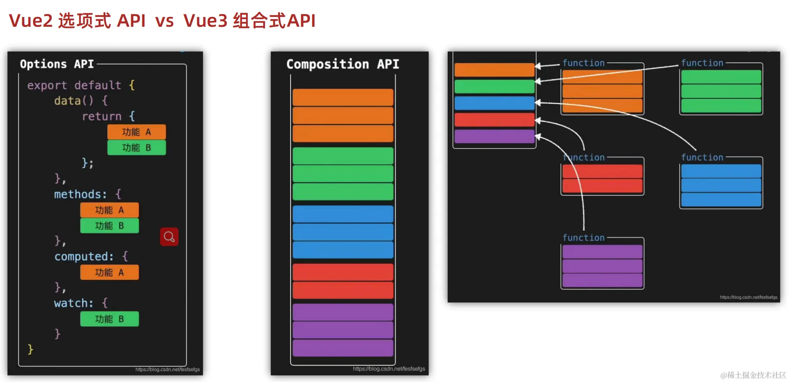
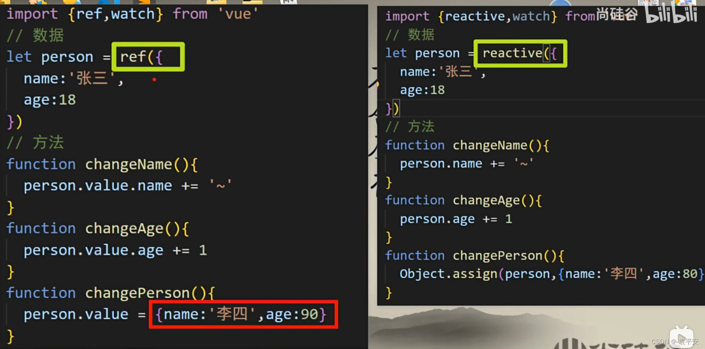
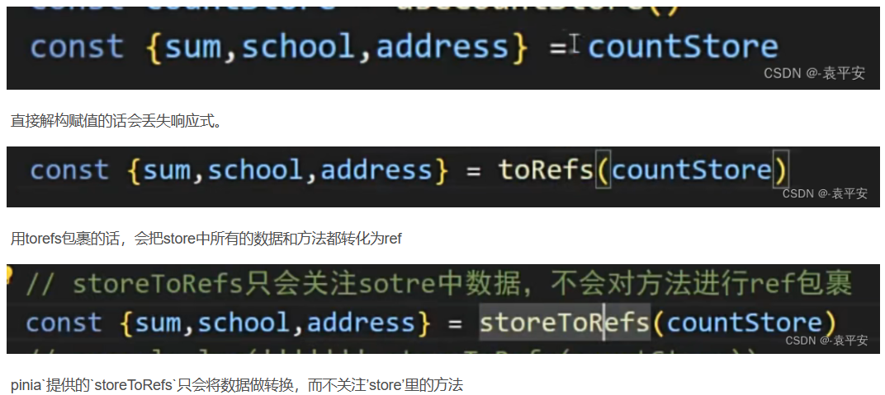

- Vue2的API设计是Options(选项式)风格的。
- Vue3的API设计是Composition(组合式)风格的。

Options API的弊端：数据、方法、计算属性等是分散在data、methods、computed中的，若要新增或者修改一个需求，就需要分别修改data、methods、computed，不便于维护和复用。

Composition API的优势：用函数的方式更优雅地组织代码，让相关功能的代码更有序地组织在一起。




## 常用Composition API

### 拉开序幕的setup

-  Vue3.0中一个新的配置项，值为一个函数。setup是所有Composition API(组合API)表演的舞台。组件中所用到的数据、方法等等，均要配置在setup中。所有的组合API函数都在此使用，只在初始化时执行一次。
- setup函数的两种返回值：
  - 若返回一个对象，则对象中的属性、方法等内容，均可以在模板中直接使用。
  - 若返回一个渲染函数，则可以自定义渲染内容。
- 注意点
  - 尽量不要与Vue2.x配置混用
    - Vue2.x配置(data、methods、computed…)中可以访问到setup提供的属性和方法。
    - 但在setup中不能访问到Vue2.x配置(data、methods、computed…)。
    - 如果与Vue2冲突，则setup优先。
  - setup不能是一个async函数，因为返回值不再是return的对象，而是promise，模板看不到return对象中的属性。(后期也可返回一个Promise实例，但需要Suspense和异步组件的配合)
- setup执行的时机
  - 在beforeCreate之前执行一次，此时组件对象还没有创建。
  - this是undefined，不能通过this来访问data/computed/methods/props。
- setup的参数
  - props：值为对象，父组件传给子组件的属性，即在子组件中通过props声明过的属性。
  - context：上下文对象
    - attrs：值为对象，组件外部传递进来但没有在props中声明过的属性，相当于this.$attrs。
    - slots： 收到的插槽内容，相当于this.$slots。
    - emit： 分发自定义事件的函数，相当于this.$emit。
- setup 的返回值
  - 一般都返回一个对象，为模板提供数据，即模板中可以直接使用此对象中的所有属性/方法。
  - 返回对象中的属性会与data函数返回对象的属性合并成为组件对象的属性。
  - 返回对象中的方法会与methods中的方法合并成为组件对象的方法。
  - 如果有重名，setup 优先。

### 响应式原理

#### vue2.x的响应式实现原理

- 对象类型：通过Object.defineProperty()对对象已有属性的读取、修改进行拦截(数据劫持)。
- 数组类型：通过重写更新数组的一系列方法来实现拦截。(对数组的变更方法进行了包裹)。

```javascript
const initData = {
  value: 1,
};
const data = {};
Object.keys(initData).forEach(key => {
  Object.defineProperty(data.key, {
    get() {
      console.log('访问', key);
      return initData[key];
    },
    set(newVal) {
      console.log('修改', key);
      initData[key] = newVal
    },
  })
})
```

存在问题：

- 新增属性、删除已有属性，界面不会自动更新。不允许在已创建的实例上动态添加新的响应式属性。三种解决方案：Vue.set()、Object.assign()、$forcecUpdated()。
- 直接通过下标修改数组元素，或者更新length，界面不会自动更新。可以通过重写数组原型上的方法(push、shift、pop、splice、unshift、sort、reverse)来解决。
- 检测不到对象属性的添加和删除，数组API方法无法监听到，需要对每个属性进行遍历监听，如果嵌套对象，需要深层监听，造成性能问题。

#### Vue3.0的响应式实现原理

- 通过Proxy(代理)：拦截对象中任意属性的变化(任意操作)，包括属性值的读写、属性的添加删除等。
- 通过Reflect(反射)：对源对象的属性进行操作。

```javascript
const initData = {
  value: 1,
};
const proxy = new Proxy(initData, { //Proxy相当于在对象外层加拦截
  // 数据依赖收集(拦截读取属性值)
  get(target, key) {
    console.log('访问', key);
    return Reflect.get(target, key);
  },
  // 数据更新或添加新属性(拦截设置属性值或添加新属性)
  set(target, key, value) {
    console.log('修改', key);
    return Reflect.set(target, key, value);
  },
  // 拦截删除属性
  deleteProperty(target, key) {
    return Reflect.deleteProperty(target, key)
  }
})
```

### ref函数

- 作用: 定义一个响应式的数据。可以使数据变为响应式的。一般用来定义一个基本类型的响应式数据。
- 语法: const xxx = ref(initValue)
  - 创建一个包含响应式数据的引用对象(reference对象，简称ref对象)。
  - JS中操作数据： 需要用xxx.value
  - 模板中读取数据: 不需要用.value，直接使用<div>{{xxx}}</div>即可
- 备注：
  - ref接收的数据可以是基本类型，也可以是对象类型。
  - 接收的是基本类型的数据：响应式依然是靠Object.defineProperty()的get与set完成的。
  - 接收的是对象类型的数据：内部其实也调用了reactive函数。

```javascript
function ref(value) {
  const refObject = {
    get value() {
      track(refObject, 'value')
      return value
    },
    set value(newValue) {
      value = newValue
      trigger(refObject, 'value')
    }
  }
  return refObject
}
```

### reactive函数

- 作用: 定义一个对象类型的响应式数据(基本类型不要用它，要用ref函数，否则报错)。定义多个数据的响应式。
- 语法：const代理对象=reactive(源对象)，接收一个普通对象(或数组)，返回一个代理对象(Proxy的实例对象，简称proxy响应式代理器对象)
- reactive定义的响应式数据是深层次的，会影响对象内部所有嵌套的属性。reactive只能定义对象类型的响应式数据。
- 内部基于ES6的Proxy实现，通过代理对象操作源对象内部数据都是响应式的。

```javascript
function reactive(obj) {
  return new Proxy(obj, {
    get(target, key) {
      track(target, key)
      return target[key]
    },
    set(target, key, value) {
      target[key] = value
      trigger(target, key)
    }
  })
}
```

### reactive对比ref

- 从定义数据角度对比：
  - ref用来定义基本类型数据。
  - reactive用来定义对象(或数组)类型数据(递归深度响应式)。
  - 备注：ref也可以用来定义对象(或数组)类型数据, 它内部会自动通过reactive转为代理对象。
- 从原理角度对比：
  - ref通过Object.defineProperty()的get与set(给属性添加getter/setter)实现响应式(数据劫持)。
  - reactive通过使用Proxy来实现响应式(对对象内部所有数据的劫持)，并通过Reflect操作源对象内部的数据。
- 从使用角度对比：
  - ref定义的数据：操作数据需要.value，读取数据时模板中直接读取不需要.value。
  - reactive定义的数据：操作数据与读取数据均不需要.value。
- 修改整个对象时：
  - reactive重新分配一个新对象，会失去响应式(可以使用Object.assign去整体替换)。



- 使用原则：
  - 若需要一个基本类型的响应式数据，必须使用ref。
  - 若需要一个响应式对象，层级不深，ref、reactive都可以。
  - 若需要一个响应式对象，且层级较深，推荐使用reactive。做表单相关的数据，推荐使用reactive。

### 计算属性与监视

#### computed计算属性

- 与Vue2.x中computed配置功能一致，可以根据已有数据计算出新数据。
- 底层借助了object.defineproperty方法提供的getter和setter。
- 具有缓存效果，提高了性能，当依赖数据未发生变化，调用的是缓存的数据，对于任何包含响应式数据的复杂逻辑，都应该使用计算属性。

```javascript
import {computed} from 'vue'

setup(){
    ...
    //计算属性——简写
    let fullName = computed(()=>{
        return person.firstName + '-' + person.lastName
    })
    //计算属性——完整
    let fullName = computed({
        get(){
            return person.firstName + '-' + person.lastName
        },
        set(value){
            const nameArr = value.split('-')
            person.firstName = nameArr[0]
            person.lastName = nameArr[1]
        }
    })
}
```

#### watch监听函数

- 与Vue2.x中watch配置功能一致，可以监听一个或多个响应式数据的变化。
- Vue3中的watch只能监视以下四种数据：
  - ref定义的数据
  - reactive定义的数据
  - 一个函数，返回一个值(getter函数)
  - 由以上类型的值组成的数组
- 注意：
  - 默认初始时不执行回调，只有值发生变化时才会执行，但可通过配置immediate为true来指定初始时立即执行第一次。
  - watch既要指明监视的属性，也要指明监视的回调。watch是惰性的，你让它监视谁它才监视谁。
  - 对象和数组都是引用类型，引用类型变量存的是地址，地址没有变，所以不会触发watch，但可通过配置deep为true来指定深度监视。
    - deep: true：侦听器会层层往下遍历，给对象的所有属性都加上这个监听器，性能开销大，修改对象中的任意一个属性都会触发侦听器中的handler。如果只需对对象的某个属性进行侦听，可通过computed作为中间层进行侦听，或使用字符串的形式定义侦听器侦听的属性。
  - 监视reactive定义的数据时：oldValue无法正确获取、强制开启了深度监视(deep配置失效)。
  - 监视reactive定义的数据中某个属性时，deep配置有效。
  - 监视对象里的属性，最好写函数式。监视地址值，需要关注对象内部和手动开启深度监视。

```javascript
//情况一：监视 ref 定义的 基本类型 数据
watch(sum,(newValue,oldValue)=>{
    console.log('sum变化了',newValue,oldValue)
},{immediate:true})

//情况二：监视 多个ref定义的响应式数据
watch([sum,msg],(newValue,oldValue)=>{
    console.log('sum或msg变化了',newValue,oldValue)
}) 

/* 情况三：监视 ref 定义的 对象类型 数据，监视的是对象的地址值，只有整个对象改变时才会被监视到
   若想监视对象内部属性的变化，需要手动开启深度监视
   watch的第一个参数是：被监视的数据
   watch的第二个参数是：监视的回调
   watch的第三个参数是：配置对象（deep、immediate等等.....） */
watch(person,(newValue,oldValue)=>{
    console.log('person变化了',newValue,oldValue)
},{deep:true})

/* 情况四：监视 reactive 定义的 对象类型 数据，无法正确获得oldValue！！
          因为默认强制开启了深度监视(deep配置失效，该深度监视没法关闭 */
watch(person,(newValue,oldValue)=>{
    console.log('person变化了',newValue,oldValue)
},{immediate:true,deep:false}) //此处的deep配置不再奏效

//情况五：监视 reactive 定义的响应式对象中的 某个属性，deep配置有效
watch(()=>person.job,(newValue,oldValue)=>{
    console.log('person的job变化了',newValue,oldValue)
},{immediate:true,deep:true})

//情况六：监视reactive定义的响应式数据中的 多个属性
watch([()=>person.job,()=>person.name],(newValue,oldValue)=>{
    console.log('person的job变化了',newValue,oldValue)
},{immediate:true,deep:true})
```

### watchEffect函数

- 立即运行一个函数，同时响应式地追踪其依赖，并在依赖更改时重新执行该函数。默认初始时就会执行第一次，从而可以自动收集依赖，当收集到的依赖数据发生变化时，就再次执行回调函数。
- watchEffect对比watch：
  - watchEffect会先执行一次用来自动收集依赖。
  - watchEffect不用指明监视哪个属性，只要指定一个回调函数，监视的回调中用到哪个属性，就监视哪个属性。
  - watchEffect 无法获取到变化前的值，只能获取变化后的值。
- watchEffect有点像computed：
  - 但computed注重的是计算出来的值(回调函数的返回值)，所以必须要写返回值。
  - 而watchEffect更注重的是过程(回调函数的函数体)，所以不用写返回值。

```javascript
//watchEffect所指定的回调中用到的数据只要发生变化，则直接重新执行回调。
watchEffect(()=>{
    const x1 = sum.value
    const x2 = person.age
    console.log('watchEffect配置的回调执行了')
})
```

### 自定义hook函数

- hook本质是一个函数，使用 Vue3 的组合 API 封装的可复用的功能函数。
- 类似于vue2.x中的mixin。
- 自定义hook的优势: 复用代码, 让setup中的逻辑更清楚易懂。

### toRef和toRefs

#### toRef

- 作用：创建一个ref对象，其value值指向另一个对象中的某个属性，二者内部操作的是同一个数据值，更新时二者是同步的。
- 语法：const name = toRef(person,'name')
- 应用：要将响应式对象的某个属性单独提供给外部使用时。要将某个prop的ref传递给复合函数时。

#### toRefs

- 作用：用于将一个响应式对象中的每一个属性转换为ref对象。
- 扩展：toRefs与toRef功能一致，但toRefs可以批量创建多个ref对象，语法：toRefs(person)
- 当从合成函数返回响应式对象时，toRefs 非常有用，这样消费组件就可以在不丢失响应式的情况下对返回的对象进行分解使用。reactive对象取出的所有属性值都是非响应式的，利用 toRefs 可以将一个响应式reactive对象的所有原始属性转换为响应式的 ref 属性。

### storeToRefs

- 借助storeToRefs将store中的数据转为ref对象，方便在模板中使用。
- 注意：pinia提供的storeToRefs只会将数据做转换，而不关注store里的方法。而Vue的toRefs会转换store中的所有数据包括方法。



## 其它Composition API

### shallowReactive 与 shallowRef

​        通过使用shallowRef()和shallowReactive()来绕开深度响应。浅层式API创建的状态只在其顶层是响应式的，对所有深层的对象不会做任何处理，避免了对每一个内部属性做响应式所带来的性能成本，这使得属性的访问变得更快，可提升性能。

- shallowReactive：只处理了对象内最外层属性的响应式。如果有一个对象数据，结构比较深，但变化时只是外层属性变化。
- shallowRef：只处理了value的响应式，不进行对象的reactive处理。如果有一个对象数据，后续功能不会修改该对象中的属性，而是生成新的对象来替换 。

#### shallowReactive 

- shallowReactive：只处理对象最外层属性的响应式(浅响应式)。
- 作用：创建一个浅层响应式对象，只会使对象的最顶层属性变成响应式的，对象内部的嵌套属性则不会变成响应式的
- 用法：const myObj = shallowReactive({ ... });
- 特点：对象的顶层属性是响应式的，但嵌套对象的属性不是。

####  shallowRef

- shallowRef：只处理基本数据类型的响应式, 不进行对象的响应式处理。
- 作用：创建一个响应式数据，但只对顶层属性进行响应式处理，只能处理第一层的数据。
- 用法： let myVar = shallowRef(initialValue);
- 如果想关注的是整体修改，用的是shallowRef。用ref会把被包裹住的所有属性都变成响应式的。
- 特点：只跟踪引用值的变化，不关心值内部的属性变化。

### readonly 与 shallowReadonly

#### readonly

- 让一个响应式数据变为只读的(深只读)。获取一个对象(响应式或纯对象)或ref并返回原始代理的只读代理。
- 特点：
  - 对象的所有嵌套属性都将变为只读。
  - 任何尝试修改这个对象的操作都会被阻止(在开发模式下，还会在控制台中发出警告)。
-  应用场景：
  - 创建不可变的状态快照。
  - 保护全局状态或配置不被修改。

#### shallowReadonly

- 让一个响应式数据变为只读的(浅只读)，只作用于对象的顶层属性。创建一个代理，使其自身的property为只读，但不执行嵌套对象的深度只读转换。
- 特点：
  - 只将对象的顶层属性设置为只读，对象内部的嵌套属性仍然是可变的。
  - 适用于只需保护对象顶层属性的场景。

### toRaw 与 markRaw

- toRaw
  - 作用：将一个由reactive或readonly生成的响应式代理对象转为普通对象。返回的对象不再是响应式的，不会触发视图更新。
  - 使用场景：临时读取响应式对象对应的普通对象，对这个普通对象的所有操作不会引起页面更新。
- markRaw
  - 作用：标记一个对象，使其永远不会再成为响应式对象。返回对象本身。
  - 应用场景:
    - 有些值不应被设置为响应式的，例如复杂的第三方类库或Vue组件对象等。
    - 当渲染具有不可变数据源的大列表时，跳过响应式转换可以提高性能。

### customRef

- 作用：创建一个自定义的 ref，并对其依赖项跟踪和更新触发进行显式控制。
- customRef中最核心的就是track和trigger，track是持续跟踪，trigger是通知你完成了。
- 实现防抖效果：
  - useSumRef.ts

```javascript
<template>
    <input type="text" v-model="keyword">
    <h3>{{keyword}}</h3>
</template>

<script>
    import {ref,customRef} from 'vue'
    export default {
        name:'Demo',
        setup(){
            // let keyword = ref('hello') //使用Vue准备好的内置ref
            //自定义一个myRef
            function myRef(value,delay){
                let timer
                //通过customRef去实现自定义
                return customRef((track,trigger)=>{
                    return{
                        get(){
                            track() //跟踪，告诉Vue这个value值是需要被“追踪”的
                            return value
                        },
                        set(newValue){
                            clearTimeout(timer)
                            timer = setTimeout(()=>{
                                value = newValue
                                trigger() //触发，告诉Vue去更新界面
                            },delay)
                        }
                    }
                })
            }
            let keyword = myRef('hello',500) //使用程序员自定义的ref
            return {
                keyword
            }
        }
    }
</script>
```

- 在组件中使用

```javascript
<template>
    <div class="app">
        <h2>{{ msg }}</h2>
        <input type="text" v-model="msg">
    </div>
</template>
 
<script setup lang="ts" name="App">
    import {ref} from 'vue'
    import useMsgRef from './useMsgRef'
    // 使用Vue提供的默认ref定义响应式数据，数据一变，页面就更新
    // let msg = ref('你好')
    // 使用useMsgRef来定义一个响应式数据且有延迟效果
    let {msg} = useMsgRef('你好',2000)
</script>
```

### provide 与 inject

- 作用：实现祖与后代组件间通信。
- 套路：父组件有一个 provide 选项来提供数据，后代组件有一个 inject 选项来开始使用这些数据。

父组件：

```javascript
setup(){
    ......
    let person = reactive({name:'张三',age:'18岁'})
    provide('person',person)
    ......
}
```

子组件：

```javascript
setup(props,context){
    ......
    const person = inject('person')
    return {car}
    ......
}
```

### 响应式数据的判断

- isRef：检查一个值是否为一个 ref 对象
- isReactive：检查一个对象是否是由 reactive 创建的响应式代理
- isReadonly：检查一个对象是否是由 readonly 创建的只读代理
- isProxy：检查一个对象是否是由 reactive 或者 readonly 方法创建的代理