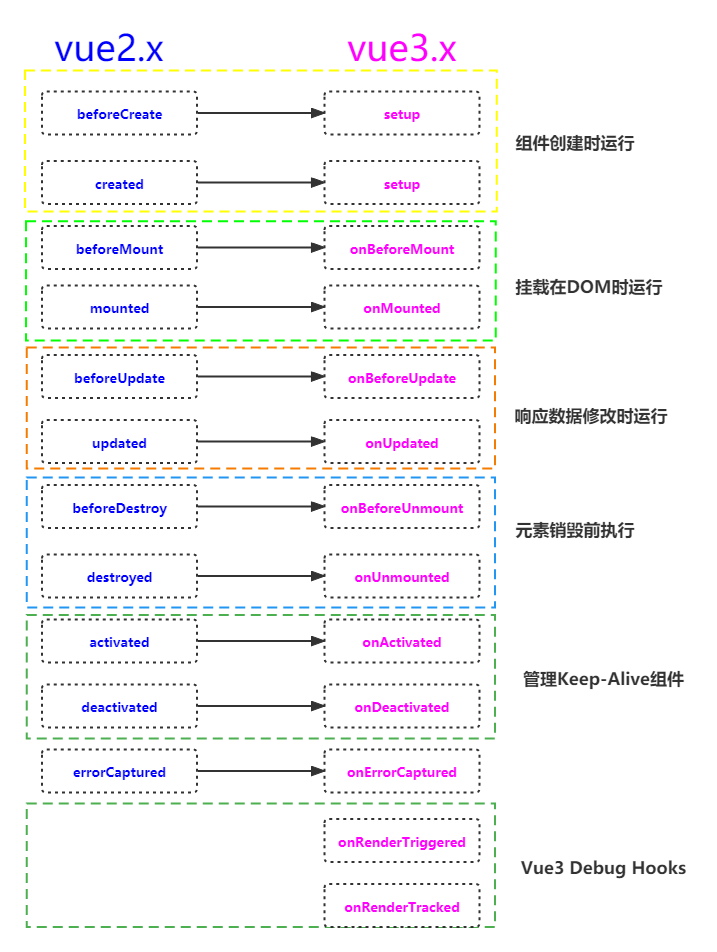
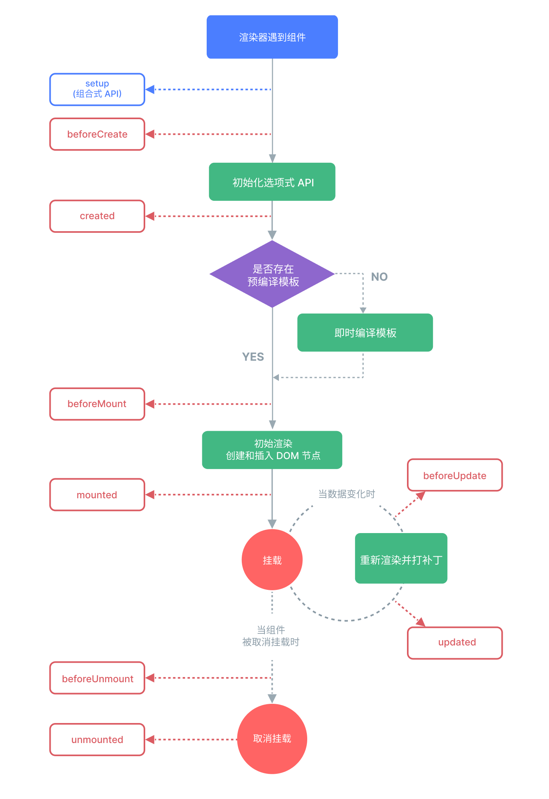

更小：Vue3移除一些不常用的 API，引入tree-shaking，可以仅打包需要的，使打包整体体积变小了。

更快：主要体现在编译方面，比如diff算法优化、静态提升、事件监听缓存、SSR优化。

更友好：vue3在兼顾Vue2的options API的同时还推出了composition API，大大增加了代码的逻辑组织和代码复用能力。

## 相关信息简介

2020年9月18日，Vue.js发布3.0版本，代号：One Piece（海贼王）

2 年多开发, 100+位贡献者, 2600+次提交, 600+次 PR、30+个RFC

Vue3 支持 vue2 的大多数特性

可以更好的支持 Typescript

## 性能提升

打包大小减少 41%

初次渲染快 55%，更新渲染快 133%

内存减少 54%

使用 Proxy 代替 defineProperty 实现数据响应式

重写虚拟DOM的实现和Tree-Shaking

## 新增特性

- Composition (组合) API
  - setup配置
  - ref 和 reactive
  - watch与watchEffect
  - provide 与 inject
  - …
- 新的生命周期函数
- 新的内置组件
  - Fragment - 文档碎片
  - Teleport - 瞬移组件的位置
  - Suspense - 异步加载组件的 loading 界面
- 其它 API 更新
  - 全局 API 的修改
  - 将原来的全局 API 转移到应用对象
  - 模板语法变化

## 组件通信的区别

- Vue3移出事件总线，使用mitt代替。
- vuex换成了pinia。
- 把.sync优化到了v-model里面了。
- 把$listeners所有的东西合并到$attrs中了。
- $children被砍掉了。

## 生命周期

### vue2.x的生命周期

### vue3.0的生命周期

