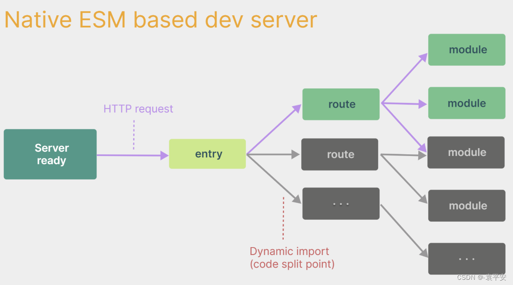

## 使用 vue-cli 创建

```bash
npm install -g @vue/cli
vue --version
vue create my-project
cd my-project
npm run serve
```

## 使用 vite 创建

```bash
npm init vite-app <project-name>
cd <project-name>
npm install
npm run dev
```

​         webpack构建与vite构建对比图如下:


