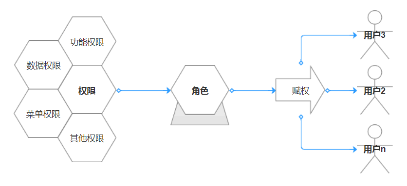
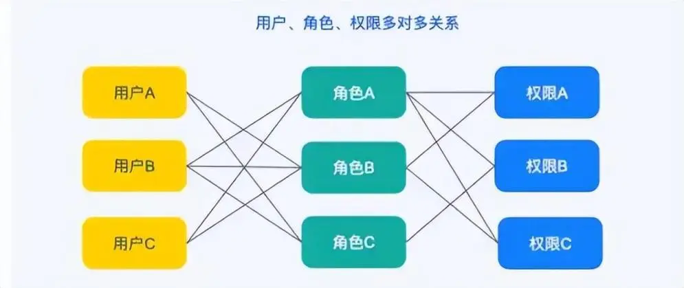
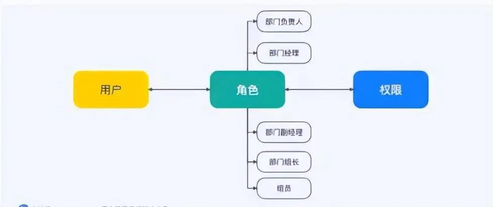
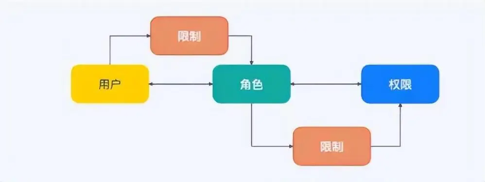
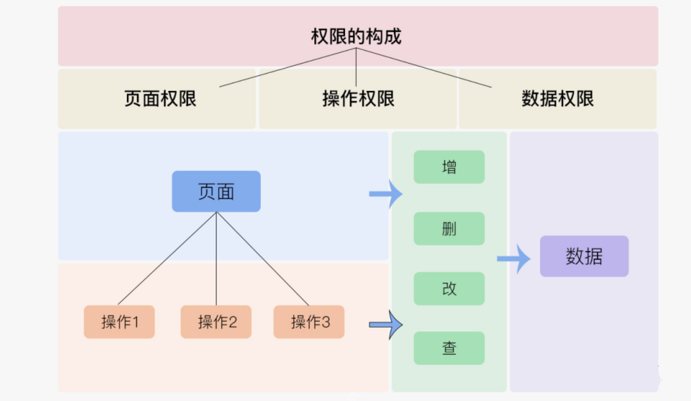
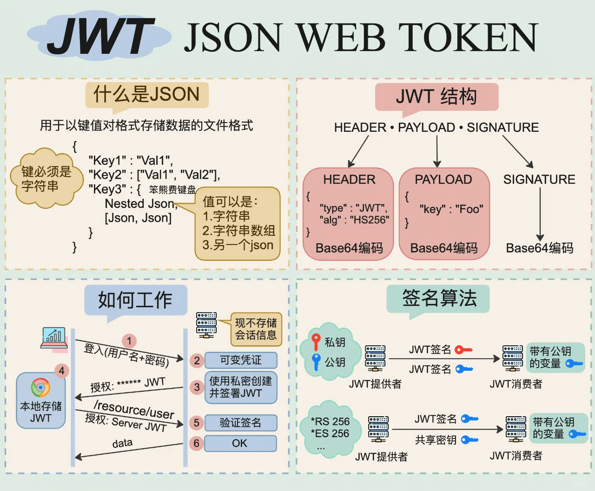
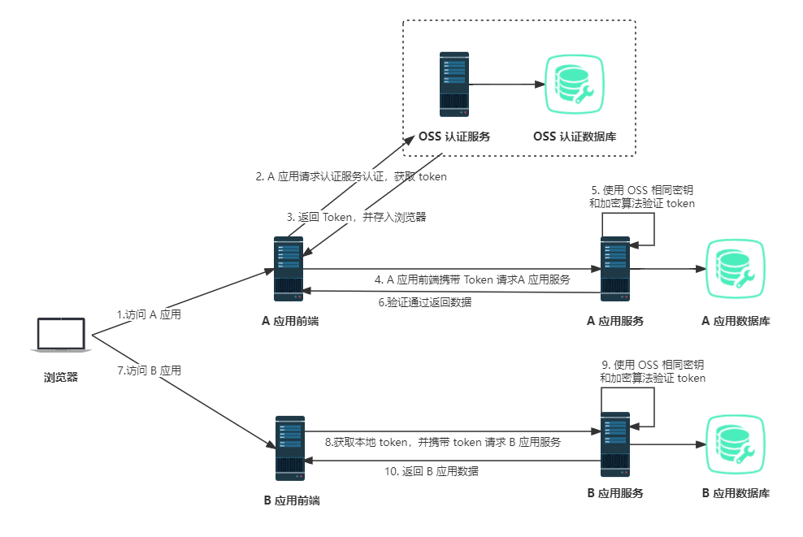

## RBAC模型

​	RBAC(Role-BasedAccess Control)，是基于角色的访问控制，是一种安全策略，它通过在用户和权限之间引入角色概念，来实现对资源的访问控制。**在RBAC中，权限与角色相关联，用户通过成为适当角色的成员而得到这些角色的权限。**



### RBAC支持的安全原则

- **最小权限原则(即细粒度控制原则)**：RBAC可将其角色配置成其完成任务所需要的最小权限集
- **责任分离原则**：通过调用相互独立互斥的角色来共同完成敏感的任务而体现，如要求一个计帐员和财务管理员一起参与同一个过帐
- **数据抽象原则**：通过权限的抽象来体现，如财务操作用借款、存款等抽象权限

### RBAC的基本数据元素

- **用户 users**：主体，即需要访问系统资源的个体或实体。每个用户都有一个或多个与之关联的角色。用户的身份通过身份验证过程进行确认，以确保其合法性。
- **角色 roles**：核心概念，它代表了一组权限的集合。角色通常根据业务功能或职责进行定义，例如“管理员”、“编辑员”、“访客”等。通过将角色分配给用户，可以实现用户与权限的间接关联，从而简化权限管理。
- **目标 objects**：资源或资产，即用户需要访问的实体。目标可以是文件、数据库、设备、服务或任何系统管理的其他资源。每个目标都有与之关联的操作和许可权。
- **操作 operations**：对目标进行的特定行为或动作，例如读取、写入、执行、删除等。每个目标都可以定义一组允许的操作，这些操作定义了用户对目标可以执行的行为。
- **许可权 permissions**：基本权限单位，它定义了用户对特定目标执行特定操作的授权。许可权通常由角色来赋予，即角色具有一组许可权，用户通过继承角色的许可权来获得对目标和操作的访问权限。

​	管理员首先定义角色并为其分配相应的许可权，然后将角色分配给用户。这样，用户就通过其关联的角色获得了对目标和操作的访问权限。当需要调整用户的权限时，管理员只需修改用户的角色分配，而无需逐个修改用户的许可权，从而大大简化了权限管理过程。

> ​	**RBAC中对于权限控制的做法**：
>
> 角色是为了完成各种工作而创造，用户则依据责任和资格来被指派相应的角色，用户可以很容易地从一个角色被指派到另一个角色。
>
> 角色可依新的需求和系统的合并而赋予新的权限，而权限也可根据需要而从某角色中回收。
>
> 角色与角色的关系同样也存在继承关系防止越权，角色与角色的关系可以建立起来以囊括更广泛的客观情况。

### RBAC设计思想

#### 基本模型**RBAC0**

​	RBAC0定义了能构成RBAC控制系统的最小的元素集合。

​	用户和角色、角色和权限多对多关系。

​	就是一个用户拥有多个角色，一个角色可以被多个用户拥有，这是用户和角色的多对多关系；同样的，角色和权限也是如此。



#### **角色分层模型RBAC1**

​	RBAC1建立在RBAC0基础之上，在角色中引入了继承的概念，有了继承那么角色就有了上下级或者等级关系。类似于树形结构，子角色可以继承父角色的所有权限。



> 如果采用RBAC0模型做权限系统，我可能需要为经理、主管、专员分别创建一个角色（角色之间权限无继承性），极有可能出现一个问题，由于权限配置错误，主管拥有经理都没有权限。
>
> RBAC1解决了这个问题，创建完经理角色并配置好权限后，主管角色的权限继承经理角色的权限，并且支持针对性删减主管权限。

#### 角色限制模型**RBAC2**

​	RBAC2在RBAC0基础上加入了约束的概念，主要引入了静态职责分离SSD和动态职责分离DSD。主要是为了增加角色赋予的限制条件，这也符合权限系统的目标：权责明确，系统使用安全、保密。



> 1. 角色互斥：同一用户不能分配到一组互斥角色集合中的多个角色，互斥角色是指权限互相制约的两个角色。
>
>    案例：财务系统中一个用户不能同时被指派给会计角色和审计员角色。
>
> 2. 基数约束：一个角色被分配的用户数量受限，它指的是有多少用户能拥有这个角色。
>
>    例如：一个角色专门为公司CEO创建的，那这个角色的数量是有限的。
>
>    先决条件角色：指要想获得较高的权限，要首先拥有低一级的权限。
>
>    例如：先有副总经理权限，才能有总经理权限。
>
> 3. 运行时互斥：例如，允许一个用户具有两个角色的成员资格，但在运行中不可同时激活这两个角色。

#### 统一模型**RBAC3**

​	是RBAC1与RBAC2的合集，所以RBAC3是既有角色分层又有约束的一种模型。这种模式既要维护好角色间的继承关系处理好分层，又要处理角色间的责任分离。

​	以上就是RBAC模型的四种设计思想，现在我们用的权限模型都是在RBAC模型的基础上根据自己的业务进行组合和改进。

## **RBAC 权限管理的在实际系统中的应用**

​	RBAC 权限模型由三大部分构成，即**用户管理**、**角色管理**、**权限管理**。

- 用户管理按照企业架构或业务线架构来划分，这些结构本身比较清晰，扩展性和可读性都非常好。
- 角色管理一定要在深入理解业务逻辑后再来设计，一般使用各部门真实的角色作为基础，再根据业务逻辑进行扩展。
- 权限管理是前两种管理的再加固，做太细容易太碎片，做太粗又不够安全，这里我们需要根据经验和实际情况来设计。

## Vben的三种权限处理方式：

1. 通过用户角色来过滤菜单(前端方式控制)，菜单和路由分开配置
2. 通过用户角色来过滤菜单(前端方式控制)，菜单由路由配置自动生成
3. 通过后台来动态生成路由表(后台方式控制)

### 前端角色权限

​	**原理：** 在前端写死路由的权限，指定路由有哪些权限可以查看。

1. 只初始化通用路由，带权限路由没有被加入路由表内。
2. 在登陆后或其他方式获取用户角色后，通过角色去遍历路由表，获取该角色可以访问的路由表，生成路由表。
3. 再通过 `router.addRoutes` 添加到路由实例，实现权限的过滤。

​	**缺点：** 权限相对不自由，如果后台改动角色，前台也要跟着改动。适合角色较固定的系统

动态更换角色

细粒度权限：函数方式、组件方式、指令方式

### 后台动态获取

​	**原理：** 通过接口动态生成路由表，且遵循一定的数据结构返回。前端根据需要处理该数据为可识别的结构，再通过 `router.addRoutes` 添加到路由实例，实现权限的动态生成。

动态更换菜单：函数方式、组件方式、指令方式

细粒度权限

## vue-router

​	`vue-router` 提供的导航守卫主要用来通过跳转或取消的方式守卫导航。`vue-router` 提供了导航钩子：全局前置导航钩子 `beforeEach` 和全局后置导航钩子 `afterEach`，它们会在路由即将改变前和改变后进行触发。和 `beforeEach` 不同的是 `afterEach` 不接收第三个参数 `next` 函数，也不会改变导航本身。

```javascript
router.beforeEach((to, from, next) => {
  /* 必须调用 `next` */
})
router.beforeResolve((to, from, next) => {
  /* 必须调用 `next` */
})
router.afterEach((to, from) => {})
```

**导航钩子有3个参数：**

1. to：即将要进入的目标路由对象
2. from：当前导航即将要离开的路由对象
3. next ：调用该方法后，才能进入下一个钩子函数（afterEach）

```javascript
next()//直接进to 所指路由
next(false) //中断当前路由
next('route') //跳转指定路由
next('error') //跳转错误路由
```

### router.addRoute()

​	`router.addRoute` 可以动态添加一条新路由。若该路由有 name，并且已经存在一个与之相同的名字，则会覆盖它。

- 添加一个新的路由记录。

```javascript
addRoute(route): () => void
```

- 添加一个新的路由记录，将其作为一个已有路由的子路由。

```javascript
addRoute(parentName, route): () => void
```

### router.beforeEach

​	全局前置守卫，初始化的时候被调用、每次路由切换之前被调用。A路由向B路由跳转时 只要形成路由跳转，在切换之前进行调用。

- 添加一个导航钩子，它会在每次导航之前被执行。返回一个用来移除该钩子的函数。

```javascript
beforeEach(guard): () => void
```

- 举个例子：判断token否存在以及要进入的页面。

```javascript
router.beforeEach((to,from,next)=>{
    let token = localstorage.getItem('token')
    if(to.path=='/login' || token){ // 如果token存在或者要进入的页面是登陆页，放行
        next()
    }else{ // 如果没有token并且进入的页面不是登陆页，那么提示过期并跳转到login页面
    vm.toast('登录过期，请重新登陆')
    setTimeout(() => {
        next({
            path:'/login'
        })
    }, 500);
    }
})
```

### router.afterEach

​	全局后置钩子，初始化的时候被调用、每次路由切换之后被调用。

- 添加一个导航钩子，它会在每次导航之后被执行。返回一个用来移除该钩子的函数。

```javascript
afterEach(guard): () => void
```

- 举个例子：每次切换页面时，页面的title也会跟着修改，同时，让页面滚动到最顶部。

```javascript
router.afterEach((to,from,nex)=>{
 document.title = to.meta.title
 window.scrollTo(0,0)
})
```

### beforeResolve

​	全局解析守卫，在每次导航时都会触发，不同的是，它会在导航被确认之前、所有组件内守卫和异步路由组件被解析之后调用。

- 添加一个导航守卫，它会在导航将要被解析之前被执行。此时所有组件都已经获取完毕，且其它导航守卫也都已经完成调用。返回一个用来移除该守卫的函数。

```javascript
beforeResolve(guard): () => void
```

### beforeEnter

​	路由独享守卫，某一个路由所单独享用的，只有前置没有后置。

```javascript
const routes = [
  {
    path: '/users/:id',
    component: UserDetails,
    beforeEnter: (to, from) => { //只在进入路由时触发，不会在 params、query 或 hash 改变时触发
      // reject the navigation
      return false
    },
  },
]
```

###  **beforeRouteEnter**

​	组件路由守卫，通过路由规则，进入该组件时被调用。

### **beforeRouteLeave** 

​	组件路由守卫，通过路由规则，离开该组件时被调用(不能说是后置，因为进入之后并不会触发，而是离开这个组件之前会触发)。

```javascript
const UserDetails = {
  template: `...`,
  beforeRouteEnter(to, from) {
    // 在渲染该组件的对应路由被验证前调用
    // 不能获取组件实例 `this` ！
    // 因为当守卫执行时，组件实例还没被创建！
  },
  beforeRouteUpdate(to, from) {
    // 在当前路由改变，但是该组件被复用时调用
    // 举例来说，对于一个带有动态参数的路径 `/users/:id`，在 `/users/1` 和 `/users/2` 之间跳转的时候，
    // 由于会渲染同样的 `UserDetails` 组件，因此组件实例会被复用。而这个钩子就会在这个情况下被调用。
    // 因为在这种情况发生的时候，组件已经挂载好了，导航守卫可以访问组件实例 `this`
  },
  beforeRouteLeave(to, from) {
    // 在导航离开渲染该组件的对应路由时调用
    // 与 `beforeRouteUpdate` 一样，它可以访问组件实例 `this`
  },
}
```

## 权限管理

​	权限管理一般从三个方面来做限制。**页面/菜单权限**，**操作权限**，**数据权限**。



### **页面/菜单权限**

​	对于没有权限操作的用户，直接隐藏对应的页面入口或菜单选项。这种方法简单快捷直接，对于一些安全不太敏感的权限，使用这种方式非常高效。

- **页面级权限控制**：页面权限中通过后台配置中的标识返回字符串 和前端路由中name字段进行匹配

### **组件级/操作权限**

​	操作权限通常指对同一组数据，不同的用户是否可以增删改查。对某些用户来说是只读浏览数据，对某些用户来说是可编辑的数据。

- **组件级权限控制**：组件级权限分为与项目信息相关的权限和与个人/部门/职位 相关的权限

### **与用户信息挂钩/数据权限**

​	对于安全需求高的权限管理，仅从前端限制隐藏菜单/编辑按钮是不够的，还需要在数接口上做限制。如果用户试图通过非法手段编辑不属于自己权限下的数据，服务器端会识别、记录并限制访问。**操作按钮显示=数据状态+当前用户角色组合，列表每一行数据操作按钮的显示跟当前行数据状态和当前用户角色关联**。

- **跟用户信息挂钩的数据**，需要服务端返回单独字段控制。可结合数据状态和用户角色来确定前端操作按钮的显示，从而实现精细化的权限控制。

> **数据权限如何管控?**
>
> 数据权限可以分为行权限和列权限。行权限控制：看多少条数据。列权限控制：看一条数据的多少个字段
>
> 可以通过组织架构来管控行权限，按照角色来配置列权限，但是遇到复杂情况，组织架构是承载不了复杂行权限管控，角色也更不能承载列的特殊化展示。
>
> 目前行业的做法是提供行列级数据权规则配置，把规则当成类似权限点配置赋予某个角色或者某个用户。

## 权限控制实现

### 页面/菜单权限

1. 后端权限管理配置
   - **后台系统维护侧边栏目录的配置**，包括目录名称、图标、链接等。
   - 后端接口能够返回侧边栏的树形结构数据，**这些数据应该包含每个菜单项对应的路由地址和权限标识。**
2. 前端路由配置
   - **前端项目中定义好静态路由和动态路由的配置。**
   - 静态路由通常是那些不需要权限即可访问的页面，如登录页、404页面等。动态路由则是根据用户角色和权限来动态生成的路由。
3. 路由匹配与生成
   - 调用后端接口获取侧边栏树形结构数据。前端通过递归遍历后端返回的树形结构数据，并与前端配置的路由进行匹配。
   - **对于匹配成功的路由，将其加入到异步路由表中。**
4. 路由表整合
   - **将动态生成的异步路由表和静态的常规路由表进行整合。**
   - 确保整合后的路由表是完整的，并且按照正确的顺序排列。
5. 生成侧边栏菜单
   - 根据整合后的路由表，**生成侧边栏菜单的DOM结构。**
   - 侧边栏菜单应该包含所有用户有权限访问的菜单项。对于没有权限访问的菜单项，应该进行隐藏或者显示为不可点击状态。
6. 路由守卫与权限校验
   - **在前端实现路由守卫，对用户的访问进行权限校验。**
   - 当用户尝试访问某个页面时，检查该用户是否具有访问该页面的权限。如果没有权限，则重定向到无权限页面或提示用户。
7. 缓存与性能优化
   - 对于一些不经常变动的侧边栏数据，可以考虑使用缓存来提高性能。
   - 在用户登录成功后，可以将侧边栏数据缓存起来，避免重复请求后端接口。

> ​	下面是一个示例：
>
> ```javascript
> // 假设后端返回的数据结构如下：  
> const menuData = [  
>   {  
>     id: 1,  
>     name: '首页',  
>     icon: 'home',  
>     path: '/',  
>     permission: 'view_home',  
>     children: [  
>       // 子菜单项...  
>     ]  
>   },  
>   // 其他菜单项...  
> ];  
>   
> // 前端配置的静态路由  
> const staticRoutes = [  
>   { path: '/login', component: Login },  
>   { path: '/404', component: NotFound },  
>   // 其他静态路由...  
> ];  
>   
> // 动态生成异步路由  
> function generateAsyncRoutes(menuData) {  
>   const asyncRoutes = [];  
>   menuData.forEach(item => {  
>     if (item.children) {  
>       item.children = generateAsyncRoutes(item.children); // 递归生成子路由  
>     }  
>     if (userHasPermission(item.permission)) { // 假设userHasPermission函数用来检查用户权限  
>       asyncRoutes.push({  
>         path: item.path,  
>         component: () => import(`@/views${item.path}.vue`), // 动态导入组件  
>         meta: { permission: item.permission }, // 可以将权限信息存储在meta中  
>         children: item.children,  
>       });  
>     }  
>   });  
>   return asyncRoutes;  
> }  
>   
> // 整合路由表  
> const allRoutes = [...staticRoutes, ...generateAsyncRoutes(menuData)];  
>   
> // 根据路由表生成侧边栏菜单（这里省略具体实现，根据路由表渲染DOM即可）  
> generateSidebarMenu(allRoutes);  
>   
> // 路由守卫示例（在Vue Router中使用beforeEach）  
> router.beforeEach((to, from, next) => {  
>   if (to.matched.some(record => record.meta.permission)) {  
>     // 检查用户是否拥有该路由的权限  
>     if (!userHasPermission(to.matched[0].meta.permission)) {  
>       next('/no-permission'); // 无权限则重定向  
>     } else {  
>       next(); // 有权限则继续  
>     }  
>   } else {  
>     next(); // 不需要权限的路由直接通过  
>   }  
> });
> ```

### 组件级/操作权限

1. 用户登录与权限获取
   - **用户登录成功后，后端应返回包含用户权限信息的响应。**
   - 权限信息可以是一个包含多个权限字段的集合，每个字段代表一个特定的权限。
2. 前端存储权限信息
   - **前端接收到权限信息后，应将其存储在本地**，如使用浏览器的localStorage或sessionStorage。
   - 也可以将权限信息保存在Vuex（如果使用的是Vue框架）或其他状态管理库中，以便在组件中方便地访问。
3. 自定义指令 v-permission
   - **创建一个自定义指令 `v-permission`，用于在DOM元素上添加权限控制逻辑。**
   - 当元素绑定该指令时，它会检查当前用户是否具有相应的权限。如果没有权限，则隐藏或禁用该元素。
4. 自定义方法 this.hasPermission
   - 在Vue组件或全局方法中，**定义一个 `hasPermission` 方法，用于在JavaScript代码中判断权限。**
   - 这个方法接受一个权限字段作为参数，并返回用户是否拥有该权限的布尔值。
5. 视图权限判断
   - 在模板中，使用 `v-permission` 指令来判断是否显示按钮或组件。
   - 例如：`<button v-permission="'edit-item'">编辑</button>`。这里的 `'edit-item'` 是一个权限字段。
6. 逻辑权限判断
   - 在组件的方法或计算属性中，使用 `this.hasPermission` 方法来判断是否执行某些逻辑。
   - 例如：`if (this.hasPermission('delete-item')) { /* 执行删除逻辑 */ }`。
7. 动态组件与路由权限
   - 对于动态加载的组件，可以在加载前检查权限，避免无权限用户访问。
   - 对于路由权限，可以结合Vue Router的导航守卫（navigation guards）来实现。在路由跳转前，检查用户是否拥有访问目标路由的权限。

> ​	下面是一个示例：
>
> ​	首先，假设后端在用户登录成功后返回的响应中包含了一个权限字段集合，如下：
>
> ```json
> {  
>   "username": "user123",  
>   "permissions": ["view_dashboard", "edit_item", "delete_item"]  
> }
> ```
>
> ​	前端Vue组件中，我们可以创建一个自定义指令 `v-permission` 和一个全局方法 `hasPermission`。自定义指令 `v-permission` 的实现：
>
> ```javascript
> Vue.directive('permission', {  
>   inserted: function (el, binding, vnode) {  
>     const permission = binding.value;  
>     if (!vnode.context.hasPermission(permission)) {  
>       el.remove(); // 或者可以设置为隐藏：el.style.display = 'none';  
>     }  
>   },  
>   update: function (el, binding, vnode) {  
>     // 当权限变化时，重新判断  
>     const permission = binding.value;  
>     const hasPermission = vnode.context.hasPermission(permission);  
>     if (hasPermission) {  
>       el.style.display = ''; // 显示元素  
>     } else {  
>       el.style.display = 'none'; // 隐藏元素  
>     }  
>   }  
> });
> ```
>
> ​	全局方法 `hasPermission` 的实现：
>
> ```javascript
> Vue.prototype.hasPermission = function (permission) {  
>   // 假设我们在Vuex中存储了用户的权限信息  
>   const store = this.$store;  
>   const userPermissions = store.state.user.permissions;  
>   return userPermissions.includes(permission);  
> };
> ```
>
> ​	现在，我们可以在Vue组件的模板中使用这个自定义指令来控制按钮的显示：
>
> ```html
> <template>  
>   <div>  
>     <button v-permission="'edit_item'">编辑</button>  
>     <button v-permission="'delete_item'">删除</button>  
>     <!-- 其他组件或按钮 -->  
>   </div>  
> </template>  
>   
> <script>  
> export default {  
>   // ... 其他选项 ...  
>   methods: {  
>     someMethod() {  
>       if (this.hasPermission('some_special_permission')) {  
>         // 执行特殊权限的操作  
>       }  
>     }  
>   }  
> }  
> </script>
> ```
>
> 在这个例子中，`v-permission` 指令被绑定到按钮上，并传入了一个权限字符串（如 `'edit_item'`）。当Vue实例被创建或更新时，指令的 `inserted` 和 `update` 钩子函数会被调用，它们会根据用户的权限来决定是否显示按钮。
>
> `hasPermission` 方法用于在Vue组件的逻辑中判断用户是否拥有某个权限。在组件的方法或计算属性中，我们可以调用这个方法来决定是否执行某些操作。

### 与用户信息挂钩/数据权限

1. 数据状态与用户角色关联

   - 每行数据都有一个状态字段，而每个用户都有一个角色。操作按钮的显示取决于这两个因素。

2. 服务端返回数据

   - 服务端返回的数据包括每行数据的状态、与这行数据相关的用户ID（如leaderId, creatorId），以及当前用户的ID。

3. 维护Map表

   - `statusButtonsMap`：维护数据状态与操作按钮的映射关系。

   - `userButtonsMap`：维护用户角色与操作按钮的映射关系。

4. 获取行数据状态操作

   - 根据服务端返回的行数据状态和`statusButtonsMap`，确定该行数据状态对应的操作按钮集合`statusOpetors`。

5. 获取行数据用户操作

   - 根据服务端返回的行数据的用户角色ID(如`leaderId`, `creatorId`)和`userButtonsMap`，确定该行数据用户角色对应的操作按钮集合`userOpetors`。

6. 求交集

   - 将`statusOpetors`和`userOpetors`进行交集运算，得到的结果就是当前行数据对当前用户可显示的操作按钮集合。

7. 前端显示

   - 根据计算得到的操作按钮集合，动态渲染列表项的操作按钮。

8. 优点

   - 灵活性：通过维护映射表，可以方便地添加、修改或删除数据状态、用户角色以及操作按钮的映射关系。

   - 安全性：确保只有满足特定条件和角色的用户才能看到和执行相应的操作，增强了系统的安全性。
   - 用户体验：只展示用户真正需要的操作按钮，简化界面，提升用户体验。

> ​	下面是一个示例：
>
> ​	假设我们有一个企业内部的任务管理系统，每个任务都有一个状态（如待分配、进行中、已完成），并且每个任务都与一个或多个用户相关联（如任务创建者、任务负责人）。不同的用户角色（如普通员工、项目经理、管理员）对任务的操作权限也有所不同。
>
> - 数据状态：
>
>   - 待分配（`pending_assignment`）
>   - 进行中（`in_progress`）
>   - 已完成（`completed`）
>
> - 用户角色：
>
>   - 普通员工（`employee`）
>   - 项目经理（`project_manager`）
>   - 管理员（`admin`）
>
>   对于某个任务，服务端可能返回以下数据：
>
> ```json
> { // 当前用户userC登录后查看任务ID为123的任务，该任务的状态为pending_assignment
>   "taskId": "123",  
>   "taskStatus": "pending_assignment",  
>   "creatorId": "userA", // 任务的创建者
>   "assigneeId": "userB", // 被分配的任务负责人
>   "currentUserId": "userC" //当前登录查看任务的用户
> }
> ```
>
> ​	设置statusButtonsMap：
>
> ```json
> const statusButtonsMap = {  
>   "pending_assignment": ["assign", "delete"],  
>   "in_progress": ["edit", "comment", "complete"],  
>   "completed": ["view", "reopen"]  
> }
> ```
>
> ​	设置userButtonsMap：
>
> ```json
> const userButtonsMap = {  
>   "admin": ["assign", "edit", "comment", "complete", "delete", "reopen"],  
>   "project_manager": ["assign", "edit", "comment", "complete", "reopen"],  
>   "employee": ["comment", "complete"]  
> }
> ```
>
> ​	获取行数据状态操作：根据 `taskStatus`(`pending_assignment`)和 `statusButtonsMap`，得到操作按钮集合 `statusOpetors` 为 `["assign", "delete"]`。
>
> ```javascript
> // 根据任务状态获取操作按钮集合  
> const statusOpetors = statusButtonsMap[taskStatus] || []; // 如果找不到对应的状态，则返回空数组  
> ```
>
> ​	获取行数据用户操作：由于当前用户 `userC` 不是任务的创建者也不是被分配者，我们假设 `userC` 的角色是 `employee`。根据 `userButtonsMap` 和用户角色 `employee`，得到操作按钮集合 `userOpetors` 为 `["comment", "complete"]`。
>
> ```javascript
> // 根据用户角色获取操作按钮集合  
> const userOpetors = userButtonsMap[currentUserRole] || []; // 如果找不到对应的角色，则返回空数组  
> ```
>
> ​	求交集：`statusOpetors` 和 `userOpetors` 的交集为空，这意味着 `userC`(作为普通员工)在当前任务状态下没有任何可操作的按钮。
>
> ```javascript
> // 计算交集  
> const intersection = statusOpetors.filter(button => userOpetors.includes(button));  
> ```
>
> ​	但如果 `userC` 是管理员(`admin`)，那么将得到 `["assign", "delete"]`，因为这是管理员在任务处于待分配状态时允许执行的操作。
>
> ​	前端展示：根据求得的交集结果，前端将不展示任何操作按钮给 `userC`（作为普通员工），因为该用户在当前任务状态下没有操作权限。如果 `userC` 是管理员，则会显示“分配”和“删除”按钮。

## 单点登录

​	单点登录（Single Sign-On，简称SSO）是一种身份验证和授权过程，它允许用户使用一个身份(通常是一个用户名和密码或一个认证令牌)在多个应用程序或服务中进行登录。**一旦用户在一个应用程序或服务中通过了身份验证，他们就可以访问与之集成的其他所有应用程序或服务，而无需再次输入用户名和密码。**

​	SSO的核心思想是实现用户身份的统一管理和认证，减少用户在不同应用之间频繁登录的麻烦，提高用户体验。同时，它也有助于降低企业IT部门的管理成本，提高系统的安全性。




