  **最近遇到一个很奇怪的bug：**
>
> 前置：后端接口返回的数据是这样的：
> 
> 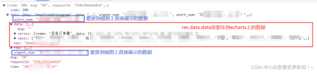
> 
> ①首先在store中取出后端返回的数据A=res.data，在这里打印输出是正常的
>
> 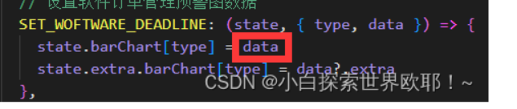
>
> ②然后在vue页面上再取出A.data也就是res.data.data，以及其它几个字段即res.data.XXX，在这里打印输出是空白的
>
> 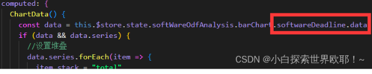
>
> ③结果在图表页中取出的一直是undefined（读取属性不存在），但是第一次加载不出来，再刷新一下却又能拿到数据了。
>
> 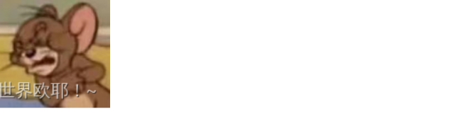
>
> **最后的解决方案：**
>
> 在定义data/computed的时候，就先对A的所有属性进行枚举，需要用到后端data里的哪一层就枚举几层，于是就没问题了！
>
> 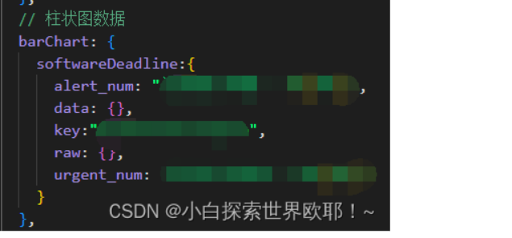
>
> **不仅仅是这个地方，在其他地方也能遇到这种bug！！！比如在展示一块信息的时候，已经写好了遍历，根据后端返回的字段自己去渲染，但是，如果不在data里面把每一个字段都枚举一下，就会导致在表单进行编辑修改的时候，数据明明数据变化了可是视图没有更新，于是乎，后端每次新增一个字段，前端也需要在枚举中增加一个字段才行。**

在问了大佬以及看了文档之后，才知道原来这是Vue2响应式原理的一个问题......

因为第一次加载的时候，找不到softwareDeadline里面的属性，没有执行defineReactive()，所以取的时候是undefined，但是ctrl+S的时候，已经是从后端取过数据放在缓存里了，所以它又显示数据正常了。

# Vue2的响应式流程

## 核心思路

​    **当创建`Vue`实例时，`vue`会遍历`data`选项的属性，利用`Object.defineProperty`为属性添加`getter`和`setter`对数据的读取进行劫持（其中`getter`用来依赖收集，`setter`用来派发更新），并且在内部追踪依赖，在属性被访问和修改时通知变化。**

​    **每个组件实例会有相应的`watcher`实例，会在组件渲染的过程中记录依赖的所有数据属性（进行依赖收集，还有`computed watcher`、`user watcher`实例），之后依赖项被改动时，`setter`方法会通知依赖于此`data`的`watcher`实例重新计算（派发更新），从而使它关联的组件重新渲染。**

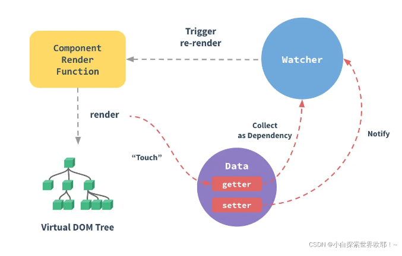

- 在`init`数据初始化的时候，对象内部通过 `defineReactive` 方法，使用 `Object.defineProperty` 将属性进行劫持（这时候只会劫持**已经存在的属性**）。如果数据是数组类型， Vue2中是通过重写数组方法来实现。多层对象是通过递归来实现劫持的。
- 在初始化流程中的编译阶段，当`render function` 被渲染的时候，会读取Vue实例中和视图相关的响应式数据，此时会触发 `getter` 函数进行 **依赖收集**（将观察者`Watcher`对象存放到当前闭包的订阅者`Dep`的`subs`中）。
- 当数据发生变化或者视图导致的数据发生变化时，会触发数据劫持的`setter`函数，`setter`会通知初始化依赖收集中的`Dep`中和视图相应的 `Watcher` ，告知需要重新渲染视图，`Watcher` 就会再次通过 `update` 方法来更新视图。

## 关键角色

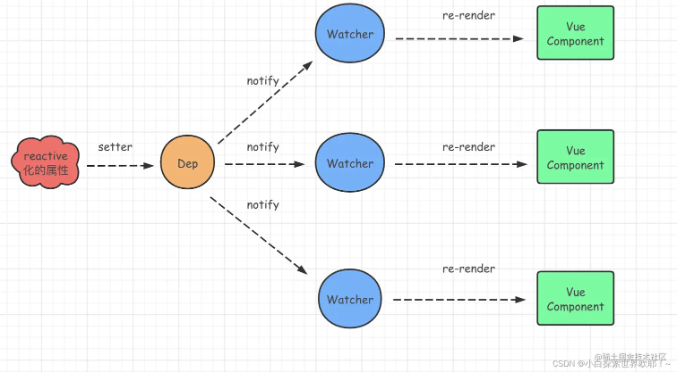

如上图所示：一个属性可能有多个依赖，每个响应式数据都有一个`Dep`来管理它的依赖。

### Observer

- 通过`Observer`对象将数据对象转换为响应式数据。
- **`通过Object.defineProperty()`给对象的属性添加`getter`和**`**setter**，`用于依赖收集和派发更新。

> `getter()`：进行依赖收集。当访问响应式数据时，会将当前的`Watcher`对象添加到依赖列表中。
>
> `setter()`：数据发生变化时，`setter`函数会被触发，并通知相关的`Watcher`对象进行更新。
>
> ​    由于 Object.defineProperty 无法监听对象的变化，所以 Vue2 中设置了一个 Observer 类来管理对象的响应式依赖，同时也会递归侦测对象中子数据的变化。
>
> 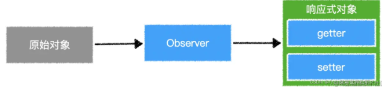
### Dep

- 相当于一个管家，负责添加或删除相关的依赖和通知相关的依赖进行相关操作。
- 用于收集当前响应式对象的依赖关系，每个响应式对象包括子对象都拥有一个`Dep`实例（里面`subs`是`Watcher`实例数组），当数据有变更时，会通过`dep.notify()`通知各个`watcher`。

> Vue会为响应式对象中的每个属性、对象本身、数组本身创建一个Dep实例，每个Dep实例都有能力做以下两件事：
>
> - 记录依赖：是谁在用我。（当有人访问这个数据时，把它记录下来。）
> - 派发更新：我变了，我要通知那些用到我的人。（当数据被修改时，通知所有的依赖数据更改了。）
>
> 1. **当读取响应式对象的某个属性时，它会进行依赖收集：有人用到了我**
> 2. **当改变某个属性时，它会派发更新：那些用我的人听好了，我变了**
>
> 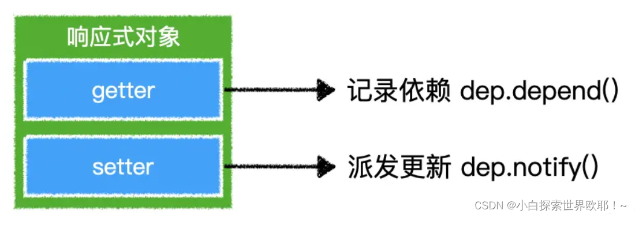

### Watcher

- 用于存储数据变化后要执行的**更新函数**，调用更新函数可以使用新的数据更新**视图。当数发生变化时触发依赖，Dep通知所有的Watcher更新视图**
- Watcher通过`new`关键字实例化的时候让`Dep.target`指向自己

> 只有 Watcher 触发的 getter才会进行依赖收集，哪个Watcher触发了getter，就把哪个 Watcher收集到Dep中。当响应式数据发生改变的时候，就会把收集到的 Watcher 都进行通知。（当Dep进行派发更新时，它会通知之前记录的所有watcher：我变了）
>
> 
>
> 
>
> 每一个vue组件实例，都至少对应一个watcher，该watcher中记录了该组件的render函数。
>
> watcher首先会把render函数运行一次以收集依赖，于是那些在render中用到的响应式数据就会记录这个watcher。
>
> 当数据变化时，dep就会通知该watcher，而watcher将重新运行render函数，从而让界面重新渲染，同时重新记录当前的依赖。

## 代码

```javascript
const Observer = function(data) {
  // 循环修改为每个属性添加get set
  for (let key in data) {
    defineReactive(data, key);
  }
}

const defineReactive = function(obj, key) {
  // 局部变量dep，用于get set内部调用
  const dep = new Dep();
  // 获取当前值
  let val = obj[key];
  Object.defineProperty(obj, key, {
    // 设置当前描述属性为可被循环
    enumerable: true,
    // 设置当前描述属性可被修改
    configurable: true,
    get() {
      console.log('in get');
      // 调用依赖收集器中的addSub，用于收集当前属性与Watcher中的依赖关系
      dep.depend();
      return val;
    },
    set(newVal) {
      if (newVal === val) {
        return;
      }
      val = newVal;
      // 当值发生变更时，通知依赖收集器，更新每个需要更新的Watcher，
      // 这里每个需要更新通过什么断定？dep.subs
      dep.notify();
    }
  });
}

const observe = function(data) {
  return new Observer(data);
}

const Vue = function(options) {
  const self = this;
  // 将data赋值给this._data，源码这部分用的Proxy所以我们用最简单的方式临时实现
  if (options && typeof options.data === 'function') {
    this._data = options.data.apply(this);
  }
  // 挂载函数
  this.mount = function() {
    new Watcher(self, self.render);
  }
  // 渲染函数
  this.render = function() {
    with(self) {
      _data.text;
    }
  }
  // 监听this._data
  observe(this._data);  
}

const Watcher = function(vm, fn) {
  const self = this;
  this.vm = vm;
  // 将当前Dep.target指向自己
  Dep.target = this;
  // 向Dep方法添加当前Wathcer
  this.addDep = function(dep) {
    dep.addSub(self);
  }
  // 更新方法，用于触发vm._render
  this.update = function() {
    console.log('in watcher update');
    fn();
  }
  // 这里会首次调用vm._render，从而触发text的get
  // 从而将当前的Wathcer与Dep关联起来
  this.value = fn();
  // 这里清空了Dep.target，为了防止notify触发时，不停的绑定Watcher与Dep，
  // 造成代码死循环
  Dep.target = null;
}

const Dep = function() {
  const self = this;
  // 收集目标
  this.target = null;
  // 存储收集器中需要通知的Watcher
  this.subs = [];
  // 当有目标时，绑定Dep与Wathcer的关系
  this.depend = function() {
    if (Dep.target) {
      // 这里其实可以直接写self.addSub(Dep.target)，
      // 没有这么写因为想还原源码的过程。
      Dep.target.addDep(self);
    }
  }
  // 为当前收集器添加Watcher
  this.addSub = function(watcher) {
    self.subs.push(watcher);
  }
  // 通知收集器中所的所有Wathcer，调用其update方法
  this.notify = function() {
    for (let i = 0; i < self.subs.length; i += 1) {
      self.subs[i].update();
    }
  }
}

const vue = new Vue({
  data() {
    return {
      text: 'hello world'
    };
  }
})

vue.mount(); // in get
vue._data.text = '123'; // in watcher update /n in get
```

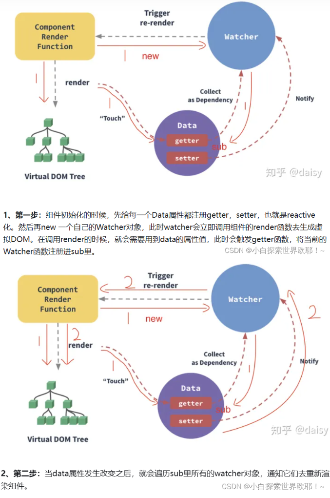
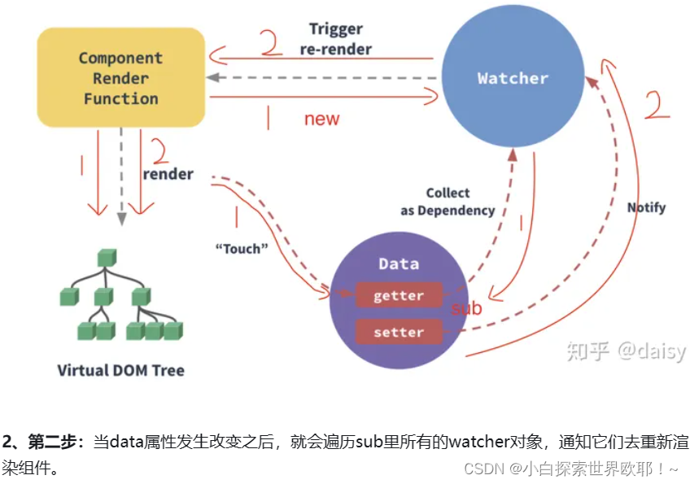