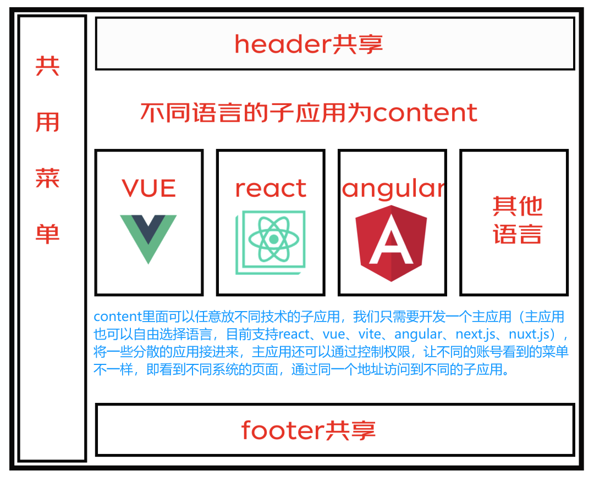

## 前言

​	随着技术的飞速发展，我们十年历史的PHP+jQuery老项目已显力不从心，技术非常老旧且维护成本高昂，其实已经无数次想要重构，但是苦于历史遗留原因以及业务的稳定性而一直难以下手，而且一时半会又不能全部重构。本次新页面较多且后续将持续迭代新模块，老页面的改动较少且代码库错综复杂，牵一发而动全身。经过几番思考，我们发现**微前端是一种非常实用的去实施渐进式重构的架构**，很适合用微前端技术来完成本次需求，最终决定**利用Vue3+Vite搭建一个全新的基座（主应用），作为新旧系统融合的桥梁，将原来的老项目接入到基座，后面的新需求都在新项目里面开发就行，不用再动老项目。**此举不仅实现了新页面Vue3开发，而且老项目也能和新项目融合一起，既保持了旧系统的稳定运行，又引入了新技术栈的活力。

​	同时，鉴于我们另一个Vue2+webpack项目也同样面临技术过时和项目规模庞大的问题，每次开发时运行起来非常卡顿，后期难以维护，也需要用微前端来进行一些拆分，不可能一直往该项目上堆代码。所以，我们决定一步到位，**设计了一套微前端项目模板，将微前端的核心配置抽象为可复用的插件，并结合自研组件库、HTTP请求、权限控制等插件，构建了一个全面的项目脚手架**，旨在简化未来项目的搭建流程，提升开发效率，确保技术栈的先进性与可持续性。

##  **微前端框架选型**

​	我们本次项目使用的是Vue3t+Vite+TypeScript的技术栈，在综合对比了各个框架之后，认为MicroApp是最适合我们当前现实情况的。原因有下：

1. 使用简单，将所有功能都封装到一个类WebComponent组件内，从而实现在基座应用中嵌入一行代码即可渲染一个微前端应用。
2. 不需要像 single-spa 和 qiankun 一样要求子应用修改渲染逻辑并暴露出方法，也不需要修改webpack配置，是目前市面上接入微前端成本最低的方案。
3. 功能丰富，提供了 js沙箱、样式隔离、元素隔离、预加载、数据通信、静态资源补全等一系列完善的功能。
4. 零依赖，这赋予它小巧的体积和更高的扩展性。
5. 兼容所有框架，为了保证各个业务之间独立开发、独立部署的能力，micro-app做了诸多兼容，在任何技术框架中都可以正常运行。
6. 侵入性低：对原代码几乎没有影响。
7. 组件化：基于webComponents思想实现微前端。

## 微前端设计思路

1. 拆分功能模块：首先，我们需要将整个后台管理系统拆分为多个独立的功能模块，如用户管理模块、专项管理模块、订单管理模块等。每个模块都可以作为一个独立的微应用进行开发和维护。

2. 设计通信协议：为了实现各个微应用之间的通信和资源共享，我们需要设计一套统一的通信协议和API。例如，我们可以定义一个emit方法来触发自定义事件，以及一个on方法来监听自定义事件；我们还可以使用Webpack的CommonsChunkPlugin插件来实现公共资源的提取和共享。

3. 开发主应用：主应用是整个后台管理系统的入口，它负责加载和管理各个微应用。主应用需要提供一个容器元素来承载各个微应用的内容，并提供一些基础设施服务，如路由管理、状态管理等。此外，主应用还需要实现与各个微应用的通信和资源共享。

4. 开发微应用：每个微应用都是一个独立的功能模块，它可以独立开发、部署和运行。每个微应用都需要提供一个容器元素来承载该应用的内容，并提供一些与主应用交互的接口，如共享资源、通信等。此外，微应用还需要实现自身的业务逻辑和界面展示。

5. 集成测试：在完成各个微应用的开发后，我们需要对整个系统进行集成测试，确保各个微应用之间的通信和资源共享正常工作。此外，我们还需要对整个系统的性能、稳定性等进行测试和优化。

## 项目实践

> ​	**技术栈：**
>
> - 主应用：Vue3+Vite+TypeScript
> - 子应用1（老项目）：用 iframe 挨个嵌入
> - 子应用2（新模块）：react / Vue3 ...

​	本次重构的是一个后台管理系统，最外层是基座，基座不仅是微前端应用集成的一个关键平台，还承载着维护公共资源、管理依赖项以及确立开发规范的重要使命。具体而言，其职责可概括为以下几点：

1. 子应用集成，给子应用提供渲染容器
2.  权限管理
3. 会话管理
4.  路由、菜单管理
5. 主题管理
6. 共享依赖
7. 多语言管理（important）

### 

​	因为micro-app对主应用和子应用的技术栈没有任何要求，所以，我们新建三个项目，my-app（Vue3）、my-app1（React）、my-app2（Vue2）。my-app是整体项目的主应用，也就是基座，my-app1和my-app2都是平级的子应用。

### 搭建微前端基座

**1. 创建项目**

**2. 路由跳转**

**3. 设置跨域**

**4. 代理配置**

**5. 数据通讯**

### 构建子应用

