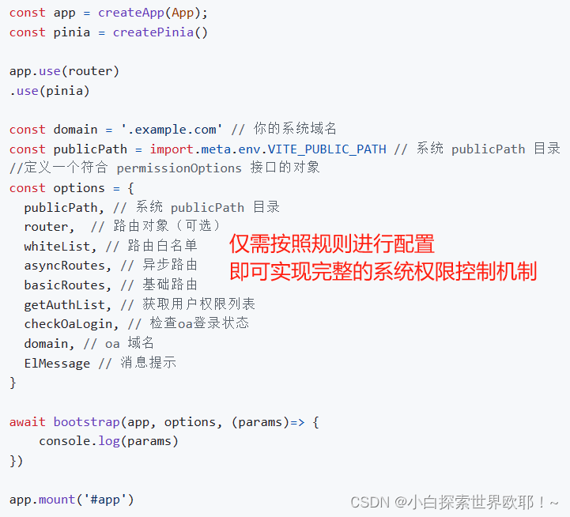
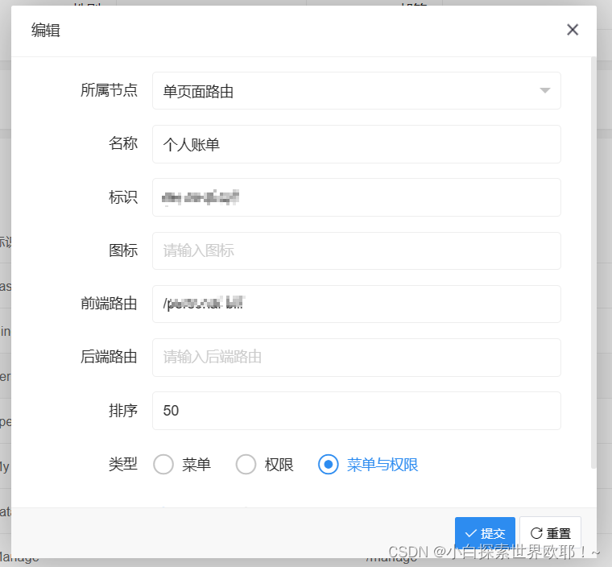
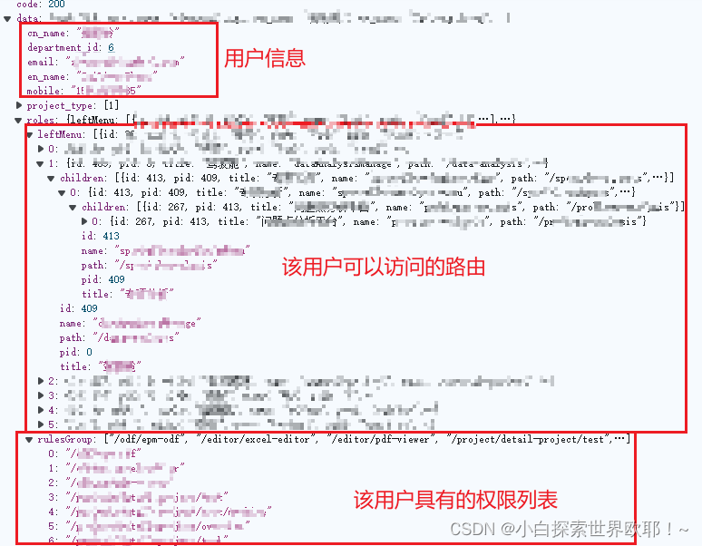

- ---
  title: 系统权限控制插件
  author: vivien
  date: '2024-05-09'
  # headerImage: /about-bg.jpg # public 文件夹下的图片
  isShowComments: true    # 展示评论
  categories:     # 分类
   - Project
  tags:       # 标签
   - 权限控制
  ---


## 系统权限控制插件 vivien-permission

使用文档：[vivien-permission](https://github.com/yoguoer/vivien-permission)

​	系统权限控制模块是一个关键组件，它确保系统中的每个用户只能访问其被授权的资源。vivien-permission 插件是一个基于后台管理系统中的路由菜单权限控制系统，通过 vue-router 全局控制后台管理系统的菜单权限。

    	背景：按照传统的开发方式方式，每次新开发一个系统，就需要花费大量时间精力去搭建权限控制模块，如果我们把权限控制这一整个模块都抽离成一个独立的权限控制插件，支持单命令安装，全面暴露参数与方法，就可以通过配置快速集成完整的权限控制机制。
    	意义：便于集成与扩展，提高项目构建速度，减少重复代码，降低工作量。提高开发效率，减少因人工手动搭建导致的不必要的错误。
### 功能

| 功能             | 介绍                                                     |
| ---------------- | -------------------------------------------------------- |
| 菜单路由权限控制 | 通过接口返回权限路由名称，控制当前登录用户的路由权限     |
| 按钮级别权限控制 | 通过接口返回按钮权限列表名称，控制当前登录用户的按钮权限 |
| 单点登录         | 使用当前插件的系统和其他系统相互登录                     |

① 能支持单点登录、 Token 维护与路由权限判断

② 提供灵活的配置选项，满足用户个性化需求



### 实现原理

​        页面/菜单权限实现思路
1、后端权限管理配置

- 后台系统维护侧边栏目录的配置，包括目录名称、图标、链接等。

- 后端接口能够返回侧边栏的树形结构数据，这些数据应该包含每个菜单项对应的路由地址和权限标识。


2、前端路由配置

- 前端项目中定义好静态路由和动态路由的配置。

- 静态路由通常是那些不需要权限即可访问的页面，如登录页、404页面等。动态路由则是根据用户角色和权限来动态生成的路由。


3、路由匹配与生成

- 调用后端接口获取侧边栏树形结构数据。前端通过递归遍历后端返回的树形结构数据，并与前端配置的路由进行匹配。

- 对于匹配成功的路由，将其加入到异步路由表中。


4、路由表整合

- 将动态生成的异步路由表和静态的常规路由表进行整合。

- 确保整合后的路由表是完整的，并且按照正确的顺序排列。


5、生成侧边栏菜单

- 根据整合后的路由表，生成侧边栏菜单的DOM结构。

- 侧边栏菜单应该包含所有用户有权限访问的菜单项。对于没有权限访问的菜单项，应该进行隐藏或者显示为不可点击状态。


6、路由守卫与权限校验

- 在前端实现路由守卫，对用户的访问进行权限校验。

- 当用户尝试访问某个页面时，检查该用户是否具有访问该页面的权限。如果没有权限，则重定向到无权限页面或提示用户。


7、缓存与性能优化

- 对于一些不经常变动的侧边栏数据，可以考虑使用缓存来提高性能。

- 在用户登录成功后，可以将侧边栏数据缓存起来，避免重复请求后端接口。

### 核心片段

1、登录成功后，获取到token和用户信息，进行存储，然后跳转首页

```typescript
// 登录方法
const login = async function (params: any) {
  try {
    //添加 try catch 捕获异常
    await userStore.Login(params);
    await userStore.GetUserInfo();
    routerNext();
  } catch (err) {
    console.error(err);
  }
};
```

接着，进行路由跳转到首页

```typescript
const routerNext = function () {
  if (router.currentRoute.value.query.redirect) { //如果重新登陆后需要返回原先的路由地址
    router.push(router.currentRoute.value.query.redirect as string);
  } else {
    router.push({ name: "TV_FDS_LIST" });
  }
};
```

2、在后台权限管理系统根据侧边栏目录配置侧边栏和菜单、前端项目代码配置路由



 3、后端接口返回用户有权限访问的路由表和拥有的权限列表



4、 递归匹配后端路由和前端路由配置，添加路由异步路由表和常规路由表，形成最终的路由表

- 递归后端接口返回的信息获取用户权限列表的方法：

```typescript
/**
 * 获取嵌套对象的所有对象的 key 对应 value值
 * @param {*} data 嵌套对象
 * @param {*} arr 存放属性数组
 * @param {*} children 保存嵌套子对象的属性
 * @param {*} key 获取的 value 对应的 key
 * @returns
 */
export function getChildValue(
  data: Array<T> = [],
  arr: Array<T> = [],
  key: string = '',
  children: string = 'children'
) {
  if (!key || data.length <= 0) return
  data.forEach(item => {
    if (item[children]) {
      getChildValue(item.children, arr, key, children)
    }
    arr.push(item[key])
  })
}
```

```typescript
    // 获取用户权限列表
    async GetAuthority(getAuthList: Function, domain: string): Promise<T> {
      try {
        if (!getAuthList || typeof getAuthList !== "function") {
          return Error("getAuthList 参数错误")
        }
        const authority: authorityType = {
          menuNames: [], // 菜单权限名称列表
          rule: [],// 按钮级别权限
        }
        /**
         *请求获取路由权限列表，返回对象：
         {
            menuNames: [], // 菜单权限名称列表
            rule: [],// 按钮级别权限
         }
         */
        const data = await getAuthList({
          token: getToken()
        })
        authority.menuNames = data.menuNames
        authority.rule = data.rule
        this.SetAuthority(authority);
        return authority
      } catch (error) {
        this.ClearLocal(domain);
        return null;
      }
    },
```

- 前端匹配生成路由的方法：

```typescript
    // 生成异步路由
    GenerateRoutes(routesMenuNames: Array<RouteItem>, asyncRoutes: AppRouteModule[], basicRoutes: AppRouteModule[]) {
      // 过滤常量路由：过滤没有权限的异步路由
      filterRoutes(basicRoutes, routesMenuNames)
      // 过滤异步路由：过滤没有权限的异步路由
      filterRoutes(asyncRoutes, routesMenuNames)
      this.SetRoutes(asyncRoutes, basicRoutes)
      return asyncRoutes
    },
```

- 过滤路由的方法：

```typescript
/**
 * Filter asynchronous routing tables by recursion
 * 过滤没有权限的常量路由路由：递归前端路由，查找 name 不存在的路由，删除
 * @param routes asyncRoutes
 * @param roles
 */
export function filterRoutes(routesInstans: Array<T>, routesMenuNames: Array<T>): void {
  // 开发环境侧边栏路由不由后端管理系统控制
  // if (process.env.NODE_ENV === envEnum.DEVELOPMENT) return
  // 测试和生产环境下，对常量路由进行过滤
  for (let i = 0; i < routesInstans.length; i++) {
    const route = routesInstans[i]
    if (route.children) {
      filterRoutes(route.children, routesMenuNames)
    }
    if (routesMenuNames && routesMenuNames.length > 0 && (!route?.hidden)) {
      route.hidden = (routesMenuNames.indexOf(route.name) < 0)
    }
  }
}
```

- 整合路由表的方法：

```typescript
    // 设置所有路由
    SetRoutes(asyncFilterRoutes: Array<T>, constantAsyncRoutes: Array<T>) {
      this.routes = constantAsyncRoutes.concat(asyncFilterRoutes).sort((value1: RouteItem, value2: RouteItem) => value1?.order - value2?.order) //所有路由
      this.addRoutes = asyncFilterRoutes //新增异步路由获取后台管理系统路由(前台未设置权限页面，因此异步路由即为后台管理路由)
    },
```

5、根据生成的路由表设置侧边栏菜单

```typescript
    // 设置侧边栏路由
    SetRoute(routes: Array<RouteItem>) {
      this.routes = routes
    },
```

- 点击某一个主菜单，生成对应侧边栏菜单的方法：

```typescript
 
    /**
     * 设置二级菜单显示的路由
     * @param {} param0
     * @param {*} routes 当前路由对象，包含路由名称 name 或则路由路径
     * @returns
     */
    SetShowRouters(routes: RouteItem) {
      const { name, matched } = routes
      let topRouteName = name // 二级路由顶部菜单栏名称
      if (matched && matched.length > 0) { // 根据路由匹配路径获取二级顶部菜单栏名称
        topRouteName = matched[0].name
      }
      const filterRouter = this.routes.map((item: RouteItem) => {
        if (item.name !== topRouteName) {
          item.hidden = true
        } else {
          item.hidden = false
        }
        return item
      })
      this.SetRoute(filterRouter)
      return routes
    }
```

6、当进行路由跳转时，路由守卫先判断token，没有token且路由地址也不在路由白名单内，就让用户跳转到登录页重新登陆拿token；如果有token，就需要对用户权限进行校验。

```typescript
 
import type { Router, RouteItem } from 'vue-router';
import { getToken as toGetToken, getOAToken } from "@/utils/token";
import { routesStoreWithOut } from "@/store/routes";
import { useUserStoreWithOut } from "@/store/user";
import type { AppRouteModule } from "@/types/router";
import { Message as showMsg } from '@/plugin/Message.ts';
 
const routeStore = routesStoreWithOut();
const userStore = useUserStoreWithOut();
 
export async function createPermissionGuard(
    router: Router,
    whiteList: string[],
    asyncRoutes: AppRouteModule[],
    basicRoutes: AppRouteModule[],
    getAuthList: Function,
    checkOaLogin: Function,
    domain: string,
    Message: Function
) {
    /**
     * 问题： 直接使用 router.beforeEach 会导致在刷新页面时无法进入 router.beforeEach 的回调函数
     * 原因：可能是因为在刷新页面时，Vue Router 的初始化过程尚未完成，导致路由守卫无法正常触发。
     * 解决方案：将 router.beforeEach 回调函数的逻辑放在一个异步函数中，并在 Vue Router 初始化完成后再调用这个异步函数。你可以使用 router.isReady() 方法来判断 Vue Router 是否已经初始化完成。
     * isReady: isReady(): Promise<void> 返回一个 Promise，它会在路由器完成初始导航之后被解析，也就是说这时所有和初始路由有关联的异步入口钩子和异步组件都已经被解析。如果初始导航已经发生，则该 Promise 会被立刻解析。
     */
    router.isReady().then(() => {
 
        router.beforeEach(async (to: any, from: any, next: Function) => {
            // 判断用户是否已经登录，已经登录情况下，进入权限判断
            if (toGetToken()) {
                return await routerPermission(to, from, next, whiteList, asyncRoutes, basicRoutes, getAuthList, domain, Message)
            } else {
                // 兼容oa 系统单点登录，获取 oa 中的 token
                const { oaToken } = getOAToken(domain)
                // oa 存在 token，用户已经登录 oa
                if (oaToken) {
                    try {
                        // 使用 oa token 换取当前系统的 token, 登录系统
                        await userStore.CheckOaLogin(checkOaLogin, domain);
 
                        return next();
                    } catch (err) {
                        userStore.ClearLocal(domain);
                        return next("/login?redirect=" + to.path);
 
                    }
                    // 用户未登录, 判断是否进入白名单页面路由
                } else if (whiteList.includes(to.name as string)) {
                    return next();
                } else {
                    return next("/login?redirect=" + to.path);
                }
            }
 
        });
    });
 
}
 
 
/**
 * 路由权限判断函数,根据路由权限进入不同路由
 */
export async function routerPermission(
    to: RouteItem,
    from: RouteItem,
    next: Function,
    whiteList: string[],
    asyncRoutes: AppRouteModule[],
    basicRoutes: AppRouteModule[],
    getAuthList: Function,
    domain: string,
    Message: Function
) {
 
    // 已经存在 token, 进入用户登录页面
    if (to.path == '/login' && from) {
        // 从登录页面进入，直接进入登录页面
        if (from.path === '/login' || '/') {
            return next();
        } else {
            //已经存在 token, 从其他页面进入用户登录页面，直接返回来源页面
            return next(from.path);
        }
    } else {
        // 获取是否用户权限
        const canAccess = await canUserAccess(to, whiteList, asyncRoutes, basicRoutes, getAuthList, domain)
        if (canAccess) {
            return next()
        } else {
            if (Message) {
                Message({
                    message: "您没有权限访问页面,请联系系统管理员!",
                    type: "warning",
                });
            } else {
                showMsg.error({
                    message: "您没有权限访问页面,请联系系统管理员!",
                });
            }
            return false
        }
    }
}
 
 
 
 
 
/**
* 获取异步权限
* @param to 
* @returns 
*/
export async function canUserAccess(
    to: RouteItem,
    whiteList: string[],
    asyncRoutes: AppRouteModule[],
    basicRoutes: AppRouteModule[],
    getAuthList: Function,
    domain: string
) {
    if (!to || to?.name === "Login") return false
    try {
        let accessRoutes = userStore.getAuthority || {}
        if (accessRoutes?.menuNames && accessRoutes?.menuNames?.length === 0) {
            // 获取用户异步路由权限
            accessRoutes = await userStore.GetAuthority(getAuthList, domain)
            // 生成用户所有路由权限
            routeStore.GenerateRoutes(accessRoutes?.menuNames || [], asyncRoutes, basicRoutes)
        }
        const allRoutes = [...whiteList, ...accessRoutes?.menuNames]
        return allRoutes.length > 0 && allRoutes.includes(to.name)
    } catch (err) {
        userStore.Logout(domain)
        return false
    }
 
}
```

### 使用方法

> 如果已经将该插件上传到npm包了，则需要以下步骤
>
> 1、安装相关依赖
>
> > 该控制系统使用 vue-router 全局控制路由菜单权限，使用 js-cookie 作为 token 存储，依赖 pinia 存储用户菜单权限。
>
> - js-cookie
>
>   ```npm
>   npm install js-cookie
>   ```
>
> - pinia
>
>   ```npm
>   npm install pinia
>   ```
>
> - vue-router
>
>   ```npm
>   npm install vue-router@4
>   ```
>
> 2、安装插件
>
> ```npm
> npm install vivien-permission
> ```

#### 基础示例

1、引入vivien-perimission

在你的项目中直接引入 XW-UI 的 vivien-perimission 插件

```typescript
// 引入插件初始化方法
import initPermission from "xw-ui/permission"
// 初始化插件
await initPermission(app, options, callback)
```

> 注意：该插件依赖 vue-router 和 pina，因此在初始化插件之前需要你预先初始化 vue-router 和 pinia，你也可以将 vue-router 是实例 router 对象传入插件中的 `options.router` 参数中，在插件中进行初始化路由和 pinia;
>
> 如果你没有预先创建 pinia 的实例，插件内部会预先创建。

下面是一个例子，展示了最简单的用法

```typescript
import { createApp } from 'vue'
import App from './views/App.vue'
import { createPinia } from 'pinia'
import bootstrap from "xw-ui/permission"
import { whiteList, asyncRoutes, basicRoutes } from "这是你的接口路由配置"
import { getAuthList, checkSSOLogin } from "这是你的接口"
import router from '这是你的router实例';  
import ElMessage from '这是你的消息提示';  

const app = createApp(App);
const pinia = createPinia()
// permission 内部将自动引入 router 和 pinia。因此你必须安装这两个插件
// 可以手动使用  router 和 pinia 插件，也可以不手动使用，去掉该语句即可
app.use(router).use(pinia)

const domain = '.example.com' // 你的系统域名
const publicPath = import.meta.env.VITE_PUBLIC_PATH // 系统 publicPath 目录
export async function setupXWPermission(app: App, router: any) {
    //定义一个符合 permissionOptions 接口的对象 
    const options = {
        router,
        publicPath: '/', // 系统 publicPath 目录
        whiteList, // 路由白名单
        asyncRoutes, // 异步路由
        basicRoutes, // 基础路由
        getAuthList, // 获取用户权限列表
        checkSSOLogin, // 检查oa登录状态
        storageType: 'cookiet',// 本地数据存储类型
        TOKEN_KEY: 'token-key', // token 存储 key 值
        SSO_TOKEN_KEYS: ['SIAMTGT', 'SIAMJWT'],

    }
    await initPermission(app, options, (params: any) => {
        console.log('权限初始化完成===', params)
    })
}
setupXWPermission(app)
app.mount('#app')
```

## 自定义指令插件 v-permission

使用文档：[v-permission](https://github.com/yoguoer/v-permission.git)

​	后台管理系统中，很多操作、视图的显隐都是与职责和角色挂钩的，同样一个列表，对某些用户来说是只读浏览数据，对某些用户来说是可编辑的数据，有些组件对某些用户也是不可见的。v-permission 插件是一个基于Vue3进行封装的自定义指令，在这个插件中，你可以检查传入的系统权限列表和用户拥有的权限列表，来确定用户是否具有某个组件/按钮级别的权限，实现更细粒度的权限控制。

    	背景：平常所接触到的系统权限控制，大部分都是菜单、路由级别的控制，但后台管理系统中，很多操作都是与职责和角色挂钩的，同样一个列表，不同人的操作列并不都一样，有些页面存在一些含有重要数据的组件，也会进行相应的权限控制，仅让领导层能看到。
    	按钮级权限：根据用户的权限不同，对不同的按钮进行权限控制，对同一组数据，不同的用户是否可以增删改查。对某些用户来说是只读浏览数据，对某些用户来说是可编辑的数据。除了按钮，比如页面中的某个字段，某个div，某个组件要求根据当前用户的权限进行控制时，都可以称为按钮级权限。
    	  因此，有必要实现按钮/组件级别的权限控制，为了更加方便高效地使用更细粒度的权限控制，封装了一个自定义指令插件v-permission，可实现随时注入使用。
### *功能*

① 指令：有权限时显示 UI，无权限时不渲染。避免出现用户看得见按钮，点击却无反应或出现无权限提示，这种不友好的使用体验。

②方法：可用于一些前置处理，比如进入页面时，根据是否有权限来判断默认渲染哪个组件作为该用户能看到的首页。

### 封装方法

#### 方式一：封装成可下载的npm包

​    在公司中，为了减少重复劳动，防止重复造轮子，开发的这种通用插件是直接传到npm上，再下载到项目中使用的，于是笔者将该插件单独写在一个很简单的小项目中，具体可见：

​     该插件的源代码及其使用文档均放在该仓库中：[github.com](https://github.com/yoguoer/v-permission.git)

#### 方式二：在项目中直接封装插件

​        当然啦，我们也可以直接在项目中去实现这个插件，下面介绍一下操作步骤。

1、在根目录下新建一个directive文件夹，用来存放我们自己开发的所有插件。为了便于区分，我们再建一个vPermission文件夹，用来存放我们的v-permission插件。

2、在directive/vPermission/**permission.ts**文件写入以下内容：

```typescript
/**
* 权限指令
* 使用： v-permission="{module:'模块名称',auth:'权限key值'}"
* const hasPermi = hasPermissions({ module: 'someModule', auth: 'someAuth' });
*/
 
/**  
  * 初始化全局权限判断方法  
  * permissionList 系统预先配置的权限列表，包含所有权限信息
  * permissions 用户当前权限列表(服务端返回接口权限列表数据) 
 */
export function initHasPermission(options: {
  permissionList: Array<string> | null,
  permissions: Array<string> | null
}
) {
  const { permissionList = null, permissions = null } = options;
  // 返回一个函数，该函数接收一个权限对象并返回是否有权限    
  return (permission: {
    module: string,
    auth: string,
  }) => {
    if (!permissionList || !permissions) {
      throw new Error('permissionList or permissions is null');
    }
    if (permission.module && permission.auth) {
      const value = permissionList[permission.module][permission.auth];
      return permissions.includes(value);
    }
    return false;
  };
}
 
// 检查权限并执行相应的操作  
function checkPermission(el: any, binding: any, hasPermissions: Function) {
  if (typeof binding.value === 'object' && binding.value.module && binding.value.auth) {
    if (!hasPermissions(binding.value)) {
      el.style.display = 'none';
    } else {
      el.style.display = ''; // 如果有权限，确保元素可见  
    }
  }
}
 
// 权限指令  
// 创建一个返回指令对象的函数，该函数接受 hasPermissions 函数作为参数  
export default function createPermissionDirective(hasPermissions: Function) {
  return {
    mounted(el: any, binding: any) {
      checkPermission(el, binding, hasPermissions);
    },
    updated(el: any, binding: any) {
      checkPermission(el, binding, hasPermissions);
    }
  };
}
```

3、在directive/vPermission/**index.ts**文件写入以下内容：

```typescript
import createPermissionDirective from './permission';
import { initHasPermission } from './permission'
 
// Vue 3 插件定义   
const install = function (app: any, options: {
  permissionList: Array<string> | null,
  permissions: Array<string> | null
} = {
    /** permissionList 系统预先配置的权限列表，包含所有权限信息
    *   permissions 用户当前权限列表(服务端返回接口权限列表数据) 
    */
    permissionList: null,
    permissions: null
  }) {
 
  // 初始化权限检查函数 
  const hasPermissions = initHasPermission(options);
  // 添加全局方法 $hasPermissions  
  app.config.globalProperties.$hasPermissions = hasPermissions;
 
 
  // 提供全局的权限检查对象 
  app.provide('hasPermissions', app.config.globalProperties.$hasPermissions);
 
  // 使用 hasPermissions 函数创建指令对象  
  const permissionDirective = createPermissionDirective(hasPermissions);
  // 注册全局指令 v-permission  
  app.directive('permission', permissionDirective);
 
}
 
// 导出插件对象  
export default {
  install
};
```

### 使用方法

- 在你的项目根目录中新建一个permission文件夹，并在文件夹下新建一个index.ts文件和一个modules文件夹。

> modules文件夹用来放置不同模块的权限控制文件（一般各个模块各自建一个.ts文件），而index.ts用来遍历读取modules下的所有文件，并将所有文件转换为键值对的形式，整合成一个包含系统所有权限信息的对象，即：{ 模块名：{ 该模块的权限列表 }, ... }。

- 在index.ts文件中键入以下代码：

```typescript
/**
 * 权限配置模块文件，统一引入所有权限配置文件
 */
const files = import.meta.glob('./modules/*.ts');
const modules = {};
for (const path in files) {
  files[path]().then((mod) => {
    let fileNameMatch = path.match(/([^\/\\]+?)\.\w+$/);
    let fileName = fileNameMatch ? fileNameMatch[1] : null;
    modules[fileName as string] = mod?.default
  });
}
 
export default modules
```

- 在modules下新建所需要的模块文件，文件中的内容格式形如以下例子（权限key值: 权限标识）：

```typescript
export default {
    add: '/add-add',
    delete: '/delete-delete', 
    edit: '/edit-edit', 
}
```

- 引入index.ts中整理好的系统预先配置的权限列表，作为我们所需要的参数permissionList，。

```typescript
import permissionList from './permission'
```

- 通过接口获取当前用户的权限列表，作为我们所需要的参数permissions。

```typescript
import permissions from '存放服务端返回接口权限列表数据的地方'
```

> permissionList形如：
>
> ```typescript
> {
>     "admin": {
>         "add": "/admin-add",
>         "delete": "/admin-delete",
>         "edit": "/admin-edit"
>     },
>     "user": {
>         "add": "/user-add",
>         "delete": "/user-delete"
>     }
> }
> ```
>
> permissions形如：
>
> ```typescript
> [
>     "/user-add",
>     "/user-delete"
> ]
> ```

- 在项目中的入口文件中引入 v-permission，将前面提到的两个参数作为选项，然后使用插件并传入选项：

```typescript
import { createApp } from 'vue'
import App from './views/App.vue'
import permission from "@/directive/permission" 
import permissionList from '@/permission'
import permissions from '存放服务端返回接口权限列表数据的地方'
 
const app = createApp(App);
 
const options = {
    permissionList,
    permissions
}
 
app.use(permission, options)
 
app.mount('#app')
```

- 在文件中使用。

#### 基础示例

- 以指令的方式使用：

  - v-permission指令形式：

    ```html
    <el-button v-permission="{ module: '模块名', auth: '权限key值' }"> 有权限则显示 </el-button>
    ```

  - v-if指令形式：

    ```html
    <el-button v-if="hasPermissions({ module: '模块名', auth: '权限key值' })"> 有权限则显示 </el-button>
    ```

- 以方法的方式使用：

  ```typescript
  import { inject } from "vue";
   
  // 注入权限判断方法 hasPermissions
  const hasPermissions = inject("hasPermissions");
  if (hasPermissions({ module: '模块名', auth: '权限key值' })) {
    console.log("用户有权限");
  } else {
    console.log("用户没有权限");
  }
  ```
