::: danger

​	笔者在搭建自己的组件库时，趁着项目当前足够空白，专门切出了一个 demo 分支，存下来当做模板以备不时之需

​	地址如下：https://github.com/yoguoer/v-echarts.git

​	可以切换到 demo 分支，查看比较干净的项目代码

:::

​	这里我以项目 v-echarts-Library 为例。首先，我们来看一下最终的目录结构，建立一个印象先：

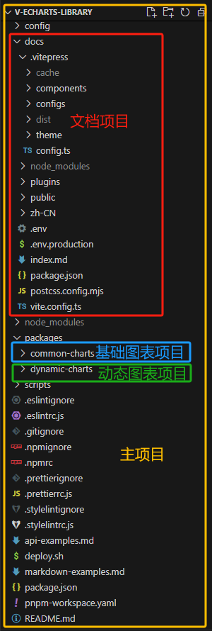

# 一、主项目搭建

1. 创建Vue3项目

```bash
npm init vite@latest
```

2. 根据需要选择配置（这里选择了使用 TypeScript）

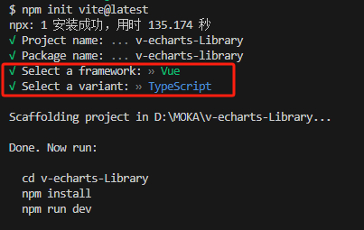

3. 进入项目，安装依赖，并运行项目

```bash
  cd v-echarts-Library
  npm install
  npm run dev
```

> 此时的目录结构：
>
> 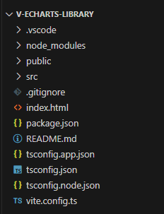
>

:::  warning

​	可以根据需要，集成一些其他配置，比如 .prettierrc、.stylelintrc、.eslintrc 等等。

:::

# 二、文档项目搭建

1、在根目录下创建一个 docs 文件夹，这里将会是我们的文档项目，然后进入该文件夹

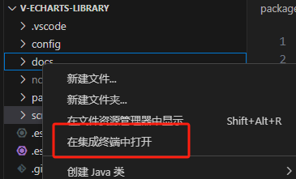

2、安装vitepress，集成vitepress及完善其配置

```bash
pnpm add vitepress -D
```

3、根目录下创建目录 docs并在 其目录中创建 index.md，其文件就是文档首页内容，可根据需要书写，测试时可先随便写点：

```markdown
# Hello Vitepress 
```

4、添加 scripts

```json
"scripts": {
  "docs:dev": "vitepress dev docs",
  "docs:build": "vitepress build docs"
},
```

5、安装 postcss 防止vitePress 的样式去污染组件的样式

```bash
pnpm add postcss -D
```

6、在docs 目录下新建 postcss.config.mjs文件， 内容为:

```typescript
import { postcssIsolateStyles } from 'vitepress'

export default {
    plugins: [
        postcssIsolateStyles({
            includeFiles: [/vp-doc\.css/] // defaults to /base\.css/
        })
    ]
}
```

7、在根目录中添加 pnpm-workspace.yaml 文件，键入如下内容：

```typescript
packages: # pnpm-workspace.yaml 定义了 工作空间 的根目录，并能够使您从工作空间中包含 / 排除目录 。 默认情况下，包含所有子目录。
  - packages/* # 将 packages 目录下所有文件夹项目视为独立项目，能独立安装 node_modules
  - docs
```

> 启动vitepress文档，页面如下
>
> 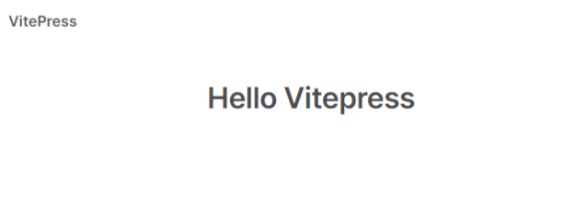

### 配置 vitepress

1、首页配置（即：docs/index.md文件）如下修改：

```markdown
---
title: v-echarts
titleTemplate: Vue3 Charts Component Library
description: Vue3 Charts Component Library
head:
  - - meta
    - name: description
      content: v-echarts is a Vue3 Charts Component Library
  - - meta
    - name: keywords
      content: v-echarts echarts Vue3 Charts Component Library

layout: home

# titleTemplate: 选项卡描述
editLink: true
lastUpdated: true
hero:
  name: v-echarts
  text: vue3图表组件
  tagline: Vue3 中基于echarts二次封装的图表组件文档
  image:
    src: /img/avator.jpg
    alt: v-echarts
  actions:
    - theme: brand
      text: 安装指南
      link: /zh-CN/guide/howToUse
    - theme: brand
      text: 组件预览
      link: /zh-CN/components/common-charts/组件总览
features:
  - icon: 🔨
    title: 实际项目
    details: 实际项目中碰到的疑点、难点，致力于更优的自我。
  - icon: 🧩
    title: 基础组件
    details: 基于Element-plus和echarts进行二次封装，使用组件 Demo 快速体验交互细节。
  - icon: ✈️
    title: Vue驱动。
    details: 享受 Vue3 + vite3 的开发体验，在 Markdown 中使用 Vue 组件，同时可以使用 Vue 来开发自定义主题。
---
```

> 启动vitepress文档，页面如下
>
> 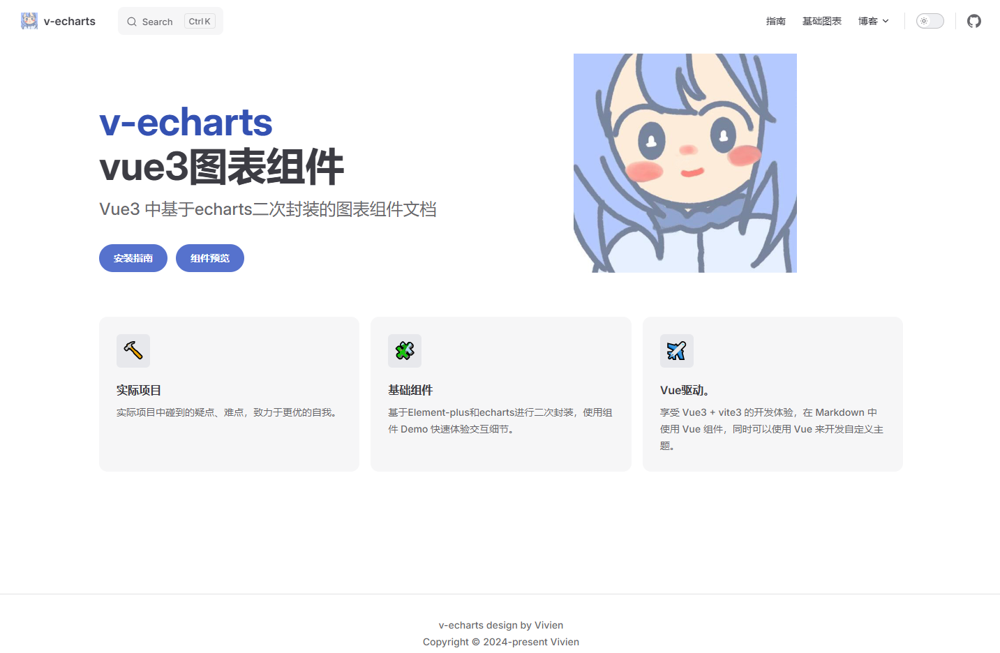

2、在 docs 目录下新建一个 zh-CN 文件夹，用来存放文档，并在其中建一个 组件使用文档components 和一个 指南手册文档guide

3、在 components 目录中创建对应组件渲染.md文件

3、在 docs 目录下新建目录 .vitepress，在该目录中创建 config.ts 文件

::: tip

​	为了文件更加清晰，笔者将 nav、sidebar、footer 都分别成了独立的 .ts 文件，放在一个 config 文件夹中

​	然后再在 config.ts 文件中导入

:::	

① 配置nav（定义顶部导航）。configs/nav.ts：

```typescript
export default [
 {
     text: '指南',
     link: '/zh-CN/guide/howToUse'
 },
 { text: '基础图表', link: '/zh-CN/components/common-charts/test/readme' },
 {
     text: '博客',
     items: [
         { text: 'CSDN', link: 'https://blog.csdn.net/Vivien_CC' },
         { text: 'github', link: 'https://github.com/yoguoer' },
     ]
 }
```

② 配置页脚。configs/footer.ts：

```typescript
export default {
message: 'v-echarts design by Vivien',
copyright: 'Copyright © 2024-present Vivien'
}
```

③ 配置侧边栏。configs/sidebar.ts：

```typescript
export default {
'/zh-CN/guide': [
 {
   text:'环境准备',
   items:[
     {text:'如何使用',link:'/zh-CN/guide/howToUse'}
   ]
 },
 {
   text: '使用指南',
   items: [
     { text: '基础图表', link: '/zh-CN/guide/common-charts' },
   ]
 },
],
'/zh-CN/components/': [
 {
   text: '基础图表',
   items: [
     { text: '测试', link: '/zh-CN/components/common-charts/test/readme' },
     { text: '折线图', link: '/zh-CN/components/common-charts/Bar/readme' },
     { text: '条形图', link: '/zh-CN/components/common-charts/Line/readme' },
     { text: '饼图', link: '/zh-CN/components/common-charts/Pie/readme' },
     { text: '仪表盘', link: '/zh-CN/components/common-charts/Guage/readme' },
   ]
 },
]
}
```

④ 最终config.ts 文件如下

```typescript
import { defineConfig } from 'vitepress'
import nav from './configs/nav'
import sidebar from './configs/sidebar'
import footer from './configs/footer'

export default defineConfig({
title: 'v-echarts',
description: 'v-echarts 是一个基于echarts和Vue3封装的图表组件库，主要用于快速构建数据可视化页面。',
lang: 'zh-CN',
base: `/v-echarts`,
head: [
 [
   'link',
   {
     rel: 'icon',
     href: '/img/vivien-logo.svg'
   }
 ]
],
lastUpdated: true,
themeConfig: {
 logo: '/img/vivien-logo.svg',
 // siteTitle: 'v-echarts',
 // outline: 3,
 socialLinks: [
   { icon: 'github', link: 'https://github.com/yoguoer' }
 ],
 nav,
 sidebar,
 footer,
 search: {
   provider: 'local'
 }
},
})
```


### 将Markdown文件中的代码示例转换为可显示在网页上的代码片段

::: tip

​	我们使用一个插件来将 Markdown 文件中的代码示例转换为可显示在网页上的代码片段。

::: 

1、 在 docs文件夹下添加一个plugins文件夹，并创建 source-code.ts 文件，键入以下内容

```typescript
import * as path from 'path'
import * as fsPromises from 'fs/promises'
import Prism from 'prismjs'
import loadLanguages from 'prismjs/components/index' // 语法高亮

loadLanguages(['markup', 'css', 'javascript'])
// 将源码使用 <pre> 标签包裹
const warp = code => `<pre v-pre><code>${code}</code></pre>`
/**
 * 实现原理是将一个字符串按照特定的模式（.*?source-code="(.*)"）进行匹配，然后将匹配到的结果按照:::分割成数组
 * @param _ 
 * @returns 
 */
function sourceSplit(_: string) {
  const result = /.*?source-code="(.*)"/.exec(_)
  const originPath = (result && result[1]) ?? ''
  return originPath.split(':::')
}

// 项目包路径
const packagesPath = path.resolve(__dirname, '../../packages/')
/**
 * 用于将 Markdown 文件中的代码示例转换为可显示在网页上的代码片段。
 * 它首先会提取模块代码中的 source-code 属性，然后读取相应的文件，并将文件内容替换到属性中。
 * 这样，浏览器就可以直接解析模块代码中的代码片段了
 * docs:https://rollupjs.org/plugin-development/#transform
 * @param src string 源代码字符串
 * @param id  string | SourceMap;
 * @returns 
 */
const sourceCode = () => {
  return {

    //在每个传入模块请求时被调用  transform 钩子
    async transform(src: string, id: string) {
      const mdFile = '.md' // 文件类型
      // 文件非 markodwn 类型，返回
      if (!id.includes(mdFile)) return
      // 提取示例组件中source-code属性值
      const reg = /source-code="(.*)"/g
      // 示例组件中不存在source-code属性，返回
      if (!src.match(reg)) return
      //使用正则表达式从模块代码中提取 source-code 属性，并将其替换为实际的代码内容。
      const match = src.match(reg)?.map(_ => {
        // 获取示例组件项目名和文件地址，通过 “项目名:::组件路由地址” 进行分割
        const [packageName, compPath] = sourceSplit(_)
        // 获取项目类型，react 使用ant design 组件，使用 tsx 语法， Vue 使用
        const suffix = packageName.includes('ant') ? 'tsx' : 'vue'
        // 返回读取的文件内容
        return fsPromises.readFile(path.resolve(packagesPath, `${packageName}/demo/${compPath}.${suffix}`), 'utf-8')
      })
      const filesRes = await Promise.all(match)


      //正则表达式 /source-code="(.*)"/g 可能会匹配到多个匹配项，因此在替换时需要使用 i++ 来确保每次替换都是唯一的。
      let i = 0
      //读取模块代码中的所有文件，并将其内容合并到模块代码中

      return src.replace(reg, (str) => {

        // 获取示例组件项目名和文件地址，通过 “项目名:::组件路由地址” 进行分割
        const [packageName, compPath] = sourceSplit(str)
        // 获取示例组件地址
        const compPathStrArr = compPath.split('/')
        // iframe src 地址
        const iframeSrc = compPathStrArr[compPathStrArr.length - 1]
        // 正则匹配 @Vi-Echarts 路径别名替换为原路径
        const searchString = new RegExp(`@/Vi-Echarts/${packageName}`, 'g')
        const replaceString = `Vi-Echarts/${packageName}`
        const file = filesRes[i] ? (filesRes[i] as string).replace(searchString, replaceString) : null
        i++
        // 返回编码后的源码文件内容
        return `source-code="${encodeURIComponent(warp(Prism.highlight(file, Prism.languages.markup, 'markup')))}" raw-source="${encodeURIComponent(file)}" lib-type="${packageName}" iframe-src="${iframeSrc}"`
      })
    }
  }
}
export default sourceCode
```

2、 在 docs/vite.config.ts 中导入插件并使用

```typescript
import sourceCode from './plugins/source-code'
import { defineConfig } from 'vite'
import path from 'path'
import { alias } from './plugins/alias'

export default defineConfig(async ({ command, mode }) => {
  const alia = await alias()
  return {
    server: {
      proxy: {
        '/assets': {
          target: 'http://localhost:8080',
          changeOrigin: true
        }
      }
    },
    plugins: [
      sourceCode()//将 Markdown 文件中的代码示例转换为可显示在网页上的代码片段
    ],
    resolve: {
      alias: [
        ...alia, // 统一项目包别名
        {
          find: '@/',
          replacement: path.join(__dirname, '/')
        }
      ]
    }
  }
})
```

### 封装渲染 Vue 的组件

1、在.vitepress文件夹下，新建一个components文件夹，用于存储我们的vue渲染模板

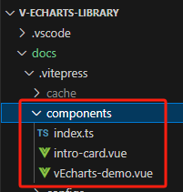

2、总体组件概况

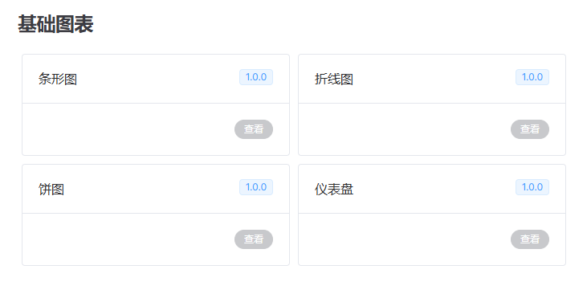

代码如下：

```vue
<template>
  <el-row class="intro-card-container">
    <el-col :span="12" v-for="item in lists" :key="item">
      <el-card class="card-container" shadow="hover" @click="viewComponent(item.link)">
        <template #header>
          <div class="card-header">
            <span>{{ item.title }}</span>
            <el-tag v-if="item.tag" :type="item.tagType || 'primary'">
              {{ item.tag }}
            </el-tag>
          </div>
        </template>
        <div class="card-footer">
          <el-button
            :type="item.link ? 'primary' : 'info'"
            round
            :disabled="!item.link"
            @click="viewComponent(item.link)"
            >查看</el-button
          >
        </div>
      </el-card>
    </el-col>
  </el-row>
</template>

<script setup>
const props = defineProps({
  lists: {
    // 组件库名称
    type: Array,
    default: null,
  },
});

const viewComponent = (link) => {
  if (!link) {
    return false;
  }
  window && window.open(link);
};
</script>
<script>
export default {
  name: "IntroCard",
};
</script>

<style scoped lang="less">
.intro-card-container {
  display: flex;
  justify-content: flex-start;
  .card-container {
    margin: 5px;
  }
  .card-header {
    display: flex;
    justify-content: space-between;
  }
  .card-footer {
    display: flex;
    justify-content: flex-end;
  }
}
</style>
```

3、单个组件预览

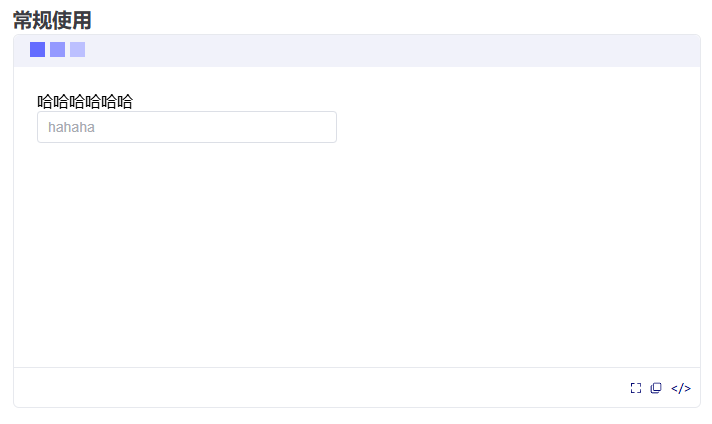

代码如下：

```vue
<template>
  <div class="container" :class="{ 'full-screen-container': isFullScreen }">
    <div class="demo">
      <!--操作菜单-->
      <div class="menu">
        <i
          class="icon"
          v-for="icon in iconColorArr"
          :key="icon.color"
          :style="{ backgroundColor: icon.color }"
        >
          <el-icon
            v-if="icon.name === 'scale'"
            class="d-caret"
            @click="handleToggleFullScreen"
            ><DCaret
          /></el-icon>
        </i>
      </div>
       <!--demo展示组件，使用 iframe 内嵌组件-->
      <iframe
        class="elp-iframe"
        :class="{ 'full-screen-iframe': isFullScreen }"
        :src="`${baseUrl[props.libType]}#/${props.iframeSrc}`"
        :style="{ height: demoHeight }"
      />
    </div>
    <div class="options">
      <el-tooltip content="全屏预览" placement="bottom">
        <el-icon class="option-item" @click="handleToggleFullScreen"
          ><FullScreen
        /></el-icon>
      </el-tooltip>
      <el-tooltip content="复制代码" placement="bottom">
        <el-icon class="option-item" @click="copyCode"><CopyDocument /></el-icon>
      </el-tooltip>
      <el-tooltip content="查看源码" placement="bottom">
        <span class="option-item code-btn" @click="handleToggleCode">&lt;/&gt;</span>
      </el-tooltip>
    </div>
    <El-collapse-transition>
      <div class="source-code" v-if="isShowCode">
        <!--demo 源码内嵌显示-->
        <div class="decode" v-html="decoded" />
        <div class="hide-code-btn">
          <el-button type="info" link :icon="CaretTop" @click="handleToggleCode"
            >隐藏源代码</el-button
          >
        </div>
      </div>
    </El-collapse-transition>
  </div>
</template>

<script setup>
import { ref, computed, onMounted } from "vue";
import {
  ElIcon,
  ElTooltip,
  ElCollapseTransition,
  ElButton,
  ElMessage,
} from "element-plus";
import { FullScreen, DCaret, CaretTop, CopyDocument } from "@element-plus/icons-vue";
import { useClipboard } from "@vueuse/core";
import "prismjs/themes/prism-tomorrow.css";

const props = defineProps({
  libType: { // 组件库名称
    type: String,
    default: "element-plus",
  },
  iframeSrc: {
    type: String,
    default: "",
  },
  demoHeight: {
    type: String,
    default: "320px",
  },
  sourceCode: {
    type: String,
    default: "",
  },
  rawSource: {
    type: String,
    default: "",
  },
});

const decoded = computed(() => {
  return decodeURIComponent(props.sourceCode);
});
// 组件库 demo 构建地址
const baseUrl = {
  "common-charts": import.meta.env.VITE_COMMON_DEV_BASE,
};

const iconColorArr = [
  { name: "", color: "#646cff" },
  { name: "", color: "#9499ff" },
  { name: "scale", color: "#bcc0ff" },
];

const isFullScreen = ref(false);
const isShowCode = ref(false);
//全屏预览
const handleToggleFullScreen = () => (isFullScreen.value = !isFullScreen.value);
//查看源码
const handleToggleCode = () => (isShowCode.value = !isShowCode.value);
//复制源码
const { copy, isSupported } = useClipboard({
  source: decodeURIComponent(props.rawSource),
  read: false,
});

const copyCode = async () => {
  if (!isSupported) {
    ElMessage.error("不支持复制");
  }
  try {
    await copy();
    ElMessage.success("复制成功");
  } catch (e) {
    ElMessage.error(e.message);
  }
};

onMounted(() => {
  // 监听键盘 esc键，退出全屏
  document.addEventListener("keyup", (e) => {
    if (e.key === "Escape" || e.key === "Esc") isFullScreen.value = false;
  });
});
</script>
<script>
export default {
  name: "vEchartsDemo",
};
</script>

<style scoped lang="less">
@menu-height: 32px;

.container {
  border: 1px solid #dcdfe6b2;
  border-radius: var(--ve-border-radius-base);
}
.full-screen-container {
  position: fixed;
  left: 0;
  top: 0;
  width: 100vw;
  height: 100vh;
  background-color: #fff;
  z-index: 10000;
}
.demo {
  .menu {
    border-radius: var(--ve-border-radius-base) var(--ve-border-radius-base) 0 0;
    height: @menu-height;
    line-height: @menu-height;
    background-color: var(--ve-custom-block-details-bg);
    padding: 0 16px;
    .icon {
      position: relative;
      display: inline-block;
      width: 15px;
      height: 15px;
      margin-right: 5px;
      &:hover {
        .d-caret {
          display: block;
          cursor: pointer;
        }
      }
      .d-caret {
        display: none;
        position: absolute;
        left: 50%;
        top: 50%;
        transform: translate(-50%, -50%) rotate(-45deg);
        color: var(--ve-c-text-2);
        font-size: 13px;
      }
    }
  }
  .elp-iframe {
    width: 100%;
    padding: 15px;
    border: 0;
  }
  .full-screen-iframe {
    width: 100vw;
    height: calc(100vh - @menu-height) !important;
  }
}
.options {
  border-top: 1px solid #dcdfe6b2;
  height: 40px;
  display: flex;
  align-items: center;
  justify-content: flex-end;
  .option-item {
    margin-right: 8px;
    cursor: pointer;
    color: var(--ve-c-text-2);
    font-size: 12px;
    &:hover {
      color: var(--ve-c-text-1);
    }
  }
}
.source-code {
  background-color: #f6f8fa;
  position: relative;
  border-top: 1px solid #dcdfe6b2;
  .decode {
    padding: 0 16px;
  }
  .hide-code-btn {
    border-top: 1px solid #dcdfe6b2;
    border-radius: 0 0 var(--ve-border-radius-base) var(--ve-border-radius-base);
    position: sticky;
    bottom: 0;
    height: 40px;
    display: flex;
    align-items: center;
    justify-content: center;
    font-size: 14px;
    background-color: var(--vp-code-block-bg);
    z-index: 10;
    .icon {
      margin-right: 8px;
    }
    &::hover{
      color: black;
    }
  }
}
</style>
```

4、在index.ts中导出

```typescript
import vEchartsDemo from './vEcharts-demo.vue';
import IntroCard from './intro-card.vue';
export const globals = [vEchartsDemo, IntroCard];
```

# 三、组件项目搭建

1、首先需要创建一个 packages 目录，用来存放组件，这里面是可以独立运行的项目

> 笔者开发的是图表组件库，分为两个项目：基础图表库 common-charts 和动态图表库 dynamic-charts

```javascript
- packages
---- common-charts // 基础图表
---- dynamic-charts // 动态图表
```

::: tip

​	packages 中的独立项目，搭建过程和我们的普通项目其实是一致的，也可以参考前面的住项目搭建步骤

​	这里只记录额外需要的部分

:::

2、每个图表库中都有一个用于全局注册组件的文件 withInstall.ts 和用于遍历并注册组件的 install.ts， 以及最外层的用于导出所有组件的 index.ts

> 为了使目录结构更清晰，将 withInstall.ts 和 install.ts 放在一个utils文件夹里

① common-charts/utils/withInstall.ts 

```typescript
import { App, Plugin } from "vue"

// 定义一个类型，用于表示带有 install 方法的组件
type SFCWithInstall<T> = T & Plugin

// 定义一个函数，用于给组件添加 install 方法
export const withInstall = <T, E extends Record<string, any>>(main: T, extra?: E) => {
  // 给 main 添加 install 方法
  ;(main as SFCWithInstall<T>).install = (app: App) => {
    // 遍历 main 和 extra 中的组件，将它们注册到 app 中
    for (const comp of [main, ...Object.values(extra ?? {})]) {
      app.component(comp.name, comp)
    }
  }
  // 如果有 extra，则将 extra 中的组件添加到 main 中
  if (extra) {
    for (const [compName, comp] of Object.entries(extra)) {
      ;(main as Record<string, any>)[compName] = comp
    }
  }
  // 将 T 断言为具体的类型 T & plugin & Record<string, any>
  return main as SFCWithInstall<T> & E
}
```

② common-charts/utils/install.ts

```typescript
import vEchartsTest from '../components/test'  // 导入已经开发好的组件

// 存储组件列表
const components = [
  vEchartsTest,
]

// 插件注册：在 Vue 项目的入口文件中，通过 ( app.use(插件) ) 进行注册
const installComponents = (app: any) => {
  components.forEach((comp: any) => { // 遍历并全局注册组件
    // app.component(comp.name as string, comp)
    app.use(comp)
  })
}

// 导出组件
export const installer = (app: any, router?: any) => {
  // 导出的对象必须具有 install，才能被 Vue.use() 方法安装
  installComponents(app)
}
```

③ common-charts/index.ts

```typescript
export * from './components'
export { installer as commonChartsInstall } from './install'
```

> 目录结构如下：
>
> 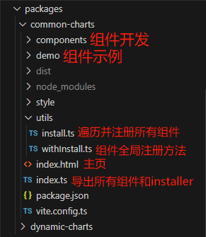

# 四、组件开发

::: danger

​	接下来，将以 common-charts 中的 test 作为例子来介绍整个过程

::: 

1、packages 中的每个文件夹，都存放着组件开发目录 components 和组件测试目录 demo

```javascript
-- packages
|--- common-charts 
	|--- components //组件开发目录
	|--- demo //组件测试目录
|---  dynamic-charts 
	|--- components
	|--- demo
```

2、每个单独的组件开发目录，最外层的 index.ts  用于整合所有组件，并对外暴露出去（代码如第 5 点所示）

3、components 中的每个组件，都应该归类于单独的目录下，包含其组件源码目录 src，和 index.ts，以便于外部引用

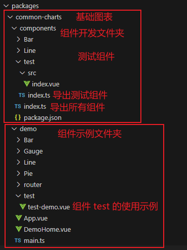

::: warning

​	这里以组件 vEchartsTest 为例

::: 

4、在 components 和 demo 中分别新建一个 test 文件夹

- **components 文件夹中：**

① 最外层的 components/index.ts 用于整合并导出组件

```typescript
export * from './test'
export * from './Bar'
export * from './Line'
export * from './Pie'
```

① components/test/src/index.vue 用于开发我们的组件，在这里就先随便写点东西好了（注意，组件必须声明 name，这个 name 就是组件的标签）

```vue
<template>
    <span>哈哈哈哈哈哈</span><br/>
    <el-input placeholder="hahaha" style="width: 300px;"/>
</template>

<script setup lang="ts" name="Test">
</script>
<script>
export default {
  name: "Test",
};
</script>
```

② components/test/index.ts 用于导出 test 组件

```typescript
import Test from './src/index.vue' // 引入组件
import { withInstall } from '../../withInstall' // 引入 withInstall 函数

// 使用 withInstall 注册组件并导出组件
const vEchartsTest = withInstall(Test)
export default vEchartsTest
```

- **demo 文件夹中：**

demo /test/test-demo.vue 用于使用 test 组件，提供使用示例

> 注意，这里的代码将会成为文档中 ”查看源码“ 功能中见到的代码和”复制代码“功能中得到的代码

```vue
<template>
  <vEchartsTest />
</template>

<script setup lang="ts">
import vEchartsTest from '../../components/test'
</script>
```

# 五、书写文档

​	在这里，我们使用前面已经封装好的 Vue 渲染组件来引入组件使用示例即可

```markdown
# 哈哈
测试一下测试一下
## 示例

### 常规使用

<vEcharts-demo
    demo-height="300px"
    source-code="common-charts:::test/test-demo"
/>
```

效果如下：

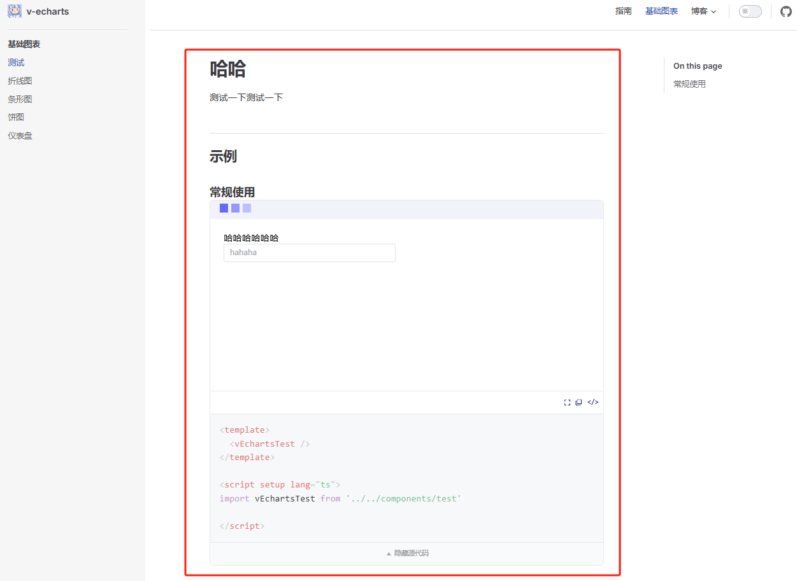

# 六、配置路由

​	写完文档后，就可以在 config.ts 中配置顶部导航栏 nav 和侧边栏 sidebar 了。

::: tip

​	这里需要根据自己的文件所在路径去配置！

​	笔者是创建了一个 zh-CN 文件夹，里面包含指南文档 guide 和组件文档 components(里面的目录结构又和 packages 文件夹里面的一一对应)

:::

```markdown
nav:[
	{ text: '基础图表', link: '/zh-CN/components/common-charts/test/readme' },
]
```

```markdown
sidebar:[
	  '/zh-CN/components/': [
    {
      text: '基础图表',
      items: [
        { text: '测试', link: '/zh-CN/components/common-charts/test/readme' },
      ]
    },
  ]
]
```

# 完成

​	经过这些操作步骤，我们的组件库雏形就已经搭建完成啦！
